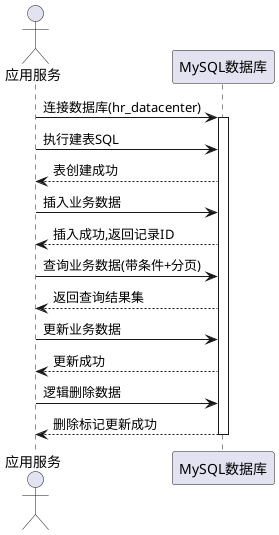
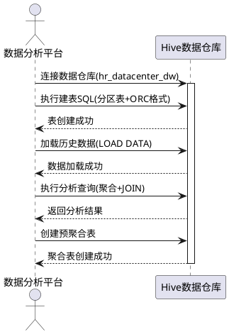
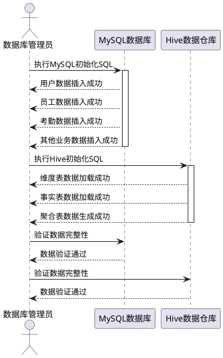

# 数据库设计需求规格文档

## 1. 组件定位

### 1.1 核心职责
本组件负责设计和管理人力资源数据中心项目的数据库结构,包括MySQL业务数据库和Hive数据仓库,实现数据的持久化存储、高效查询和大数据分析能力。

### 1.2 核心输入
1. 项目业务需求:员工管理、考勤、绩效、薪酬、培训等HR业务模块的数据存储需求
2. 数据量预估:员工1000-10000人,考勤记录每年365万条,薪资记录每年12万条
3. 查询性能要求:列表查询<1秒,统计查询<3秒,报表生成<10秒
4. 数据分析需求:员工流失预警、部门效能分析、人员结构分析等大数据场景

### 1.3 核心输出
1. MySQL数据库:完整的建库建表SQL脚本,包含10张核心业务表
2. Hive数据仓库:完整的建库建表SQL脚本,用于大数据分析
3. 初始化数据:大量测试数据插入SQL,覆盖各种业务场景
4. 索引优化:针对高频查询场景的索引设计

### 1.4 职责边界
本组件不负责:
1. 应用程序的数据访问层代码实现
2. 数据库的运维部署和监控
3. 数据迁移和ETL流程的实现
4. 前端界面的数据展示逻辑

## 2. 领域术语

**员工(Employee)**
: 企业的在职或离职人员,包含基本信息、工作信息、状态信息等完整档案数据。

**考勤记录(Attendance)**
: 员工每日的打卡记录,包含上班打卡、下班打卡、考勤类型、工作时长等信息。
: 备注:考勤类型包括正常、迟到、早退、旷工、请假、加班。

**绩效目标(PerformanceGoal)**
: 员工在一定评估周期内需要达成的工作目标,包含目标描述、权重、完成标准等。

**绩效评估(PerformanceEvaluation)**
: 对员工绩效目标完成情况的综合评价,包含自评、上级评价、综合评分、绩效等级等。

**薪资发放(SalaryPayment)**
: 员工每月的薪资发放记录,包含各项收入、扣款、应发和实发金额等详细信息。

**薪资调整(SalaryAdjustment)**
: 员工薪资的调整记录,包含调整类型、调整前后金额、生效日期等。

**培训课程(TrainingCourse)**
: 企业组织的培训活动,包含课程名称、类型、讲师、时间、名额等信息。

**培训报名(TrainingEnrollment)**
: 员工参加培训课程的报名记录,包含审核状态、出勤状态、培训成绩等。

**用户(User)**
: 系统的使用者,包含登录账号、权限、部门关联等信息。

**部门(Department)**
: 企业的组织架构单元,员工所属的工作部门。

## 3. 角色与边界

### 3.1 核心角色
1. **HR管理员**: 负责员工信息管理、薪资管理、培训管理等HR业务操作
2. **普通员工**: 查看个人信息、考勤打卡、请假申请、绩效自评等
3. **部门经理**: 审批请假、绩效评价、部门数据查看等
4. **系统管理员**: 用户管理、权限配置、系统维护等

### 3.2 外部系统
1. **应用服务层**: 通过JDBC/MyBatis访问MySQL数据库进行业务数据操作
2. **大数据分析平台**: 通过Hive JDBC访问Hive数据仓库进行数据分析
3. **数据同步服务**: 定时将MySQL数据同步到Hive数据仓库

### 3.3 交互上下文

```plantuml
@startuml
!define RECTANGLE class

RECTANGLE "数据库设计组件" as DB {
}

package "人类角色" {
    actor "HR管理员" as HR
    actor "普通员工" as Emp
    actor "部门经理" as Mgr
    actor "系统管理员" as Admin
}

package "外部系统" {
    RECTANGLE "应用服务层" as App
    RECTANGLE "大数据分析平台" as Analysis
    RECTANGLE "数据同步服务" as Sync
}

HR --> DB : 业务数据操作
Emp --> DB : 个人数据查询
Mgr --> DB : 审批与评价
Admin --> DB : 系统管理

App --> DB : MySQL数据访问
Analysis --> DB : Hive数据分析
Sync --> DB : MySQL→Hive同步

@enduml
```

## 4. DFX约束

### 4.1 性能
1. **查询响应时间**:
   - 员工列表查询(含分页): < 1秒
   - 考勤统计查询(按月): < 3秒
   - 薪资汇总查询(按部门): < 3秒
   - 绩效分析报表生成: < 10秒

2. **数据容量支持**:
   - 员工数据: 支持10000人
   - 考勤记录: 支持每年365万条(10000人×365天)
   - 薪资记录: 支持每年12万条(10000人×12月)
   - 历史数据保留: 至少3年

3. **并发能力**:
   - 支持至少100个并发查询
   - 写操作支持至少50个并发

### 4.2 可靠性
1. **数据一致性**:
   - 薪资计算必须精确到分,不允许误差
   - 外键关联必须保证数据完整性
   - 逻辑删除机制保证数据可追溯

2. **数据备份**:
   - MySQL: 每日全量备份,每小时增量备份
   - Hive: 每周全量备份
   - 备份数据保留30天

3. **故障恢复**:
   - 数据库故障恢复时间 < 1小时
   - 数据丢失容忍度: 0(必须保证数据不丢失)

### 4.3 安全性
1. **数据加密**:
   - 用户密码必须使用BCrypt加密存储
   - 身份证号建议加密存储(可选)
   - 薪资数据传输必须加密

2. **访问控制**:
   - 数据库用户权限最小化原则
   - 敏感表(薪资)需要独立权限控制
   - 所有写操作需要审计日志

3. **SQL注入防护**:
   - 必须使用参数化查询
   - 禁止拼接SQL语句

### 4.4 可维护性
1. **监控指标**:
   - 数据库连接池使用率
   - 慢查询监控(>1秒)
   - 表空间使用率

2. **日志规范**:
   - 所有DDL操作必须记录日志
   - 数据迁移操作必须记录日志
   - 异常情况必须记录详细日志

3. **文档要求**:
   - 每张表必须有注释说明
   - 每个字段必须有注释说明
   - 索引设计必须有性能优化说明

### 4.5 兼容性
1. **数据库版本**:
   - MySQL: 8.0及以上
   - Hive: 3.1.3及以上
   - 字符集: utf8mb4

2. **数据迁移**:
   - 必须提供存量数据迁移脚本
   - 必须保证迁移过程数据完整性
   - 必须提供回滚方案

## 5. 核心能力

### 5.1 MySQL业务数据库设计

#### 5.1.1 业务规则

1. **数据库创建规则**: 必须创建名为hr_datacenter的数据库,使用utf8mb4字符集和utf8mb4_unicode_ci排序规则
   a. 验收条件: [执行建库SQL] → [数据库创建成功,字符集为utf8mb4]

2. **表结构设计规则**: 必须创建10张核心业务表,每张表必须包含主键、创建时间、更新时间、逻辑删除标记
   a. 验收条件: [执行建表SQL] → [10张表创建成功,每张表都有id、create_time、update_time、deleted字段]

3. **员工表设计规则**: employee表必须包含员工编号、姓名、性别、出生日期、身份证号、手机、邮箱、部门、职位、薪资、入职日期、离职日期、状态、学历等字段,员工编号必须唯一
   a. 验收条件: [插入重复员工编号] → [插入失败,提示唯一约束冲突]

4. **考勤表设计规则**: attendance表必须关联员工ID,包含考勤日期、上下班打卡时间、考勤类型、考勤状态、工作时长等字段,同一员工同一天只能有一条考勤记录
   a. 验收条件: [同一员工同一天插入两条考勤] → [插入失败,提示唯一约束冲突]

5. **请假表设计规则**: leave表必须关联员工ID和审批人ID,包含请假类型、开始时间、结束时间、请假时长、请假原因、审批状态等字段
   a. 验收条件: [提交请假申请] → [记录创建成功,审批状态为待审批]

6. **绩效表设计规则**: performance_goal和performance_evaluation表必须关联员工ID,包含评估年度、评估周期、目标描述、自评分、上级评分、综合评分、绩效等级等字段
   a. 验收条件: [创建绩效目标] → [记录创建成功,目标状态为草稿]

7. **薪资表设计规则**: salary_payment表必须包含详细的收入项(基本工资、绩效工资、津贴、补贴、加班费)和扣款项(社保、公积金、个税),应发工资和实发工资必须精确计算
   a. 验收条件: [插入薪资记录] → [应发工资=收入项合计,实发工资=应发工资-扣款合计]

8. **培训表设计规则**: training_course表必须包含课程名称、类型、讲师、时长、地点、时间、名额、已报名人数等字段,training_enrollment表必须关联课程ID和员工ID
   a. 验收条件: [员工报名培训] → [已报名人数+1,报名记录创建成功]

9. **用户表设计规则**: sys_user表必须包含用户名、密码、真实姓名、部门ID、手机、邮箱、状态等字段,用户名必须唯一,密码必须BCrypt加密
   a. 验收条件: [插入用户] → [密码已加密存储,用户名唯一]

10. **索引设计规则**: 必须为高频查询字段创建索引,包括员工编号、用户名、考勤日期、绩效年度周期、薪资年月等
    a. 验收条件: [执行查询] → [查询使用索引,响应时间<1秒]

11. **禁止项**: 禁止在业务表中存储大文本、二进制文件等非结构化数据
    a. 验收条件: [检查表结构] → [无TEXT、BLOB等大字段类型]

#### 5.1.2 交互流程



#### 5.1.3 异常场景

1. **数据库连接失败**
   a. 触发条件: 数据库服务未启动或网络不通
   b. 系统行为: 应用层捕获连接异常,记录错误日志
   c. 用户感知: 提示"数据库连接失败,请联系管理员"

2. **唯一约束冲突**
   a. 触发条件: 插入重复的员工编号或用户名
   b. 系统行为: 数据库拒绝插入,返回唯一约束错误
   c. 用户感知: 提示"该员工编号已存在,请使用其他编号"

3. **外键约束冲突**
   a. 触发条件: 插入考勤记录时员工ID不存在
   b. 系统行为: 数据库拒绝插入,返回外键约束错误
   c. 用户感知: 提示"员工不存在,请先创建员工信息"

4. **数据类型不匹配**
   a. 触发条件: 插入字符串到数值字段
   b. 系统行为: 数据库拒绝插入,返回类型错误
   c. 用户感知: 提示"数据格式错误,请检查输入"

5. **查询超时**
   a. 触发条件: 复杂查询执行时间超过阈值
   b. 系统行为: 数据库中断查询,返回超时错误
   c. 用户感知: 提示"查询超时,请缩小查询范围或联系管理员优化"

### 5.2 Hive数据仓库设计

#### 5.2.1 业务规则

1. **数据库创建规则**: 必须创建名为hr_datacenter_dw的数据仓库,用于存储历史数据和分析数据
   a. 验收条件: [执行建库SQL] → [数据仓库创建成功]

2. **分区表设计规则**: 考勤、薪资等大数据量表必须使用分区表,按年月分区,提高查询性能
   a. 验收条件: [查询某月数据] → [只扫描对应分区,查询性能提升]

3. **ORC存储格式规则**: 所有Hive表必须使用ORC列式存储格式,支持压缩和高效查询
   a. 验收条件: [创建表] → [存储格式为ORC,数据压缩]

4. **员工维度表规则**: 必须创建员工维度表dim_employee,包含员工的所有属性信息,用于多维分析
   a. 验收条件: [查询员工维度] → [返回员工完整属性信息]

5. **考勤事实表规则**: 必须创建考勤事实表fact_attendance,包含考勤记录和关联的员工维度,按年月分区
   a. 验收条件: [查询某月考勤] → [返回考勤记录和员工信息]

6. **薪资事实表规则**: 必须创建薪资事实表fact_salary,包含薪资发放记录和关联的员工维度,按年月分区
   a. 验收条件: [查询某月薪资] → [返回薪资记录和员工信息]

7. **绩效事实表规则**: 必须创建绩效事实表fact_performance,包含绩效评估记录和关联的员工维度,按年分区
   a. 验收条件: [查询某年绩效] → [返回绩效记录和员工信息]

8. **培训事实表规则**: 必须创建培训事实表fact_training,包含培训报名记录和关联的员工维度、课程维度
   a. 验收条件: [查询培训记录] → [返回培训记录和员工、课程信息]

9. **聚合表规则**: 必须创建预聚合表,如部门月度考勤汇总、部门月度薪资汇总等,提高分析查询性能
   a. 验收条件: [查询部门汇总] → [直接读取聚合表,响应时间<3秒]

10. **禁止项**: 禁止在Hive中执行事务性操作(INSERT/UPDATE/DELETE单条记录)
    a. 验收条件: [检查SQL脚本] → [无单条记录的写操作]

#### 5.2.2 交互流程



#### 5.2.3 异常场景

1. **Hive服务不可用**
   a. 触发条件: Hive服务未启动或Hadoop集群故障
   b. 系统行为: 应用层捕获连接异常,记录错误日志
   c. 用户感知: 提示"数据仓库服务不可用,请联系管理员"

2. **分区不存在**
   a. 触发条件: 查询不存在的年月分区
   b. 系统行为: Hive返回空结果集
   c. 用户感知: 提示"该时间段无数据"

3. **查询资源不足**
   a. 触发条件: 复杂查询占用资源超过限制
   b. 系统行为: Hive拒绝执行,返回资源不足错误
   c. 用户感知: 提示"查询资源不足,请简化查询或联系管理员"

4. **数据格式错误**
   a. 触发条件: 加载的数据文件格式不符合表结构
   b. 系统行为: Hive拒绝加载,返回格式错误
   c. 用户感知: 提示"数据格式错误,请检查数据文件"

### 5.3 初始化数据生成

#### 5.3.1 业务规则

1. **用户数据规则**: 必须插入至少2个测试用户(管理员admin、HR用户hr001),密码使用BCrypt加密
   a. 验收条件: [查询用户表] → [至少2条用户记录,密码已加密]

2. **员工数据规则**: 必须插入至少50个测试员工,覆盖不同部门、职位、状态(在职、离职、试用)
   a. 验收条件: [查询员工表] → [至少50条员工记录,覆盖各种状态]

3. **考勤数据规则**: 必须插入至少1000条考勤记录,覆盖最近3个月,包含各种考勤类型(正常、迟到、早退、请假、加班)
   a. 验收条件: [查询考勤表] → [至少1000条记录,覆盖各种类型]

4. **请假数据规则**: 必须插入至少50条请假记录,覆盖各种请假类型(事假、病假、年假等)和审批状态
   a. 验收条件: [查询请假表] → [至少50条记录,覆盖各种类型和状态]

5. **绩效数据规则**: 必须插入至少100条绩效目标和50条绩效评估记录,覆盖不同年度、周期、绩效等级
   a. 验收条件: [查询绩效表] → [至少100条目标、50条评估,覆盖各种等级]

6. **薪资数据规则**: 必须插入至少500条薪资发放记录,覆盖最近12个月,薪资计算必须准确
   a. 验收条件: [查询薪资表] → [至少500条记录,应发=收入合计,实发=应发-扣款]

7. **培训数据规则**: 必须插入至少10个培训课程和100条培训报名记录,覆盖各种课程类型和审核状态
   a. 验收条件: [查询培训表] → [至少10个课程、100条报名,覆盖各种状态]

8. **数据关联规则**: 所有关联数据必须保证外键完整性,如考勤记录的员工ID必须存在
   a. 验收条件: [检查外键关联] → [所有外键都指向有效记录]

9. **数据真实性规则**: 生成的数据必须符合业务逻辑,如入职日期早于离职日期、薪资为正数等
   a. 验收条件: [检查数据逻辑] → [所有数据符合业务规则]

10. **禁止项**: 禁止生成违反业务规则的数据,如负数薪资、未来日期的考勤等
    a. 验收条件: [检查数据] → [无违反业务规则的数据]

#### 5.3.2 交互流程



#### 5.3.3 异常场景

1. **数据插入失败**
   a. 触发条件: 违反唯一约束或外键约束
   b. 系统行为: 数据库拒绝插入,事务回滚
   c. 用户感知: 提示"数据初始化失败,请检查SQL脚本"

2. **数据量不足**
   a. 触发条件: 插入的数据量未达到预期
   b. 系统行为: 记录警告日志
   c. 用户感知: 提示"数据量不足,可能影响测试效果"

3. **数据逻辑错误**
   a. 触发条件: 生成的数据违反业务规则
   b. 系统行为: 数据库接受插入,但业务逻辑错误
   c. 用户感知: 提示"数据逻辑错误,请检查数据生成规则"

## 6. 数据约束

### 6.1 员工(Employee)
1. **emp_id**: 员工ID,主键,自增,必须大于0
2. **emp_no**: 员工编号,唯一,格式为"EMP"+8位数字,如"EMP00000001"
3. **emp_name**: 员工姓名,必填,长度2-50字符,只能包含中文和英文
4. **gender**: 性别,必填,取值0(女)或1(男)
5. **birth_date**: 出生日期,必填,必须早于当前日期至少18年
6. **id_card**: 身份证号,必填,18位,符合身份证校验规则
7. **phone**: 手机号码,必填,11位,符合手机号格式
8. **email**: 邮箱,可选,符合邮箱格式
9. **department**: 部门,必填,长度2-50字符
10. **position**: 职位,必填,长度2-50字符
11. **salary**: 薪资,必填,大于0,精确到分
12. **hire_date**: 入职日期,必填,必须早于或等于当前日期
13. **resign_date**: 离职日期,可选,如果存在必须晚于入职日期
14. **status**: 员工状态,必填,取值0(离职)、1(在职)、2(试用)
15. **education**: 学历,可选,取值"高中"、"大专"、"本科"、"硕士"、"博士"

### 6.2 考勤记录(Attendance)
1. **attendance_id**: 考勤ID,主键,自增
2. **emp_id**: 员工ID,外键,必须关联有效的员工记录
3. **attendance_date**: 考勤日期,必填,不能是未来日期
4. **clock_in_time**: 上班打卡时间,可选,格式HH:MM:SS
5. **clock_out_time**: 下班打卡时间,可选,格式HH:MM:SS,如果存在必须晚于上班打卡时间
6. **attendance_type**: 考勤类型,必填,取值0(正常)、1(迟到)、2(早退)、3(旷工)、4(请假)、5(加班)
7. **attendance_status**: 考勤状态,必填,取值0(未打卡)、1(已打卡)、2(请假)、3(加班)
8. **work_duration**: 工作时长,可选,单位分钟,必须大于等于0

### 6.3 请假记录(Leave)
1. **leave_id**: 请假ID,主键,自增
2. **emp_id**: 员工ID,外键,必须关联有效的员工记录
3. **leave_type**: 请假类型,必填,取值0(事假)、1(病假)、2(年假)、3(婚假)、4(产假)、5(丧假)
4. **start_time**: 请假开始时间,必填
5. **end_time**: 请假结束时间,必填,必须晚于开始时间
6. **leave_duration**: 请假时长,必填,单位小时,必须大于0
7. **reason**: 请假原因,必填,长度10-500字符
8. **approver_id**: 审批人ID,外键,必须关联有效的用户记录
9. **approval_status**: 审批状态,必填,取值0(待审批)、1(已同意)、2(已拒绝)

### 6.4 绩效目标(PerformanceGoal)
1. **goal_id**: 目标ID,主键,自增
2. **emp_id**: 员工ID,外键,必须关联有效的员工记录
3. **year**: 评估年度,必填,4位数字,如2025
4. **period_type**: 评估周期,必填,取值1(年度)、2(季度)、3(月度)
5. **goal_description**: 目标描述,必填,长度10-500字符
6. **weight**: 权重,必填,1-100之间的整数
7. **completion_standard**: 完成标准,必填,长度10-500字符

### 6.5 绩效评估(PerformanceEvaluation)
1. **evaluation_id**: 评估ID,主键,自增
2. **emp_id**: 员工ID,外键,必须关联有效的员工记录
3. **year**: 评估年度,必填,4位数字
4. **period_type**: 评估周期,必填,取值1(年度)、2(季度)、3(月度)
5. **self_score**: 自评分,必填,0-100之间的数值,精确到小数点后2位
6. **supervisor_score**: 上级评分,可选,0-100之间的数值
7. **final_score**: 综合评分,可选,0-100之间的数值
8. **performance_level**: 绩效等级,可选,取值S、A、B、C、D

### 6.6 薪资发放(SalaryPayment)
1. **payment_id**: 发放ID,主键,自增
2. **emp_id**: 员工ID,外键,必须关联有效的员工记录
3. **year**: 发放年度,必填,4位数字
4. **month**: 发放月份,必填,1-12之间的整数
5. **basic_salary**: 基本工资,必填,大于等于0
6. **performance_salary**: 绩效工资,必填,大于等于0
7. **position_allowance**: 岗位津贴,必填,大于等于0
8. **transport_allowance**: 交通补贴,必填,大于等于0
9. **communication_allowance**: 通讯补贴,必填,大于等于0
10. **meal_allowance**: 餐补,必填,大于等于0
11. **overtime_pay**: 加班费,必填,大于等于0
12. **social_insurance**: 社保个人部分,必填,大于等于0
13. **housing_fund**: 公积金个人部分,必填,大于等于0
14. **income_tax**: 个人所得税,必填,大于等于0
15. **other_deduction**: 其他扣款,必填,大于等于0
16. **total_gross_salary**: 应发工资总额,必填,等于所有收入项之和
17. **total_net_salary**: 实发工资总额,必填,等于应发工资减去所有扣款项

### 6.7 培训课程(TrainingCourse)
1. **course_id**: 课程ID,主键,自增
2. **course_name**: 课程名称,必填,长度5-100字符
3. **course_type**: 课程类型,必填,取值1(新员工培训)、2(技能培训)、3(管理培训)、4(安全培训)
4. **instructor**: 培训讲师,必填,长度2-50字符
5. **duration**: 培训时长,必填,大于0,单位小时
6. **location**: 培训地点,必填,长度5-100字符
7. **start_date**: 开始日期,必填
8. **end_date**: 结束日期,必填,必须晚于开始日期
9. **capacity**: 培训名额,必填,大于0
10. **enrolled_count**: 已报名人数,必填,大于等于0,小于等于培训名额

### 6.8 用户(User)
1. **user_id**: 用户ID,主键,自增
2. **username**: 用户名,唯一,长度4-20字符,只能包含字母、数字、下划线
3. **password**: 密码,必填,BCrypt加密后的字符串,长度60字符
4. **real_name**: 真实姓名,必填,长度2-50字符
5. **dept_id**: 部门ID,可选,外键
6. **phone**: 手机号码,可选,11位
7. **email**: 邮箱,可选,符合邮箱格式
8. **status**: 用户状态,必填,取值0(禁用)、1(启用)
