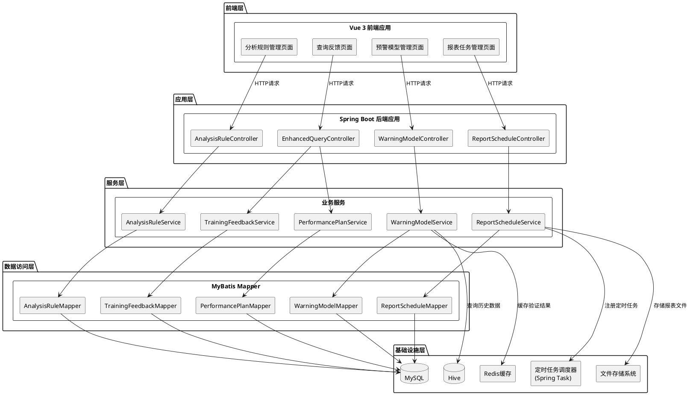

# 人力资源数据中心系统 - 技术设计文档

## 1. 实现模型

### 1.1 上下文视图

本系统采用前后端分离架构，新增功能模块将集成到现有的Spring Boot + Vue架构中。



### 1.2 服务/组件总体架构

#### 1.2.1 后端架构设计

采用分层架构模式，遵循现有项目的架构风格：

**Controller层（控制器层）**
- `AnalysisRuleController`: 分析规则管理控制器
- `WarningModelController`: 预警模型管理控制器
- `ReportScheduleController`: 报表定时任务控制器
- `EnhancedQueryController`: 增强查询控制器
- `TrainingFeedbackController`: 培训反馈控制器
- `PerformancePlanController`: 绩效改进计划控制器

**Service层（服务层）**
- `AnalysisRuleService`: 分析规则业务逻辑
- `WarningModelService`: 预警模型业务逻辑
- `ReportScheduleService`: 报表定时任务业务逻辑
- `EnhancedQueryService`: 增强查询业务逻辑
- `TrainingFeedbackService`: 培训反馈业务逻辑
- `PerformancePlanService`: 绩效改进计划业务逻辑

**Mapper层（数据访问层）**
- `AnalysisRuleMapper`: 分析规则数据访问
- `WarningModelMapper`: 预警模型数据访问
- `ReportScheduleMapper`: 报表定时任务数据访问
- `RuleAdjustmentLogMapper`: 规则调整日志数据访问
- `ReportShareRecordMapper`: 报表分享记录数据访问
- `TrainingFeedbackMapper`: 培训反馈数据访问
- `PerformancePlanMapper`: 绩效改进计划数据访问

#### 1.2.2 前端架构设计

采用Vue 3组件化架构，遵循现有项目的前端风格：

**页面组件**
- `RuleManagementView.vue`: 分析规则管理页面
- `ModelManagementView.vue`: 预警模型管理页面
- `ReportScheduleView.vue`: 报表定时任务管理页面
- `EnhancedQueryView.vue`: 增强查询页面
- `TrainingFeedbackView.vue`: 培训反馈页面
- `PerformancePlanView.vue`: 绩效改进计划页面

**公共组件**
- `RuleForm.vue`: 规则表单组件
- `ModelForm.vue`: 模型表单组件
- `TaskForm.vue`: 任务表单组件
- `ShareLinkDialog.vue`: 分享链接对话框组件

**API封装**
- `analysisRule.js`: 分析规则API
- `warningModel.js`: 预警模型API
- `reportSchedule.js`: 报表定时任务API
- `enhancedQuery.js`: 增强查询API
- `trainingFeedback.js`: 培训反馈API
- `performancePlan.js`: 绩效改进计划API

### 1.3 实现设计文档

#### 1.3.1 分析规则管理实现设计

**核心类设计**

```java
// Controller层
@RestController
@RequestMapping("/api/analysis-rules")
public class AnalysisRuleController {
    
    @PostMapping
    public Response<String> createRule(@RequestBody AnalysisRuleDTO dto);
    
    @PutMapping("/{ruleId}")
    public Response<Void> updateRule(@PathVariable String ruleId, @RequestBody AnalysisRuleDTO dto);
    
    @DeleteMapping("/{ruleId}")
    public Response<Void> deleteRule(@PathVariable String ruleId);
    
    @GetMapping("/{ruleId}")
    public Response<AnalysisRuleVO> getRule(@PathVariable String ruleId);
    
    @GetMapping
    public Response<PageResult<AnalysisRuleVO>> queryRules(AnalysisRuleQueryDTO query);
    
    @PutMapping("/{ruleId}/status")
    public Response<Void> toggleRuleStatus(@PathVariable String ruleId, @RequestParam boolean active);
}

// Service层
@Service
public class AnalysisRuleServiceImpl implements AnalysisRuleService {
    
    @Autowired
    private AnalysisRuleMapper ruleMapper;
    
    @Autowired
    private RuleAdjustmentLogMapper logMapper;
    
    @Transactional
    public String createRule(AnalysisRuleDTO dto) {
        // 1. 验证规则参数合法性
        validateRuleParams(dto);
        
        // 2. 检查规则名称是否重复
        checkDuplicateName(dto.getRuleName());
        
        // 3. 生成规则ID
        String ruleId = generateRuleId();
        
        // 4. 保存规则记录
        AnalysisRule rule = convertToEntity(dto);
        rule.setRuleId(ruleId);
        ruleMapper.insert(rule);
        
        // 5. 记录操作日志
        saveAdjustmentLog(ruleId, "CREATE", null, JSON.toJSONString(rule));
        
        return ruleId;
    }
    
    @Transactional
    public void updateRule(String ruleId, AnalysisRuleDTO dto) {
        // 1. 查询现有规则
        AnalysisRule existingRule = ruleMapper.selectById(ruleId);
        
        // 2. 验证规则参数合法性
        validateRuleParams(dto);
        
        // 3. 记录调整前的值
        String oldValue = JSON.toJSONString(existingRule);
        
        // 4. 更新规则参数
        AnalysisRule newRule = convertToEntity(dto);
        newRule.setRuleId(ruleId);
        ruleMapper.updateById(newRule);
        
        // 5. 记录调整日志
        String newValue = JSON.toJSONString(newRule);
        saveAdjustmentLog(ruleId, "UPDATE", oldValue, newValue);
    }
    
    @Transactional
    public void deleteRule(String ruleId) {
        // 1. 查询规则状态
        AnalysisRule rule = ruleMapper.selectById(ruleId);
        
        // 2. 检查是否为已生效规则
        if (rule.isActive()) {
            throw new BusinessException("CANNOT_DELETE_ACTIVE_RULE", "已生效规则不能删除");
        }
        
        // 3. 删除规则记录
        ruleMapper.deleteById(ruleId);
        
        // 4. 记录操作日志
        saveAdjustmentLog(ruleId, "DELETE", JSON.toJSONString(rule), null);
    }
}
```

**数据验证逻辑**

```java
private void validateRuleParams(AnalysisRuleDTO dto) {
    // 根据规则类型验证参数
    switch (dto.getRuleType()) {
        case "TURNOVER_WARNING":
            // 验证流失预警阈值参数
            validateTurnoverParams(dto.getRuleParams());
            break;
        case "COMPENSATION_BENCHMARK":
            // 验证薪酬对标参数
            validateCompensationParams(dto.getRuleParams());
            break;
        case "TRAINING_ROI":
            // 验证培训ROI参数
            validateTrainingROIParams(dto.getRuleParams());
            break;
        // 其他规则类型...
    }
}
```

#### 1.3.2 预警模型管理实现设计

**核心类设计**

```java
// Controller层
@RestController
@RequestMapping("/api/warning-models")
public class WarningModelController {
    
    @PostMapping
    public Response<String> createModel(@RequestBody WarningModelDTO dto);
    
    @PutMapping("/{modelId}/weights")
    public Response<Void> adjustWeights(@PathVariable String modelId, @RequestBody Map<String, Double> weights);
    
    @PostMapping("/{modelId}/validate")
    public Response<ModelValidationResult> validateModel(@PathVariable String modelId);
    
    @GetMapping("/{modelId}")
    public Response<WarningModelVO> getModel(@PathVariable String modelId);
    
    @GetMapping
    public Response<PageResult<WarningModelVO>> queryModels(WarningModelQueryDTO query);
}

// Service层
@Service
public class WarningModelServiceImpl implements WarningModelService {
    
    @Autowired
    private WarningModelMapper modelMapper;
    
    @Autowired
    private HiveQueryService hiveQueryService;
    
    @Autowired
    private RedisTemplate redisTemplate;
    
    @Transactional
    public String createModel(WarningModelDTO dto) {
        // 1. 验证特征权重和为1
        validateWeightSum(dto.getFeatureWeights());
        
        // 2. 生成模型ID
        String modelId = generateModelId();
        
        // 3. 保存模型记录
        WarningModel model = convertToEntity(dto);
        model.setModelId(modelId);
        model.setVersion("v1.0");
        modelMapper.insert(model);
        
        return modelId;
    }
    
    @Transactional
    public void adjustWeights(String modelId, Map<String, Double> weights) {
        // 1. 验证权重和为1
        validateWeightSum(weights);
        
        // 2. 查询现有模型
        WarningModel existingModel = modelMapper.selectById(modelId);
        
        // 3. 创建新版本
        String newVersion = incrementVersion(existingModel.getVersion());
        
        // 4. 更新模型权重
        WarningModel newModel = new WarningModel();
        newModel.setModelId(modelId);
        newModel.setFeatureWeights(JSON.toJSONString(weights));
        newModel.setVersion(newVersion);
        modelMapper.updateById(newModel);
        
        // 5. 清除缓存
        String cacheKey = "model_validation:" + modelId;
        redisTemplate.delete(cacheKey);
    }
    
    public ModelValidationResult validateModel(String modelId) {
        // 1. 检查缓存
        String cacheKey = "model_validation:" + modelId;
        ModelValidationResult cachedResult = (ModelValidationResult) redisTemplate.opsForValue().get(cacheKey);
        if (cachedResult != null) {
            return cachedResult;
        }
        
        // 2. 查询模型信息
        WarningModel model = modelMapper.selectById(modelId);
        
        // 3. 从Hive查询历史数据
        List<HistoricalData> historicalData = hiveQueryService.queryHistoricalData(model.getModelType());
        
        // 4. 计算预测准确率
        double accuracyRate = calculateAccuracyRate(model, historicalData);
        
        // 5. 更新模型准确率
        modelMapper.updateAccuracyRate(modelId, accuracyRate);
        
        // 6. 缓存结果
        ModelValidationResult result = new ModelValidationResult(accuracyRate, historicalData.size());
        redisTemplate.opsForValue().set(cacheKey, result, 1, TimeUnit.HOURS);
        
        return result;
    }
    
    private void validateWeightSum(Map<String, Double> weights) {
        double sum = weights.values().stream().mapToDouble(Double::doubleValue).sum();
        if (Math.abs(sum - 1.0) > 0.0001) {
            throw new BusinessException("INVALID_WEIGHT_SUM", "特征权重之和必须等于1");
        }
    }
}
```

#### 1.3.3 报表定时生成与分享实现设计

**核心类设计**

```java
// Controller层
@RestController
@RequestMapping("/api/report-schedules")
public class ReportScheduleController {
    
    @PostMapping
    public Response<String> createTask(@RequestBody ReportScheduleDTO dto);
    
    @PutMapping("/{taskId}")
    public Response<Void> updateTask(@PathVariable String taskId, @RequestBody ReportScheduleDTO dto);
    
    @DeleteMapping("/{taskId}")
    public Response<Void> deleteTask(@PathVariable String taskId);
    
    @GetMapping("/{taskId}")
    public Response<ReportScheduleVO> getTask(@PathVariable String taskId);
    
    @GetMapping
    public Response<PageResult<ReportScheduleVO>> queryTasks(ReportScheduleQueryDTO query);
    
    @GetMapping("/share/{token}")
    public Response<ReportContentVO> accessSharedReport(@PathVariable String token);
}

// Service层
@Service
public class ReportScheduleServiceImpl implements ReportScheduleService {
    
    @Autowired
    private ReportScheduleMapper taskMapper;
    
    @Autowired
    private ReportShareRecordMapper shareMapper;
    
    @Autowired
    private ReportTemplateService templateService;
    
    @Autowired
    private TaskScheduler taskScheduler;
    
    @Transactional
    public String createTask(ReportScheduleDTO dto) {
        // 1. 验证执行周期不小于1小时
        validateSchedulePeriod(dto);
        
        // 2. 生成任务ID
        String taskId = generateTaskId();
        
        // 3. 保存任务配置
        ReportScheduleTask task = convertToEntity(dto);
        task.setTaskId(taskId);
        taskMapper.insert(task);
        
        // 4. 注册定时任务
        registerScheduledTask(task);
        
        return taskId;
    }
    
    private void registerScheduledTask(ReportScheduleTask task) {
        // 根据调度类型创建Cron表达式
        String cronExpression = buildCronExpression(task);
        
        // 注册定时任务
        ScheduledFuture<?> future = taskScheduler.schedule(() -> {
            executeReportGeneration(task.getTaskId());
        }, new CronTrigger(cronExpression));
        
        // 保存ScheduledFuture引用，用于后续取消任务
        scheduledTasks.put(task.getTaskId(), future);
    }
    
    @Async
    public void executeReportGeneration(String taskId) {
        try {
            // 1. 查询任务配置
            ReportScheduleTask task = taskMapper.selectById(taskId);
            
            // 2. 生成报表数据
            ReportData reportData = templateService.generateReport(task.getTemplateId());
            
            // 3. 存储报表文件
            String filePath = saveReportFile(reportData, taskId);
            
            // 4. 生成分享链接
            String shareToken = generateShareToken();
            String shareLink = buildShareLink(shareToken);
            
            // 5. 计算过期时间
            LocalDateTime expiryTime = LocalDateTime.now().plusDays(task.getLinkExpiryDays());
            
            // 6. 保存分享记录
            ReportShareRecord shareRecord = new ReportShareRecord();
            shareRecord.setTaskId(taskId);
            shareRecord.setReportFilePath(filePath);
            shareRecord.setShareLink(shareLink);
            shareRecord.setSharePermissions(task.getSharePermissions());
            shareRecord.setExpiryTime(expiryTime);
            shareMapper.insert(shareRecord);
            
            // 7. 记录执行日志
            logExecutionSuccess(taskId, filePath);
            
        } catch (Exception e) {
            // 记录失败日志并重试
            logExecutionFailure(taskId, e);
            retryTask(taskId);
        }
    }
    
    public ReportContentVO accessSharedReport(String token) {
        // 1. 查询分享记录
        ReportShareRecord shareRecord = shareMapper.selectByToken(token);
        
        if (shareRecord == null) {
            throw new BusinessException("LINK_NOT_FOUND", "分享链接不存在");
        }
        
        // 2. 验证链接是否过期
        if (shareRecord.getExpiryTime().isBefore(LocalDateTime.now())) {
            throw new BusinessException("LINK_EXPIRED", "分享链接已过期");
        }
        
        // 3. 验证用户权限
        String currentUserRole = SecurityUtil.getCurrentUserRole();
        if (!shareRecord.getSharePermissions().contains(currentUserRole)) {
            throw new BusinessException("NO_PERMISSION", "您没有权限访问此报表");
        }
        
        // 4. 读取报表文件
        ReportContentVO content = readReportFile(shareRecord.getReportFilePath());
        
        return content;
    }
}
```

**定时任务配置**

```java
@Configuration
@EnableScheduling
@EnableAsync
public class ScheduleConfig {
    
    @Bean
    public TaskScheduler taskScheduler() {
        ThreadPoolTaskScheduler scheduler = new ThreadPoolTaskScheduler();
        scheduler.setPoolSize(5);
        scheduler.setThreadNamePrefix("report-schedule-");
        scheduler.initialize();
        return scheduler;
    }
}
```

#### 1.3.4 增强查询与反馈功能实现设计

**核心类设计**

```java
// Controller层
@RestController
@RequestMapping("/api/enhanced-query")
public class EnhancedQueryController {
    
    @PostMapping("/search")
    public Response<PageResult<EmployeeDataVO>> fuzzySearch(@RequestBody FuzzyQueryDTO dto);
    
    @GetMapping("/employee/{employeeId}")
    public Response<EmployeeDetailVO> queryByEmployeeId(@PathVariable String employeeId);
}

@RestController
@RequestMapping("/api/training-feedback")
public class TrainingFeedbackController {
    
    @PostMapping
    public Response<String> submitFeedback(@RequestBody TrainingFeedbackDTO dto);
    
    @GetMapping
    public Response<PageResult<TrainingFeedbackVO>> queryFeedbacks(FeedbackQueryDTO query);
}

@RestController
@RequestMapping("/api/performance-plans")
public class PerformancePlanController {
    
    @PostMapping
    public Response<String> createPlan(@RequestBody PerformancePlanDTO dto);
    
    @PutMapping("/{planId}")
    public Response<Void> updatePlan(@PathVariable String planId, @RequestBody PerformancePlanDTO dto);
    
    @GetMapping
    public Response<PageResult<PerformancePlanVO>> queryPlans(PlanQueryDTO query);
}

// Service层
@Service
public class EnhancedQueryServiceImpl implements EnhancedQueryService {
    
    @Autowired
    private EmployeeProfileMapper employeeMapper;
    
    @Autowired
    private SqlValidationService sqlValidationService;
    
    public PageResult<EmployeeDataVO> fuzzySearch(FuzzyQueryDTO dto) {
        // 1. 验证查询条件安全性
        validateQuerySecurity(dto);
        
        // 2. 构建查询条件
        LambdaQueryWrapper<EmployeeProfile> wrapper = buildQueryWrapper(dto);
        
        // 3. 执行分页查询
        Page<EmployeeProfile> page = employeeMapper.selectPage(new Page<>(dto.getPageNum(), dto.getPageSize()), wrapper);
        
        // 4. 转换为VO
        List<EmployeeDataVO> voList = convertToVOList(page.getRecords());
        
        return new PageResult<>(voList, page.getTotal());
    }
    
    private void validateQuerySecurity(FuzzyQueryDTO dto) {
        // 检查SQL注入风险
        if (sqlValidationService.hasSqlInjectionRisk(dto)) {
            throw new BusinessException("INVALID_QUERY_CONDITION", "查询条件不合法");
        }
    }
    
    private LambdaQueryWrapper<EmployeeProfile> buildQueryWrapper(FuzzyQueryDTO dto) {
        LambdaQueryWrapper<EmployeeProfile> wrapper = new LambdaQueryWrapper<>();
        
        // 部门模糊查询
        if (StringUtils.isNotBlank(dto.getDepartment())) {
            wrapper.like(EmployeeProfile::getDepartment, dto.getDepartment());
        }
        
        // 岗位模糊查询
        if (StringUtils.isNotBlank(dto.getPosition())) {
            wrapper.like(EmployeeProfile::getPosition, dto.getPosition());
        }
        
        // 员工编号查询
        if (StringUtils.isNotBlank(dto.getEmployeeId())) {
            wrapper.like(EmployeeProfile::getEmployeeId, dto.getEmployeeId());
        }
        
        // 统计周期查询
        if (dto.getStartDate() != null && dto.getEndDate() != null) {
            wrapper.between(EmployeeProfile::getCreateTime, dto.getStartDate(), dto.getEndDate());
        }
        
        return wrapper;
    }
}

@Service
public class TrainingFeedbackServiceImpl implements TrainingFeedbackService {
    
    @Autowired
    private TrainingFeedbackMapper feedbackMapper;
    
    @Autowired
    private EmployeeProfileMapper employeeMapper;
    
    @Transactional
    public String submitFeedback(TrainingFeedbackDTO dto) {
        // 1. 验证反馈权限
        validateFeedbackPermission(dto.getEmployeeId());
        
        // 2. 验证反馈数据完整性
        validateFeedbackData(dto);
        
        // 3. 生成反馈ID
        String feedbackId = generateFeedbackId();
        
        // 4. 保存反馈记录
        TrainingFeedback feedback = convertToEntity(dto);
        feedback.setFeedbackId(feedbackId);
        feedbackMapper.insert(feedback);
        
        return feedbackId;
    }
    
    private void validateFeedbackPermission(String employeeId) {
        // 获取当前用户角色和部门
        String currentUserRole = SecurityUtil.getCurrentUserRole();
        String currentUserDept = SecurityUtil.getCurrentUserDept();
        
        // 如果是部门负责人，验证员工是否属于本部门
        if ("DEPT_HEAD".equals(currentUserRole)) {
            EmployeeProfile employee = employeeMapper.selectById(employeeId);
            if (!currentUserDept.equals(employee.getDepartment())) {
                throw new BusinessException("NO_DATA_PERMISSION", "您没有权限反馈此员工数据");
            }
        }
    }
}
```

---

## 2. 接口设计

### 2.1 总体设计

所有接口遵循RESTful设计规范，使用统一的响应格式：

```json
{
  "code": 200,
  "message": "操作成功",
  "data": {}
}
```

错误响应格式：

```json
{
  "code": "INVALID_RULE_PARAMS",
  "message": "规则参数不合法，请检查后重新提交",
  "data": null
}
```

### 2.2 接口清单

#### 2.2.1 分析规则管理接口

**1. 创建分析规则**

- **URL**: `POST /api/analysis-rules`
- **请求体**:
```json
{
  "ruleType": "TURNOVER_WARNING",
  "ruleName": "员工流失预警规则",
  "ruleParams": {
    "threshold": 0.15,
    "timeWindow": "6个月"
  },
  "isActive": false
}
```
- **响应体**:
```json
{
  "code": 200,
  "message": "创建成功",
  "data": "RULE_20260324_0001"
}
```

**2. 更新分析规则**

- **URL**: `PUT /api/analysis-rules/{ruleId}`
- **请求体**:
```json
{
  "ruleName": "员工流失预警规则（修改）",
  "ruleParams": {
    "threshold": 0.18,
    "timeWindow": "12个月"
  }
}
```
- **响应体**:
```json
{
  "code": 200,
  "message": "更新成功",
  "data": null
}
```

**3. 删除分析规则**

- **URL**: `DELETE /api/analysis-rules/{ruleId}`
- **响应体**:
```json
{
  "code": 200,
  "message": "删除成功",
  "data": null
}
```

**4. 查询分析规则**

- **URL**: `GET /api/analysis-rules/{ruleId}`
- **响应体**:
```json
{
  "code": 200,
  "message": "查询成功",
  "data": {
    "ruleId": "RULE_20260324_0001",
    "ruleType": "TURNOVER_WARNING",
    "ruleName": "员工流失预警规则",
    "ruleParams": {
      "threshold": 0.15,
      "timeWindow": "6个月"
    },
    "isActive": true,
    "createdBy": "admin",
    "createdTime": "2026-03-24 10:00:00",
    "updatedBy": "admin",
    "updatedTime": "2026-03-24 11:00:00"
  }
}
```

**5. 分页查询分析规则**

- **URL**: `GET /api/analysis-rules?pageNum=1&pageSize=10&ruleType=TURNOVER_WARNING&isActive=true`
- **响应体**:
```json
{
  "code": 200,
  "message": "查询成功",
  "data": {
    "records": [...],
    "total": 100,
    "pageNum": 1,
    "pageSize": 10
  }
}
```

**6. 切换规则生效状态**

- **URL**: `PUT /api/analysis-rules/{ruleId}/status?active=true`
- **响应体**:
```json
{
  "code": 200,
  "message": "状态切换成功",
  "data": null
}
```

#### 2.2.2 预警模型管理接口

**1. 创建预警模型**

- **URL**: `POST /api/warning-models`
- **请求体**:
```json
{
  "modelType": "TURNOVER_PREDICTION",
  "modelName": "员工流失预测模型",
  "featureWeights": {
    "age": 0.2,
    "performance": 0.3,
    "salary": 0.3,
    "tenure": 0.2
  }
}
```
- **响应体**:
```json
{
  "code": 200,
  "message": "创建成功",
  "data": "MODEL_20260324_0001"
}
```

**2. 调整特征权重**

- **URL**: `PUT /api/warning-models/{modelId}/weights`
- **请求体**:
```json
{
  "age": 0.25,
  "performance": 0.25,
  "salary": 0.3,
  "tenure": 0.2
}
```
- **响应体**:
```json
{
  "code": 200,
  "message": "权重调整成功",
  "data": null
}
```

**3. 验证模型准确率**

- **URL**: `POST /api/warning-models/{modelId}/validate`
- **响应体**:
```json
{
  "code": 200,
  "message": "验证成功",
  "data": {
    "accuracyRate": 0.85,
    "sampleSize": 1000,
    "validationTime": "2026-03-24 10:00:00"
  }
}
```

#### 2.2.3 报表定时任务接口

**1. 创建报表定时任务**

- **URL**: `POST /api/report-schedules`
- **请求体**:
```json
{
  "templateId": "TPL_001",
  "taskName": "月度人力资源报表",
  "scheduleType": "MONTHLY",
  "executeTime": "1 09:00",
  "sharePermissions": ["HR_ADMIN", "DEPT_HEAD"],
  "linkExpiryDays": 30
}
```
- **响应体**:
```json
{
  "code": 200,
  "message": "创建成功",
  "data": "TASK_20260324_0001"
}
```

**2. 访问分享报表**

- **URL**: `GET /api/report-schedules/share/{token}`
- **响应体**:
```json
{
  "code": 200,
  "message": "访问成功",
  "data": {
    "reportTitle": "月度人力资源报表",
    "reportContent": "...",
    "generatedTime": "2026-03-24 09:00:00"
  }
}
```

#### 2.2.4 增强查询接口

**1. 模糊查询**

- **URL**: `POST /api/enhanced-query/search`
- **请求体**:
```json
{
  "department": "技术部",
  "position": "工程师",
  "employeeId": "EMP",
  "startDate": "2026-01-01",
  "endDate": "2026-03-24",
  "pageNum": 1,
  "pageSize": 10
}
```
- **响应体**:
```json
{
  "code": 200,
  "message": "查询成功",
  "data": {
    "records": [...],
    "total": 50,
    "pageNum": 1,
    "pageSize": 10
  }
}
```

**2. 按员工编号查询**

- **URL**: `GET /api/enhanced-query/employee/{employeeId}`
- **响应体**:
```json
{
  "code": 200,
  "message": "查询成功",
  "data": {
    "employeeId": "EMP001",
    "name": "张三",
    "department": "技术部",
    "position": "高级工程师",
    ...
  }
}
```

#### 2.2.5 培训反馈接口

**1. 提交培训反馈**

- **URL**: `POST /api/training-feedback`
- **请求体**:
```json
{
  "trainingId": "TRAIN_001",
  "employeeId": "EMP001",
  "satisfactionScore": 4,
  "skillImprovement": 5,
  "applicationEffect": 4,
  "feedbackContent": "培训效果很好，技能提升明显"
}
```
- **响应体**:
```json
{
  "code": 200,
  "message": "提交成功",
  "data": "FB_20260324_0001"
}
```

#### 2.2.6 绩效改进计划接口

**1. 创建绩效改进计划**

- **URL**: `POST /api/performance-plans`
- **请求体**:
```json
{
  "employeeId": "EMP001",
  "improvementGoal": "提升项目管理能力",
  "actionSteps": [
    "参加项目管理培训",
    "参与实际项目",
    "定期复盘总结"
  ],
  "targetCompletionTime": "2026-06-30"
}
```
- **响应体**:
```json
{
  "code": 200,
  "message": "创建成功",
  "data": "PLAN_20260324_0001"
}
```

**2. 更新绩效改进计划**

- **URL**: `PUT /api/performance-plans/{planId}`
- **请求体**:
```json
{
  "currentProgress": 60,
  "completionStatus": "IN_PROGRESS",
  "improvementEffect": "项目管理能力有所提升"
}
```
- **响应体**:
```json
{
  "code": 200,
  "message": "更新成功",
  "data": null
}
```

---

## 3. 数据模型

### 3.1 设计目标

- 兼容现有数据库结构，不破坏现有表
- 支持JSON格式存储复杂参数
- 支持审计日志记录
- 支持数据版本管理

### 3.2 模型实现

#### 3.2.1 分析规则表（analysis_rule）

```sql
CREATE TABLE `analysis_rule` (
  `id` BIGINT NOT NULL AUTO_INCREMENT COMMENT '主键ID',
  `rule_id` VARCHAR(50) NOT NULL COMMENT '规则唯一标识',
  `rule_type` VARCHAR(50) NOT NULL COMMENT '规则类型',
  `rule_name` VARCHAR(50) NOT NULL COMMENT '规则名称',
  `rule_params` TEXT NOT NULL COMMENT '规则参数（JSON格式）',
  `is_active` TINYINT(1) DEFAULT 0 COMMENT '生效状态（0-未生效，1-已生效）',
  `created_by` VARCHAR(50) NOT NULL COMMENT '创建人',
  `created_time` DATETIME NOT NULL DEFAULT CURRENT_TIMESTAMP COMMENT '创建时间',
  `updated_by` VARCHAR(50) NOT NULL COMMENT '最后修改人',
  `updated_time` DATETIME NOT NULL DEFAULT CURRENT_TIMESTAMP ON UPDATE CURRENT_TIMESTAMP COMMENT '最后修改时间',
  PRIMARY KEY (`id`),
  UNIQUE KEY `uk_rule_id` (`rule_id`),
  UNIQUE KEY `uk_rule_name` (`rule_name`),
  KEY `idx_rule_type` (`rule_type`),
  KEY `idx_is_active` (`is_active`)
) ENGINE=InnoDB DEFAULT CHARSET=utf8mb4 COMMENT='分析规则表';
```

#### 3.2.2 规则调整日志表（rule_adjustment_log）

```sql
CREATE TABLE `rule_adjustment_log` (
  `id` BIGINT NOT NULL AUTO_INCREMENT COMMENT '主键ID',
  `log_id` VARCHAR(50) NOT NULL COMMENT '日志唯一标识',
  `rule_id` VARCHAR(50) NOT NULL COMMENT '关联的分析规则ID',
  `adjustment_type` VARCHAR(20) NOT NULL COMMENT '调整类型',
  `old_value` TEXT COMMENT '调整前的值（JSON格式）',
  `new_value` TEXT COMMENT '调整后的值（JSON格式）',
  `adjusted_by` VARCHAR(50) NOT NULL COMMENT '调整人',
  `adjusted_time` DATETIME NOT NULL DEFAULT CURRENT_TIMESTAMP COMMENT '调整时间',
  `remark` VARCHAR(200) COMMENT '调整备注',
  PRIMARY KEY (`id`),
  UNIQUE KEY `uk_log_id` (`log_id`),
  KEY `idx_rule_id` (`rule_id`),
  KEY `idx_adjusted_time` (`adjusted_time`)
) ENGINE=InnoDB DEFAULT CHARSET=utf8mb4 COMMENT='规则调整日志表';
```

#### 3.2.3 预警模型表（warning_model）

```sql
CREATE TABLE `warning_model` (
  `id` BIGINT NOT NULL AUTO_INCREMENT COMMENT '主键ID',
  `model_id` VARCHAR(50) NOT NULL COMMENT '模型唯一标识',
  `model_type` VARCHAR(50) NOT NULL COMMENT '模型类型',
  `model_name` VARCHAR(50) NOT NULL COMMENT '模型名称',
  `feature_weights` TEXT NOT NULL COMMENT '特征权重（JSON格式）',
  `accuracy_rate` DECIMAL(5,4) COMMENT '准确率',
  `version` VARCHAR(20) NOT NULL COMMENT '模型版本',
  `is_active` TINYINT(1) DEFAULT 0 COMMENT '是否启用（0-未启用，1-已启用）',
  `created_by` VARCHAR(50) NOT NULL COMMENT '创建人',
  `created_time` DATETIME NOT NULL DEFAULT CURRENT_TIMESTAMP COMMENT '创建时间',
  PRIMARY KEY (`id`),
  UNIQUE KEY `uk_model_id` (`model_id`),
  KEY `idx_model_type` (`model_type`),
  KEY `idx_is_active` (`is_active`)
) ENGINE=InnoDB DEFAULT CHARSET=utf8mb4 COMMENT='预警模型表';
```

#### 3.2.4 报表定时任务表（report_schedule_task）

```sql
CREATE TABLE `report_schedule_task` (
  `id` BIGINT NOT NULL AUTO_INCREMENT COMMENT '主键ID',
  `task_id` VARCHAR(50) NOT NULL COMMENT '任务唯一标识',
  `template_id` VARCHAR(50) NOT NULL COMMENT '关联的报表模板ID',
  `task_name` VARCHAR(50) NOT NULL COMMENT '任务名称',
  `schedule_type` VARCHAR(20) NOT NULL COMMENT '调度类型',
  `execute_time` VARCHAR(50) NOT NULL COMMENT '执行时间',
  `share_permissions` VARCHAR(200) NOT NULL COMMENT '分享权限（JSON数组格式）',
  `link_expiry_days` INT NOT NULL COMMENT '链接有效期天数',
  `is_active` TINYINT(1) DEFAULT 1 COMMENT '是否启用（0-未启用，1-已启用）',
  `created_by` VARCHAR(50) NOT NULL COMMENT '创建人',
  `created_time` DATETIME NOT NULL DEFAULT CURRENT_TIMESTAMP COMMENT '创建时间',
  PRIMARY KEY (`id`),
  UNIQUE KEY `uk_task_id` (`task_id`),
  KEY `idx_template_id` (`template_id`),
  KEY `idx_is_active` (`is_active`)
) ENGINE=InnoDB DEFAULT CHARSET=utf8mb4 COMMENT='报表定时任务表';
```

#### 3.2.5 报表分享记录表（report_share_record）

```sql
CREATE TABLE `report_share_record` (
  `id` BIGINT NOT NULL AUTO_INCREMENT COMMENT '主键ID',
  `share_id` VARCHAR(50) NOT NULL COMMENT '分享记录唯一标识',
  `task_id` VARCHAR(50) NOT NULL COMMENT '关联的定时任务ID',
  `report_file_path` VARCHAR(500) NOT NULL COMMENT '报表文件存储路径',
  `share_link` VARCHAR(500) NOT NULL COMMENT '分享链接',
  `share_permissions` VARCHAR(200) NOT NULL COMMENT '分享权限（JSON数组格式）',
  `expiry_time` DATETIME NOT NULL COMMENT '链接过期时间',
  `created_time` DATETIME NOT NULL DEFAULT CURRENT_TIMESTAMP COMMENT '创建时间',
  PRIMARY KEY (`id`),
  UNIQUE KEY `uk_share_id` (`share_id`),
  KEY `idx_task_id` (`task_id`),
  KEY `idx_expiry_time` (`expiry_time`)
) ENGINE=InnoDB DEFAULT CHARSET=utf8mb4 COMMENT='报表分享记录表';
```

#### 3.2.6 培训效果反馈表（training_feedback）

```sql
CREATE TABLE `training_feedback` (
  `id` BIGINT NOT NULL AUTO_INCREMENT COMMENT '主键ID',
  `feedback_id` VARCHAR(50) NOT NULL COMMENT '反馈唯一标识',
  `training_id` VARCHAR(50) NOT NULL COMMENT '关联的培训记录ID',
  `employee_id` VARCHAR(50) NOT NULL COMMENT '员工ID',
  `satisfaction_score` INT NOT NULL COMMENT '培训满意度评分（1-5）',
  `skill_improvement` INT NOT NULL COMMENT '技能提升程度（1-5）',
  `application_effect` INT NOT NULL COMMENT '应用效果（1-5）',
  `feedback_content` VARCHAR(500) COMMENT '反馈内容',
  `feedback_by` VARCHAR(50) NOT NULL COMMENT '反馈人',
  `feedback_time` DATETIME NOT NULL DEFAULT CURRENT_TIMESTAMP COMMENT '反馈时间',
  PRIMARY KEY (`id`),
  UNIQUE KEY `uk_feedback_id` (`feedback_id`),
  KEY `idx_training_id` (`training_id`),
  KEY `idx_employee_id` (`employee_id`),
  KEY `idx_feedback_time` (`feedback_time`)
) ENGINE=InnoDB DEFAULT CHARSET=utf8mb4 COMMENT='培训效果反馈表';
```

#### 3.2.7 绩效改进计划表（performance_improvement_plan）

```sql
CREATE TABLE `performance_improvement_plan` (
  `id` BIGINT NOT NULL AUTO_INCREMENT COMMENT '主键ID',
  `plan_id` VARCHAR(50) NOT NULL COMMENT '计划唯一标识',
  `employee_id` VARCHAR(50) NOT NULL COMMENT '员工ID',
  `improvement_goal` VARCHAR(200) NOT NULL COMMENT '改进目标',
  `action_steps` TEXT NOT NULL COMMENT '执行步骤（JSON数组格式）',
  `target_completion_time` DATE NOT NULL COMMENT '目标完成时间',
  `current_progress` INT DEFAULT 0 COMMENT '当前进度（0-100）',
  `completion_status` VARCHAR(20) NOT NULL DEFAULT 'NOT_STARTED' COMMENT '完成状态',
  `actual_completion_time` DATE COMMENT '实际完成时间',
  `improvement_effect` VARCHAR(200) COMMENT '改进效果',
  `created_by` VARCHAR(50) NOT NULL COMMENT '创建人',
  `created_time` DATETIME NOT NULL DEFAULT CURRENT_TIMESTAMP COMMENT '创建时间',
  `updated_by` VARCHAR(50) NOT NULL COMMENT '最后更新人',
  `updated_time` DATETIME NOT NULL DEFAULT CURRENT_TIMESTAMP ON UPDATE CURRENT_TIMESTAMP COMMENT '最后更新时间',
  PRIMARY KEY (`id`),
  UNIQUE KEY `uk_plan_id` (`plan_id`),
  KEY `idx_employee_id` (`employee_id`),
  KEY `idx_completion_status` (`completion_status`)
) ENGINE=InnoDB DEFAULT CHARSET=utf8mb4 COMMENT='绩效改进计划表';
```

---

## 4. 技术选型说明

### 4.1 后端技术选型

| 技术组件 | 选型 | 说明 |
|---------|------|------|
| 定时任务调度 | Spring Task | Spring Boot内置，无需额外依赖，支持Cron表达式 |
| 异步执行 | @Async | Spring Boot内置，支持异步执行报表生成任务 |
| JSON处理 | Jackson | Spring Boot默认JSON库，用于处理复杂参数 |
| 文件存储 | 本地文件系统 | 简单可靠，适合中小规模报表文件存储 |
| 缓存 | Redis | 用于缓存模型验证结果，提升性能 |
| 权限控制 | Spring Security + JWT | 复用现有安全框架 |

### 4.2 前端技术选型

| 技术组件 | 选型 | 说明 |
|---------|------|------|
| UI组件 | Element Plus | 复用现有组件库，保持风格一致 |
| 表单验证 | Element Plus Form | 内置表单验证功能 |
| 图表展示 | ECharts | 复用现有图表库 |
| 路由管理 | Vue Router | 复用现有路由框架 |
| 状态管理 | Pinia | 复用现有状态管理 |

### 4.3 数据库设计原则

- **兼容性**：新增表不破坏现有表结构
- **扩展性**：使用JSON字段存储复杂参数，便于扩展
- **审计性**：所有关键操作记录日志
- **性能**：合理设计索引，优化查询性能

---

## 5. 部署说明

### 5.1 数据库初始化

执行以下SQL脚本初始化新增表：

```bash
mysql -u root -p hr_data_center < database/mysql/analysis_rules_init.sql
```

### 5.2 配置文件更新

在`application.yml`中添加以下配置：

```yaml
# 定时任务配置
spring:
  task:
    scheduling:
      pool:
        size: 5
      thread-name-prefix: report-schedule-

# 异步任务配置
  async:
    executor:
      core-pool-size: 5
      max-pool-size: 10
      queue-capacity: 100
      thread-name-prefix: async-executor-

# 文件存储配置
file:
  storage:
    path: /data/reports
    max-size: 100MB

# Redis配置（如果未配置）
  redis:
    host: localhost
    port: 6379
    database: 0
    timeout: 3000
```

### 5.3 前端路由配置

在`router/index.js`中添加新路由：

```javascript
{
  path: '/admin/rules',
  name: 'RuleManagement',
  component: () => import('@/views/admin/RuleManagementView.vue'),
  meta: { requiresAuth: true, roles: ['HR_ADMIN'] }
},
{
  path: '/admin/models',
  name: 'ModelManagement',
  component: () => import('@/views/admin/ModelManagementView.vue'),
  meta: { requiresAuth: true, roles: ['HR_ADMIN'] }
},
{
  path: '/admin/report-schedules',
  name: 'ReportSchedule',
  component: () => import('@/views/admin/ReportScheduleView.vue'),
  meta: { requiresAuth: true, roles: ['HR_ADMIN'] }
}
```
