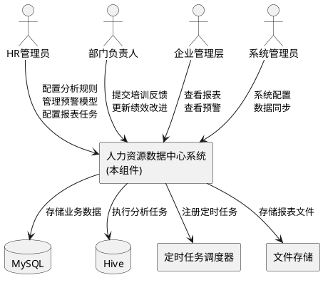
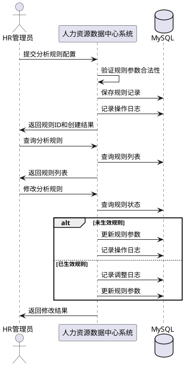
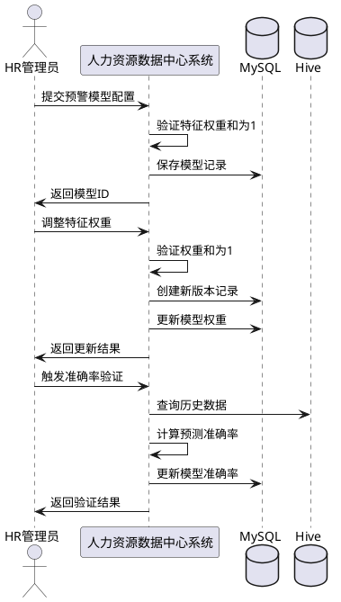
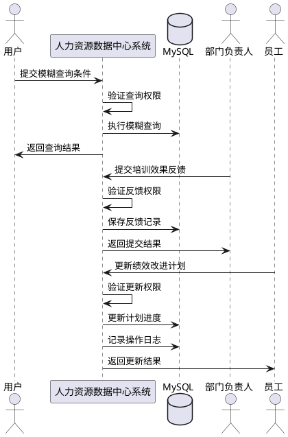

# 人力资源数据中心系统 - 功能补充需求规格

## 1. 组件定位

### 1.1 核心职责

本组件负责补充人力资源数据中心系统中缺失的核心功能模块，包括分析规则管理、预警模型管理、报表定时生成与分享、以及增强的查询反馈功能，实现开题报告要求的完整业务能力。

### 1.2 核心输入

1. **分析规则配置请求**：管理员提交的分析规则参数（流失预警阈值、薪酬竞争力对标标准、培训ROI计算规则等）
2. **预警模型配置请求**：管理员提交的预警模型参数（模型类型、特征权重、验证数据等）
3. **报表定时任务配置**：管理员配置的报表生成周期、分享权限等参数
4. **模糊查询请求**：用户提交的查询条件（部门、岗位、统计周期、员工编号）
5. **培训效果反馈**：部门负责人提交的培训效果反馈数据
6. **绩效改进更新**：用户提交的绩效改进计划执行进度更新

### 1.3 核心输出

1. **分析规则管理结果**：规则创建、修改、删除、查询的响应结果
2. **预警模型管理结果**：模型创建、权重调整、准确率验证的结果
3. **定时报表生成结果**：自动生成的报表文件、分享链接
4. **查询结果**：符合模糊查询条件的人力资源数据列表
5. **反馈提交结果**：培训效果反馈、绩效改进更新的确认结果
6. **规则调整日志**：规则变更的历史记录

### 1.4 职责边界

本组件**不负责**：
- 基础的员工档案CRUD操作（已有EmployeeProfileService实现）
- 八大核心分析功能的具体计算逻辑（已有AnalysisService实现）
- 用户认证和权限验证（已有SecurityConfig实现）
- 数据库连接和事务管理（已有MyBatis配置实现）

---

## 2. 领域术语

**分析规则**
: 定义各维度分析算法的参数配置，包括阈值、权重、计算公式等，用于控制分析结果的生成逻辑。
: 备注：如流失预警阈值、薪酬竞争力对标标准、培训ROI计算规则

**规则生效状态**
: 表示分析规则当前是否应用于实际分析计算的状态，包括"未生效"和"已生效"两种状态。
: 备注：未生效规则可删除/修改，已生效规则仅可查看/记录调整日志

**预警模型**
: 基于历史数据建立的预测模型，用于识别潜在的人力资源风险，如员工流失风险、人才缺口风险等。
: 备注：包含模型类型、特征权重、准确率等属性

**特征权重**
: 预警模型中各影响因素的权重系数，用于计算风险评分。
: 备注：如年龄权重、绩效权重、薪酬权重等

**模型准确率**
: 预警模型预测结果与实际结果的匹配程度，用于评估模型有效性。
: 备注：通过历史数据验证计算得出

**报表定时任务**
: 按照预设周期自动生成报表的后台任务，支持日报、周报、月报等周期。
: 备注：使用Spring Task或Quartz实现

**报表分享链接**
: 具有时效性和权限控制的报表访问链接，允许授权用户查看报表内容。
: 备注：包含访问权限、有效期等属性

**模糊查询**
: 支持部分匹配的查询方式，允许用户使用不完整的条件进行数据检索。
: 备注：支持部门、岗位、统计周期、员工编号等维度

**培训效果反馈**
: 部门负责人对本部门员工培训效果的评估和反馈信息。
: 备注：包含培训满意度、技能提升程度、应用效果等

**绩效改进计划**
: 针对绩效不达标员工制定的改进措施和执行计划。
: 备注：包含改进目标、执行步骤、完成进度等

---

## 3. 角色与边界

### 3.1 核心角色

- **HR管理员**：负责分析规则配置、预警模型管理、报表定时任务配置、全企业数据查看
- **部门负责人**：负责本部门培训效果反馈提交、本部门绩效改进跟踪、本部门数据查看
- **企业管理层**：负责查看分析报表、预警信息，无配置权限
- **系统管理员**：负责用户管理、系统配置、数据同步管理

### 3.2 外部系统

- **MySQL数据库**：存储分析规则、预警模型、报表配置、反馈数据等业务数据
- **Hive数据仓库**：执行大数据分析任务，存储分析结果数据
- **定时任务调度器**：执行报表定时生成任务
- **文件存储系统**：存储生成的报表文件

### 3.3 交互上下文



---

## 4. DFX约束

### 4.1 性能

- 分析规则查询接口响应时间 **必须** 小于 500ms
- 预警模型验证接口响应时间 **必须** 小于 3s（涉及历史数据计算）
- 报表生成任务 **必须** 在 5分钟内完成
- 模糊查询接口响应时间 **必须** 小于 1s
- 系统支持至少 100 个并发用户同时操作

### 4.2 可靠性

- 系统可用性目标 **必须** 达到 99.5%
- 定时任务失败后 **必须** 自动重试 3 次
- 规则调整日志 **必须** 持久化存储，不可丢失
- 预警模型验证结果 **必须** 缓存，避免重复计算

### 4.3 安全性

- 所有配置接口 **必须** 经过JWT认证
- 分析规则修改 **必须** 记录操作日志
- 报表分享链接 **必须** 包含访问权限验证
- 敏感配置参数（如阈值）**必须** 加密存储
- 已生效规则 **禁止** 直接删除，只能查看或记录调整日志

### 4.4 可维护性

- 所有接口 **必须** 返回统一的响应格式
- 定时任务执行状态 **必须** 记录到日志表
- 规则变更 **必须** 记录变更前后值
- 异常场景 **必须** 返回明确的错误码和提示信息

### 4.5 兼容性

- 新增功能 **必须** 兼容现有数据库结构
- API接口变更 **必须** 保持向后兼容
- 报表格式 **必须** 支持Excel和PDF两种格式

---

## 5. 核心能力

### 5.1 分析规则管理

#### 5.1.1 业务规则

1. **规则创建规则**：管理员可以创建新的分析规则，必须指定规则类型、规则名称、规则参数、生效状态。

   a. 验收条件：[管理员提交完整的规则信息] → [系统创建规则记录并返回规则ID]

2. **规则修改规则**：未生效的规则可以修改所有参数，已生效的规则只能修改部分参数并记录调整日志。

   a. 验收条件：[管理员修改未生效规则] → [系统更新规则参数]
   
   b. 验收条件：[管理员修改已生效规则] → [系统记录调整日志并更新参数]

3. **规则删除规则**：只有未生效的规则可以删除，已生效的规则禁止删除。

   a. 验收条件：[管理员删除未生效规则] → [系统删除规则记录]
   
   b. 验收条件：[管理员删除已生效规则] → [系统拒绝删除并提示错误]

4. **规则查询规则**：支持按规则类型、规则名称、生效状态进行查询。

   a. 验收条件：[管理员提交查询条件] → [系统返回符合条件的规则列表]

5. **规则生效状态切换规则**：管理员可以将未生效规则设置为生效，或将已生效规则设置为失效。

   a. 验收条件：[管理员切换规则状态] → [系统更新规则状态并记录操作日志]

6. **Hive任务周期配置规则**：管理员可以配置Hive分析任务的执行周期和数据清洗规则。

   a. 验收条件：[管理员配置任务周期] → [系统更新定时任务配置]

7. **禁止项**：禁止直接删除已生效的规则。

   a. 验收条件：[尝试删除已生效规则] → [系统拒绝操作并返回错误提示]

#### 5.1.2 交互流程



#### 5.1.3 异常场景

1. **规则参数不合法**

   a. 触发条件：[管理员提交的规则参数不符合格式要求或超出取值范围]
   
   b. 系统行为：[系统拒绝创建并返回参数错误提示]
   
   c. 用户感知：[错误码：INVALID_RULE_PARAMS，提示：规则参数不合法，请检查后重新提交]

2. **规则名称重复**

   a. 触发条件：[管理员创建的规则名称已存在]
   
   b. 系统行为：[系统拒绝创建并返回重复提示]
   
   c. 用户感知：[错误码：DUPLICATE_RULE_NAME，提示：规则名称已存在，请使用其他名称]

3. **删除已生效规则**

   a. 触发条件：[管理员尝试删除已生效的分析规则]
   
   b. 系统行为：[系统拒绝删除操作]
   
   c. 用户感知：[错误码：CANNOT_DELETE_ACTIVE_RULE，提示：已生效规则不能删除，请先设置为失效状态]

---

### 5.2 预警模型管理

#### 5.2.1 业务规则

1. **模型创建规则**：管理员可以创建预警模型，必须指定模型类型、模型名称、特征权重、验证数据集。

   a. 验收条件：[管理员提交完整的模型信息] → [系统创建模型记录并返回模型ID]

2. **特征权重调整规则**：管理员可以调整模型中各特征的权重，所有权重之和必须等于1。

   a. 验收条件：[管理员调整权重且权重和为1] → [系统更新模型权重]
   
   b. 验收条件：[管理员调整权重且权重和不等于1] → [系统拒绝更新并提示错误]

3. **模型准确率验证规则**：管理员可以触发模型准确率验证，系统使用历史数据计算预测准确率。

   a. 验收条件：[管理员触发验证] → [系统计算准确率并更新模型记录]

4. **模型版本管理规则**：每次模型参数调整后，系统自动创建新版本，保留历史版本记录。

   a. 验收条件：[管理员修改模型参数] → [系统创建新版本并保留历史版本]

5. **模型查询规则**：支持按模型类型、模型名称、准确率范围进行查询。

   a. 验收条件：[管理员提交查询条件] → [系统返回符合条件的模型列表]

6. **禁止项**：禁止创建特征权重和不为1的模型。

   a. 验收条件：[提交权重和不为1的模型] → [系统拒绝创建并返回错误提示]

#### 5.2.2 交互流程



#### 5.2.3 异常场景

1. **特征权重和不为1**

   a. 触发条件：[管理员提交的特征权重之和不为1]
   
   b. 系统行为：[系统拒绝创建或更新]
   
   c. 用户感知：[错误码：INVALID_WEIGHT_SUM，提示：特征权重之和必须等于1]

2. **验证数据不足**

   a. 触发条件：[历史数据不足以进行准确率验证]
   
   b. 系统行为：[系统返回验证失败提示]
   
   c. 用户感知：[错误码：INSUFFICIENT_DATA，提示：历史数据不足，无法验证模型准确率]

3. **模型类型不支持**

   a. 触发条件：[管理员指定的模型类型不在支持列表中]
   
   b. 系统行为：[系统拒绝创建]
   
   c. 用户感知：[错误码：UNSUPPORTED_MODEL_TYPE，提示：不支持的模型类型]

---

### 5.3 报表定时生成与分享

#### 5.3.1 业务规则

1. **定时任务创建规则**：管理员可以创建报表定时任务，必须指定报表模板、生成周期、执行时间、分享权限。

   a. 验收条件：[管理员提交完整的任务配置] → [系统创建定时任务并返回任务ID]

2. **报表自动生成规则**：定时任务到达执行时间时，系统自动生成报表并存储。

   a. 验收条件：[到达任务执行时间] → [系统自动生成报表并存储到文件系统]

3. **报表分享链接生成规则**：报表生成后，系统自动生成分享链接，链接包含访问权限和有效期。

   a. 验收条件：[报表生成完成] → [系统生成分享链接并返回给管理员]

4. **分享权限验证规则**：用户访问分享链接时，系统验证用户权限和链接有效期。

   a. 验收条件：[授权用户在有效期内访问] → [系统返回报表内容]
   
   b. 验收条件：[无权限用户或链接已过期] → [系统拒绝访问]

5. **任务修改规则**：管理员可以修改定时任务的执行周期、执行时间、分享权限。

   a. 验收条件：[管理员修改任务配置] → [系统更新任务配置]

6. **任务删除规则**：管理员可以删除定时任务，已生成的报表文件不受影响。

   a. 验收条件：[管理员删除任务] → [系统删除任务配置但保留已生成报表]

7. **禁止项**：禁止创建执行周期小于1小时的定时任务。

   a. 验收条件：[提交周期小于1小时的任务] → [系统拒绝创建并返回错误提示]

#### 5.3.2 交互流程

```plantuml
@startuml
actor "HR管理员" as Admin
participant "人力资源数据中心系统" as System
participant "定时任务调度器" as Scheduler
rectangle "文件存储" as FileStorage
database "MySQL" as DB

Admin -> System : 创建报表定时任务
System -> DB : 保存任务配置
System -> Scheduler : 注册定时任务
System -> Admin : 返回任务ID

Scheduler -> System : 触发报表生成
System -> System : 生成报表数据
System -> FileStorage : 存储报表文件
System -> System : 生成分享链接
System -> DB : 记录执行日志

actor "用户" as User
User -> System : 访问分享链接
System -> System : 验证权限和有效期
alt 验证通过
    System -> FileStorage : 读取报表文件
    System -> User : 返回报表内容
else 验证失败
    System -> User : 返回访问拒绝提示
end

@enduml
```

#### 5.3.3 异常场景

1. **报表生成失败**

   a. 触发条件：[报表模板不存在或数据查询失败]
   
   b. 系统行为：[系统记录失败日志并重试]
   
   c. 用户感知：[错误码：REPORT_GENERATION_FAILED，提示：报表生成失败，系统将自动重试]

2. **分享链接过期**

   a. 触发条件：[用户访问已过期的分享链接]
   
   b. 系统行为：[系统拒绝访问]
   
   c. 用户感知：[错误码：LINK_EXPIRED，提示：分享链接已过期，请联系管理员获取新链接]

3. **无访问权限**

   a. 触发条件：[用户角色不在分享权限列表中]
   
   b. 系统行为：[系统拒绝访问]
   
   c. 用户感知：[错误码：NO_PERMISSION，提示：您没有权限访问此报表]

---

### 5.4 增强的查询与反馈功能

#### 5.4.1 业务规则

1. **模糊查询规则**：支持按部门、岗位、统计周期、员工编号进行模糊查询，支持多条件组合查询。

   a. 验收条件：[用户提交查询条件] → [系统返回符合条件的数据列表]

2. **员工编号查询规则**：支持按员工编号进行精确查询和模糊查询。

   a. 验收条件：[用户输入员工编号] → [系统返回该员工的相关数据]

3. **培训效果反馈提交规则**：部门负责人可以提交本部门员工的培训效果反馈，包括培训满意度、技能提升程度、应用效果。

   a. 验收条件：[部门负责人提交反馈] → [系统保存反馈记录并关联培训记录]

4. **绩效改进计划更新规则**：用户可以更新绩效改进计划的执行进度，包括完成状态、完成时间、改进效果。

   a. 验收条件：[用户更新改进计划] → [系统更新计划进度并记录操作日志]

5. **反馈查询规则**：支持查询历史反馈记录，支持按时间范围、员工、培训项目筛选。

   a. 验收条件：[用户提交查询条件] → [系统返回反馈记录列表]

6. **权限控制规则**：部门负责人只能查看和反馈本部门员工的数据，HR管理员可以查看和反馈所有员工的数据。

   a. 验收条件：[部门负责人查询] → [系统返回本部门数据]
   
   b. 验收条件：[HR管理员查询] → [系统返回所有数据]

7. **禁止项**：禁止部门负责人查看或反馈其他部门员工的数据。

   a. 验收条件：[部门负责人尝试访问其他部门数据] → [系统拒绝访问并返回错误提示]

#### 5.4.2 交互流程



#### 5.4.3 异常场景

1. **查询条件不合法**

   a. 触发条件：[用户提交的查询条件包含非法字符或SQL注入风险]
   
   b. 系统行为：[系统拒绝查询并返回安全提示]
   
   c. 用户感知：[错误码：INVALID_QUERY_CONDITION，提示：查询条件不合法，请修改后重试]

2. **无权限访问数据**

   a. 触发条件：[部门负责人尝试访问其他部门员工数据]
   
   b. 系统行为：[系统拒绝访问]
   
   c. 用户感知：[错误码：NO_DATA_PERMISSION，提示：您没有权限访问此数据]

3. **反馈数据不完整**

   a. 触发条件：[用户提交的反馈数据缺少必填字段]
   
   b. 系统行为：[系统拒绝提交]
   
   c. 用户感知：[错误码：INCOMPLETE_FEEDBACK，提示：反馈数据不完整，请填写所有必填项]

---

## 6. 数据约束

### 6.1 分析规则（AnalysisRule）

1. **rule_id**：规则唯一标识，系统自动生成，格式为"RULE_YYYYMMDD_NNNN"
2. **rule_type**：规则类型，取值范围为["TURNOVER_WARNING", "COMPENSATION_BENCHMARK", "TRAINING_ROI", "PERFORMANCE_EVAL", "TALENT_GAP"]
3. **rule_name**：规则名称，长度不超过50字符，不能包含特殊字符
4. **rule_params**：规则参数，JSON格式，包含具体的阈值、权重等参数
5. **is_active**：生效状态，取值为true（已生效）或false（未生效）
6. **created_by**：创建人，关联用户表的user_id
7. **created_time**：创建时间，格式为"YYYY-MM-DD HH:MM:SS"
8. **updated_by**：最后修改人，关联用户表的user_id
9. **updated_time**：最后修改时间，格式为"YYYY-MM-DD HH:MM:SS"

### 6.2 规则调整日志（RuleAdjustmentLog）

1. **log_id**：日志唯一标识，系统自动生成
2. **rule_id**：关联的分析规则ID
3. **adjustment_type**：调整类型，取值范围为["CREATE", "UPDATE", "ACTIVATE", "DEACTIVATE"]
4. **old_value**：调整前的值，JSON格式
5. **new_value**：调整后的值，JSON格式
6. **adjusted_by**：调整人，关联用户表的user_id
7. **adjusted_time**：调整时间，格式为"YYYY-MM-DD HH:MM:SS"
8. **remark**：调整备注，长度不超过200字符

### 6.3 预警模型（WarningModel）

1. **model_id**：模型唯一标识，系统自动生成，格式为"MODEL_YYYYMMDD_NNNN"
2. **model_type**：模型类型，取值范围为["TURNOVER_PREDICTION", "TALENT_GAP", "COST_OVERSPEED"]
3. **model_name**：模型名称，长度不超过50字符
4. **feature_weights**：特征权重，JSON格式，如{"age": 0.2, "performance": 0.3, "salary": 0.5}，所有权重之和必须等于1
5. **accuracy_rate**：准确率，取值范围为0-1，初始值为null
6. **version**：模型版本，格式为"v1.0"、"v1.1"等
7. **is_active**：是否启用，取值为true或false
8. **created_by**：创建人，关联用户表的user_id
9. **created_time**：创建时间，格式为"YYYY-MM-DD HH:MM:SS"

### 6.4 报表定时任务（ReportScheduleTask）

1. **task_id**：任务唯一标识，系统自动生成
2. **template_id**：关联的报表模板ID
3. **task_name**：任务名称，长度不超过50字符
4. **schedule_type**：调度类型，取值范围为["DAILY", "WEEKLY", "MONTHLY"]
5. **execute_time**：执行时间，格式为"HH:MM"（日报）或"DAY HH:MM"（周报/月报）
6. **share_permissions**：分享权限，JSON数组格式，如["HR_ADMIN", "DEPT_HEAD"]
7. **link_expiry_days**：链接有效期天数，取值范围为1-365
8. **is_active**：是否启用，取值为true或false
9. **created_by**：创建人，关联用户表的user_id
10. **created_time**：创建时间，格式为"YYYY-MM-DD HH:MM:SS"

### 6.5 报表分享记录（ReportShareRecord）

1. **share_id**：分享记录唯一标识，系统自动生成
2. **task_id**：关联的定时任务ID
3. **report_file_path**：报表文件存储路径
4. **share_link**：分享链接，包含唯一token
5. **share_permissions**：分享权限，JSON数组格式
6. **expiry_time**：链接过期时间，格式为"YYYY-MM-DD HH:MM:SS"
7. **created_time**：创建时间，格式为"YYYY-MM-DD HH:MM:SS"

### 6.6 培训效果反馈（TrainingFeedback）

1. **feedback_id**：反馈唯一标识，系统自动生成
2. **training_id**：关联的培训记录ID
3. **employee_id**：员工ID
4. **satisfaction_score**：培训满意度评分，取值范围为1-5
5. **skill_improvement**：技能提升程度，取值范围为1-5
6. **application_effect**：应用效果，取值范围为1-5
7. **feedback_content**：反馈内容，长度不超过500字符
8. **feedback_by**：反馈人，关联用户表的user_id
9. **feedback_time**：反馈时间，格式为"YYYY-MM-DD HH:MM:SS"

### 6.7 绩效改进计划（PerformanceImprovementPlan）

1. **plan_id**：计划唯一标识，系统自动生成
2. **employee_id**：员工ID
3. **improvement_goal**：改进目标，长度不超过200字符
4. **action_steps**：执行步骤，JSON数组格式
5. **target_completion_time**：目标完成时间，格式为"YYYY-MM-DD"
6. **current_progress**：当前进度，取值范围为0-100
7. **completion_status**：完成状态，取值范围为["NOT_STARTED", "IN_PROGRESS", "COMPLETED", "DELAYED"]
8. **actual_completion_time**：实际完成时间，格式为"YYYY-MM-DD"，可为null
9. **improvement_effect**：改进效果，长度不超过200字符，可为null
10. **created_by**：创建人，关联用户表的user_id
11. **created_time**：创建时间，格式为"YYYY-MM-DD HH:MM:SS"
12. **updated_by**：最后更新人，关联用户表的user_id
13. **updated_time**：最后更新时间，格式为"YYYY-MM-DD HH:MM:SS"
