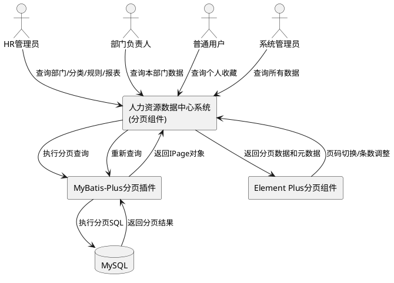
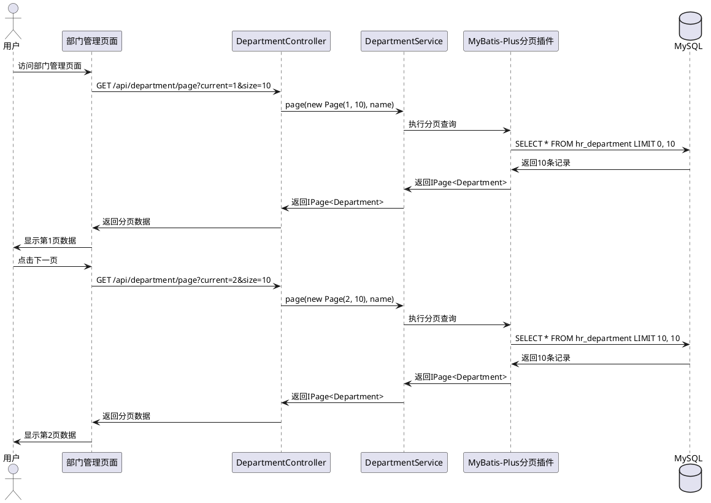
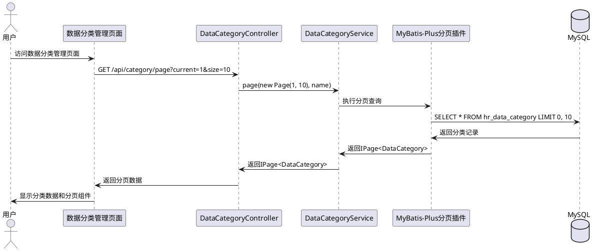
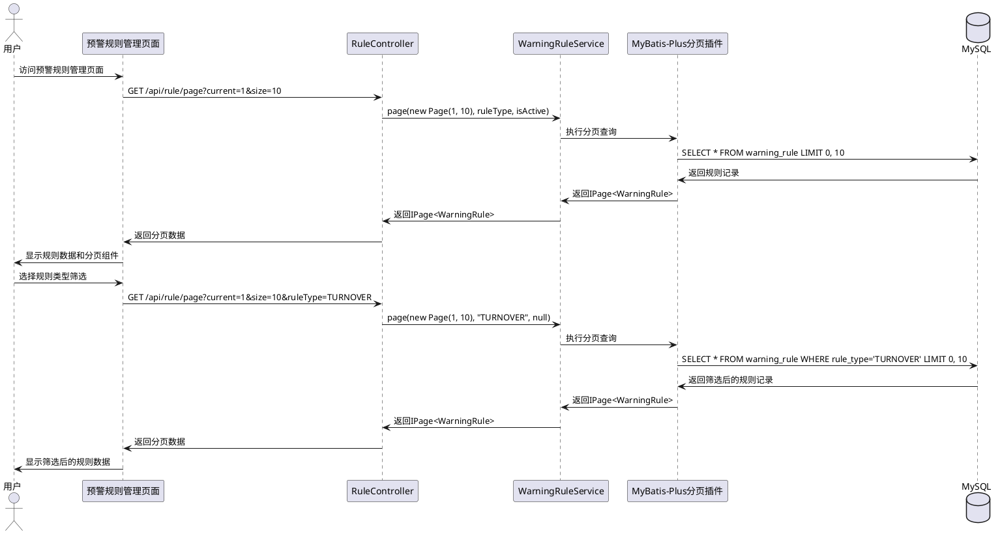
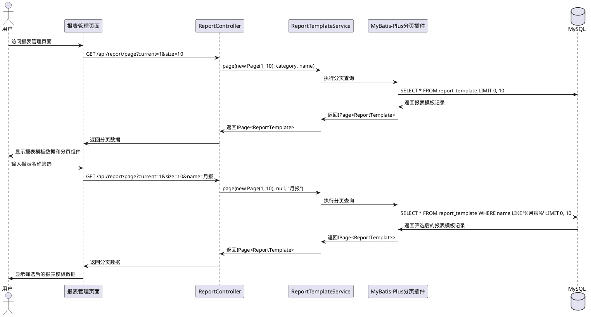
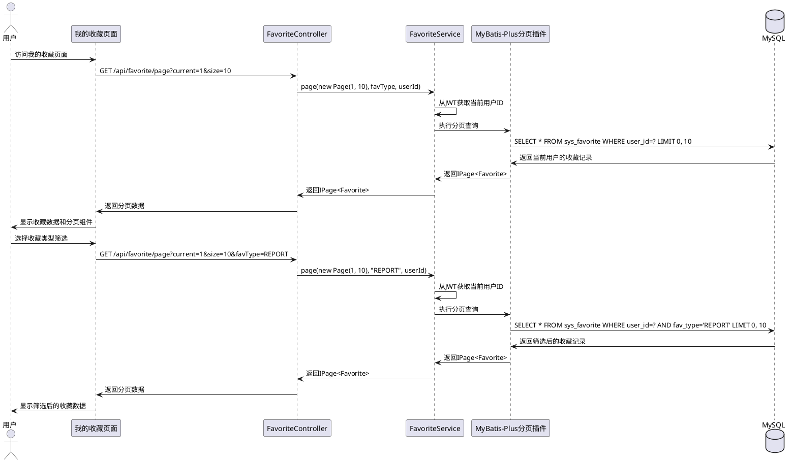

# 分页功能 - 需求规格说明

## 1. 组件定位

### 1.1 核心职责

本组件负责为人力资源数据中心系统中未实现分页功能的数据表提供统一的分页查询能力，确保在数据量增长时系统仍能保持良好的性能和用户体验。

### 1.2 核心输入

1. **分页查询请求**：用户提交的分页参数（页码、每页条数）和筛选条件
2. **页码切换请求**：用户点击分页组件的上一页、下一页、页码等操作
3. **每页条数调整请求**：用户修改每页显示的数据条数

### 1.3 核心输出

1. **分页数据列表**：当前页的数据记录集合
2. **分页元数据**：总记录数、总页数、当前页码、每页条数
3. **分页组件渲染**：前端分页控件的状态和交互反馈

### 1.4 职责边界

本组件**不负责**：
- 数据的增删改操作（由各自的Service层负责）
- 数据的筛选和排序逻辑（由QueryWrapper构建）
- 前端页面布局和样式（由Vue组件负责）
- 权限验证（由Spring Security负责）

---

## 2. 领域术语

**分页查询**
: 将大量数据按照指定的页码和每页条数分割成多个页面的查询方式。
: 备注：支持按页码跳转、每页条数调整、上一页/下一页导航

**分页参数**
: 用于控制分页行为的参数，包括current（当前页码）和size（每页条数）。
: 备注：current从1开始，size默认值为10，最大值为100

**IPage**
: MyBatis-Plus提供的分页结果封装类，包含records（数据列表）、total（总记录数）、size（每页条数）、current（当前页）、pages（总页数）。
: 备注：标准分页响应格式

**数据库分页**
: 通过SQL的LIMIT和OFFSET语句在数据库层面实现分页，避免加载全部数据到内存。
: 备注：性能优于内存分页

**筛选条件**
: 用于过滤数据的查询条件，如部门名称、规则类型等。
: 备注：分页查询支持可选的筛选条件

---

## 3. 角色与边界

### 3.1 核心角色

- **HR管理员**：查看和分页浏览所有部门、数据分类、预警规则、报表模板
- **部门负责人**：查看和分页浏览本部门相关的数据
- **普通用户**：查看和分页浏览个人收藏数据
- **系统管理员**：查看和分页浏览所有数据

### 3.2 外部系统

- **MySQL数据库**：提供分页查询的数据源
- **MyBatis-Plus分页插件**：拦截SQL并自动添加分页语句
- **前端分页组件**：Element Plus的el-pagination组件

### 3.3 交互上下文



---

## 4. DFX约束

### 4.1 性能

- 分页查询响应时间 **必须** 小于 1秒（数据量<10000条）
- 分页查询 **必须** 使用数据库分页而非内存分页
- 每页最大条数 **必须** 限制为100，防止一次性加载过多数据

### 4.2 可靠性

- 分页参数 **必须** 进行边界校验，防止页码越界
- 当请求的页码超过总页数时，系统 **必须** 返回最后一页数据
- 当请求的页码小于1时，系统 **必须** 返回第1页数据

### 4.3 安全性

- 分页参数 **必须** 验证为正整数，防止SQL注入
- 所有分页接口 **必须** 经过JWT认证
- 收藏数据分页 **必须** 按用户ID过滤，用户只能查看自己的收藏

### 4.4 可维护性

- 所有分页接口 **必须** 使用统一的参数命名（current, size）
- 所有分页响应 **必须** 使用MyBatis-Plus的IPage标准格式
- 分页接口路径命名 **必须** 统一为`/api/{entity}/page`

### 4.5 兼容性

- 新增的分页接口 **必须** 保留原有的`/list`接口
- 前端调用分页接口时，分页参数 **必须** 为可选参数
- 分页功能 **必须** 兼容现有的筛选条件

---

## 5. 核心能力

### 5.1 部门表分页功能

#### 5.1.1 业务规则

1. **分页查询规则**：支持按部门名称进行筛选的分页查询，返回部门列表和分页元数据。

   a. 验收条件：[用户访问部门管理页面] → [系统默认显示第1页，每页10条记录]

2. **页码切换规则**：用户可以点击上一页、下一页、页码进行页码切换。

   a. 验收条件：[用户点击下一页按钮] → [系统加载并显示下一页的部门数据]

3. **每页条数调整规则**：用户可以修改每页显示的条数，系统重新加载数据。

   a. 验收条件：[用户修改每页条数为20] → [系统重新加载数据并按每页20条显示]

4. **筛选条件规则**：支持按部门名称进行模糊查询筛选。

   a. 验收条件：[用户输入部门名称"技术"] → [系统返回名称包含"技术"的部门列表]

5. **禁止项**：禁止请求页码超过总页数时返回空数据。

   a. 验收条件：[用户请求页码超过总页数] → [系统返回最后一页数据]

#### 5.1.2 交互流程



#### 5.1.3 异常场景

1. **页码越界**

   a. 触发条件：[用户请求的页码超过总页数]

   b. 系统行为：[系统返回最后一页数据]

   c. 用户感知：[分页组件自动调整到最后一页]

2. **每页条数超出限制**

   a. 触发条件：[用户请求每页条数大于100]

   b. 系统行为：[系统自动调整为100]

   c. 用户感知：[分页组件显示每页100条]

3. **部门名称包含特殊字符**

   a. 触发条件：[用户输入的部门名称包含SQL注入字符]

   b. 系统行为：[MyBatis-Plus自动转义，安全执行查询]

   c. 用户感知：[正常返回查询结果]

---

### 5.2 数据分类表分页功能

#### 5.2.1 业务规则

1. **分页查询规则**：支持按分类名称进行筛选的分页查询，返回分类列表和分页元数据。

   a. 验收条件：[用户访问数据分类管理页面] → [系统默认显示第1页，每页10条记录]

2. **数据量较小场景规则**：当分类数据量小于等于10条时，分页组件仍需显示。

   a. 验收条件：[分类数据量为8条] → [系统显示分页组件，总记录数为8]

3. **筛选条件规则**：支持按分类名称进行模糊查询筛选。

   a. 验收条件：[用户输入分类名称"薪酬"] → [系统返回名称包含"薪酬"的分类列表]

#### 5.2.2 交互流程



#### 5.2.3 异常场景

1. **分类数据为空**

   a. 触发条件：[数据库中不存在任何分类数据]

   b. 系统行为：[系统返回空列表，total为0]

   c. 用户感知：[显示"暂无数据"提示]

---

### 5.3 预警规则表分页功能

#### 5.3.1 业务规则

1. **分页查询规则**：支持按规则类型进行筛选的分页查询，返回规则列表和分页元数据。

   a. 验收条件：[用户访问预警规则管理页面] → [系统默认显示第1页，每页10条记录]

2. **规则类型筛选规则**：支持按规则类型（流失预警、薪酬竞争力等）进行筛选。

   a. 验收条件：[用户选择规则类型"流失预警"] → [系统返回该类型的规则列表]

3. **生效状态筛选规则**：支持按规则生效状态（已生效、未生效）进行筛选。

   a. 验收条件：[用户选择生效状态"已生效"] → [系统返回已生效的规则列表]

#### 5.3.2 交互流程



#### 5.3.3 异常场景

1. **规则类型不存在**

   a. 触发条件：[用户选择的规则类型不在预定义列表中]

   b. 系统行为：[系统返回空列表，total为0]

   c. 用户感知：[显示"暂无数据"提示]

---

### 5.4 报表模板表分页功能

#### 5.4.1 业务规则

1. **分页查询规则**：支持按报表分类和报表名称进行筛选的分页查询，返回报表模板列表和分页元数据。

   a. 验收条件：[用户访问报表管理页面] → [系统默认显示第1页，每页10条记录]

2. **报表分类筛选规则**：支持按报表分类进行筛选。

   a. 验收条件：[用户选择报表分类"薪酬分析"] → [系统返回该分类的报表模板]

3. **报表名称筛选规则**：支持按报表名称进行模糊查询。

   a. 验收条件：[用户输入报表名称"月报"] → [系统返回名称包含"月报"的报表模板]

4. **总记录数显示规则**：分页组件必须显示总记录数和总页数。

   a. 验收条件：[报表模板数量超过当前页容量] → [分页组件显示"共X条 Y页"]

#### 5.4.2 交互流程



#### 5.4.3 异常场景

1. **报表名称包含特殊字符**

   a. 触发条件：[用户输入的报表名称包含SQL注入字符]

   b. 系统行为：[MyBatis-Plus自动转义，安全执行查询]

   c. 用户感知：[正常返回查询结果]

---

### 5.5 收藏表分页功能

#### 5.5.1 业务规则

1. **分页查询规则**：支持按收藏类型进行筛选的分页查询，返回收藏列表和分页元数据，必须按用户ID过滤。

   a. 验收条件：[用户访问我的收藏页面] → [系统默认显示第1页，每页10条记录]

2. **用户数据隔离规则**：用户只能查看自己的收藏数据，系统自动按当前登录用户ID过滤。

   a. 验收条件：[用户A访问收藏页面] → [系统只返回用户A的收藏数据]

3. **收藏类型筛选规则**：支持按收藏类型（报表、数据分析等）进行筛选。

   a. 验收条件：[用户选择收藏类型"报表"] → [系统返回报表类型的收藏]

4. **数据量增长场景规则**：随着用户数量增长，收藏数据量会持续增长，分页功能必须保证性能。

   a. 验收条件：[用户收藏数量超过100条] → [系统仍能在1秒内返回分页结果]

#### 5.5.2 交互流程



#### 5.5.3 异常场景

1. **用户未登录**

   a. 触发条件：[未登录用户访问收藏页面]

   b. 系统行为：[系统返回401未授权错误]

   c. 用户感知：[跳转到登录页面]

2. **收藏数据为空**

   a. 触发条件：[当前用户没有任何收藏数据]

   b. 系统行为：[系统返回空列表，total为0]

   c. 用户感知：[显示"暂无收藏"提示]

---

## 6. 数据约束

### 6.1 分页请求参数

1. **current**：当前页码，必须为正整数，默认值为1
2. **size**：每页条数，必须为正整数，默认值为10，最大值为100
3. **name**：名称筛选条件，字符串类型，可选参数，支持模糊查询
4. **ruleType**：规则类型筛选条件，字符串类型，可选参数
5. **isActive**：生效状态筛选条件，布尔类型，可选参数
6. **category**：报表分类筛选条件，字符串类型，可选参数
7. **favType**：收藏类型筛选条件，字符串类型，可选参数

### 6.2 分页响应格式

```json
{
  "code": 200,
  "message": "success",
  "data": {
    "records": [],      // 当前页数据列表
    "total": 0,         // 总记录数
    "size": 10,         // 每页条数
    "current": 1,       // 当前页码
    "pages": 0          // 总页数
  }
}
```

### 6.3 数据量评估

| 表名 | 当前数据量 | 预估年增长 | 优先级 |
|------|-----------|-----------|--------|
| hr_department | 17条 | <10条 | 中 |
| hr_data_category | 8条 | <5条 | 低 |
| warning_rule | 10条 | ~20条 | 中 |
| report_template | 10条 | ~30条 | 中 |
| sys_favorite | 12条 | 随用户增长 | 高 |

---

## 7. 接口需求

### 7.1 后端API接口

#### 7.1.1 部门分页查询

- **接口路径**：`GET /api/department/page`
- **请求参数**：
  - `current`：当前页码，默认值1
  - `size`：每页条数，默认值10
  - `name`：部门名称，可选
- **响应格式**：`IPage<Department>`
- **权限要求**：`hasRole('HR_ADMIN')`

#### 7.1.2 数据分类分页查询

- **接口路径**：`GET /api/category/page`
- **请求参数**：
  - `current`：当前页码，默认值1
  - `size`：每页条数，默认值10
  - `name`：分类名称，可选
- **响应格式**：`IPage<DataCategory>`
- **权限要求**：`hasRole('HR_ADMIN')`

#### 7.1.3 预警规则分页查询

- **接口路径**：`GET /api/rule/page`
- **请求参数**：
  - `current`：当前页码，默认值1
  - `size`：每页条数，默认值10
  - `ruleType`：规则类型，可选
  - `isActive`：生效状态，可选
- **响应格式**：`IPage<WarningRule>`
- **权限要求**：`hasRole('HR_ADMIN')`

#### 7.1.4 报表模板分页查询

- **接口路径**：`GET /api/report/page`
- **请求参数**：
  - `current`：当前页码，默认值1
  - `size`：每页条数，默认值10
  - `category`：报表分类，可选
  - `name`：报表名称，可选
- **响应格式**：`IPage<ReportTemplate>`
- **权限要求**：`hasRole('HR_ADMIN')`

#### 7.1.5 收藏分页查询

- **接口路径**：`GET /api/favorite/page`
- **请求参数**：
  - `current`：当前页码，默认值1
  - `size`：每页条数，默认值10
  - `favType`：收藏类型，可选
- **响应格式**：`IPage<Favorite>`
- **权限要求**：已登录用户（自动按用户ID过滤）

### 7.2 前端组件需求

#### 7.2.1 分页组件配置

- **组件类型**：Element Plus的`el-pagination`组件
- **显示内容**：总条数、页码、每页条数选择器
- **支持功能**：页码快速跳转、上一页/下一页导航
- **布局配置**：`total, sizes, prev, pager, next, jumper`
- **每页条数选项**：[10, 20, 50, 100]

#### 7.2.2 分页数据绑定

- **双向绑定**：`v-model:current-page="page.current"`
- **双向绑定**：`v-model:page-size="page.size"`
- **事件监听**：`@current-change="load"`、`@size-change="load"`

---

## 8. 约束条件

### 8.1 技术约束

- **必须**使用MyBatis-Plus的分页插件（已集成）
- **必须**使用Element Plus的分页组件
- **禁止**修改现有已实现分页的接口
- **禁止**使用内存分页（必须使用数据库分页）

### 8.2 业务约束

- 部门表支持树形结构展示，分页查询需考虑是否需要树形分页
- 收藏表必须按用户ID过滤，确保数据隔离
- 预警规则需支持按生效状态筛选
- 每页最大条数限制为100，防止性能问题

### 8.3 安全约束

- 分页参数必须进行边界校验，防止页码越界
- 分页参数必须验证为正整数，防止SQL注入
- 用户只能查看自己的收藏数据
- 所有分页接口必须经过JWT认证

---

## 9. 验收标准

### 9.1 功能验收

- [ ] 部门表实现了分页查询功能
- [ ] 数据分类表实现了分页查询功能
- [ ] 预警规则表实现了分页查询功能
- [ ] 报表模板表实现了分页查询功能
- [ ] 收藏表实现了分页查询功能
- [ ] 分页参数和响应格式符合规范
- [ ] 前端分页组件正常工作
- [ ] 翻页、跳页、修改每页条数功能正常

### 9.2 性能验收

- [ ] 分页查询响应时间<1秒（数据量<10000）
- [ ] 使用数据库分页而非内存分页
- [ ] 分页查询SQL执行计划合理（使用索引）

### 9.3 兼容性验收

- [ ] 原有list接口仍然可用
- [ ] 现有功能未受影响
- [ ] 前后端接口对接正确

### 9.4 安全验收

- [ ] 分页参数边界校验正常
- [ ] SQL注入防护有效
- [ ] 收藏数据用户隔离正常
- [ ] JWT认证正常

---

## 10. 依赖关系

### 10.1 前置依赖

- MyBatis-Plus分页插件已配置（已完成）
- Element Plus组件库已集成（已完成）
- JWT认证机制已实现（已完成）

### 10.2 后续影响

- 数据量增长后可能需要添加索引优化查询性能
- 可能需要实现缓存机制提升高频查询性能
- 可能需要实现分页参数持久化（记住用户选择的每页条数）

---

## 11. 风险评估

| 风险项 | 风险等级 | 影响范围 | 缓解措施 |
|--------|---------|---------|---------|
| 现有功能受影响 | 低 | 已有页面 | 保留原list接口，充分测试 |
| 性能下降 | 低 | 所有分页查询 | 使用数据库分页，添加索引 |
| 前后端对接错误 | 中 | 新增接口 | 统一接口规范，编写接口文档 |
| 数据不一致 | 低 | 分页数据 | 使用事务，添加数据校验 |
| 分页参数越界 | 中 | 所有分页查询 | 添加边界校验逻辑 |
| 收藏数据泄露 | 高 | 收藏表 | 严格按用户ID过滤，充分测试 |

---

## 12. 附录

### 12.1 参考文档

- MyBatis-Plus分页插件文档：https://baomidou.com/pages/97710a/
- Element Plus分页组件文档：https://element-plus.org/zh-CN/component/pagination.html
- 项目README.md：`d:/HrDataCenter/README.md`

### 12.2 相关代码文件

**后端Controller：**
- `DepartmentController.java`
- `DataCategoryController.java`
- `RuleController.java`
- `ReportController.java`
- `FavoriteController.java`

**后端Service：**
- `DepartmentService.java`
- `DataCategoryService.java`
- `WarningRuleService.java`
- `ReportTemplateService.java`
- `FavoriteService.java`

**前端View：**
- `DepartmentManagementView.vue`
- `CategoryManagementView.vue`
- `RuleManagementView.vue`
- `ReportManagementView.vue`
- `MyFavoritesView.vue`

### 12.3 已实现分页的参考示例

**用户管理分页接口（UserAdminController.java）：**
```java
@GetMapping
public Response<IPage<User>> page(
    @RequestParam(defaultValue = "1") long current,
    @RequestParam(defaultValue = "10") long size,
    @RequestParam(required = false) String username,
    @RequestParam(required = false) String name,
    @RequestParam(required = false) String role) {
    IPage<User> page = userService.page(new Page<>(current, size), username, name, role);
    page.getRecords().forEach(u -> u.setPassword(null));
    return Response.success(page);
}
```

**前端分页组件示例（UserManagementView.vue）：**
```vue
<el-pagination
  v-model:current-page="page.current"
  v-model:page-size="page.size"
  :total="page.total"
  layout="total, prev, pager, next"
  @current-change="load"
  style="margin-top: 16px"
/>
```

### 12.4 EARS格式说明

本需求规格说明采用EARS（Easy Approach to Requirements Syntax）格式，主要使用以下模式：

- **When-Then-The system shall-So that**：描述系统在特定条件下的行为和目的
- **验收条件**：使用 `[条件] → [结果]` 格式描述可验证的验收标准
- **异常场景**：使用 `触发条件`、`系统行为`、`用户感知` 三段式描述异常处理

---

**文档版本**：v1.0
**创建日期**：2025-03-25
**最后更新**：2025-03-25
**作者**：SDD Agent
