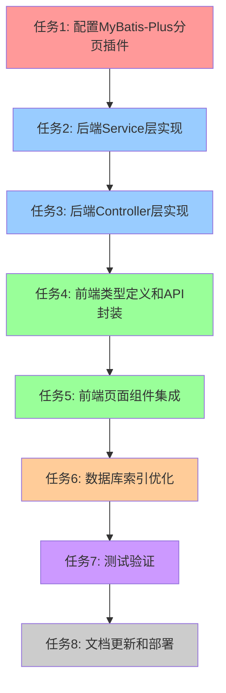

# 分页功能 - 编码任务文档

## 任务概述

本文档将分页功能的设计方案拆解为可执行的编码任务，涵盖后端开发、前端开发和测试验证三个主要部分。所有任务按照依赖关系和优先级组织，确保开发过程高效有序。

**任务统计：**
- 主任务数：8个
- 子任务数：23个
- 覆盖需求：5个核心分页功能 + 通用基础设施

---

## 任务依赖图



---

## 任务1：配置MyBatis-Plus分页插件

### 任务描述

配置MyBatis-Plus分页插件，为后续的分页查询提供基础支持。这是整个分页功能的基础设施，必须最先完成。

### 输入

- 项目技术栈：Spring Boot 2.7.18 + MyBatis-Plus 3.5.5
- 数据库类型：MySQL 8.0.33
- 分页插件配置要求：最大每页条数100，页码越界不自动跳转

### 输出

- `MybatisPlusConfig.java` 配置类
- 分页插件Bean定义

### 验收标准

- [ ] MyBatis-Plus配置类已创建
- [ ] 分页插件Bean已正确注册到Spring容器
- [ ] 分页插件配置了MySQL数据库类型
- [ ] 分页插件设置了最大每页条数限制为100
- [ ] 分页插件设置了页码越界处理策略

### 子任务

#### 1.1 创建MyBatis-Plus配置类

**任务描述：** 在 `com.hr.backend.config` 包下创建 `MybatisPlusConfig` 配置类。

**输入：** Spring Boot配置类规范

**输出：** `MybatisPlusConfig.java` 文件

**验收标准：**
- [ ] 配置类添加了 `@Configuration` 注解
- [ ] 配置类位于正确的包路径下

**代码生成提示：**
```java
package com.hr.backend.config;

import com.baomidou.mybatisplus.annotation.DbType;
import com.baomidou.mybatisplus.extension.plugins.MybatisPlusInterceptor;
import com.baomidou.mybatisplus.extension.plugins.inner.PaginationInnerInterceptor;
import org.springframework.context.annotation.Bean;
import org.springframework.context.annotation.Configuration;

@Configuration
public class MybatisPlusConfig {
    // 在这里实现分页插件配置
}
```

#### 1.2 配置分页插件Bean

**任务描述：** 在配置类中创建 `mybatisPlusInterceptor` Bean，配置分页插件参数。

**输入：** MyBatis-Plus分页插件API文档

**输出：** 完整的分页插件配置方法

**验收标准：**
- [ ] 方法添加了 `@Bean` 注解
- [ ] 创建了 `MybatisPlusInterceptor` 实例
- [ ] 添加了 `PaginationInnerInterceptor` 拦截器
- [ ] 设置了数据库类型为 `DbType.MYSQL`
- [ ] 设置了 `setOverflow(false)`
- [ ] 设置了 `setMaxLimit(100L)`

**代码生成提示：**
```java
@Bean
public MybatisPlusInterceptor mybatisPlusInterceptor() {
    MybatisPlusInterceptor interceptor = new MybatisPlusInterceptor();
    PaginationInnerInterceptor paginationInterceptor = new PaginationInnerInterceptor(DbType.MYSQL);
    paginationInterceptor.setOverflow(false);
    paginationInterceptor.setMaxLimit(100L);
    interceptor.addInnerInterceptor(paginationInterceptor);
    return interceptor;
}
```

#### 1.3 验证分页插件配置

**任务描述：** 启动应用，验证分页插件是否正确加载。

**输入：** 应用启动日志

**输出：** 应用成功启动，分页插件正常工作

**验收标准：**
- [ ] 应用成功启动，没有报错
- [ ] 日志中显示MyBatis-Plus插件加载成功
- [ ] 可以正常调用现有分页接口（如用户管理）

---

## 任务2：后端Service层实现

### 任务描述

为5个实体类（Department、DataCategory、WarningRule、ReportTemplate、Favorite）的Service层添加分页查询方法。

### 输入

- MyBatis-Plus分页插件已配置
- 现有Service接口和实现类
- 分页查询需求（筛选条件、排序规则）

### 输出

- 5个Service接口的新增分页方法
- 5个Service实现类的分页方法实现

### 验收标准

- [ ] 所有Service接口都添加了分页方法声明
- [ ] 所有Service实现类都实现了分页方法
- [ ] 分页方法使用 `LambdaQueryWrapper` 构建查询条件
- [ ] 分页方法支持可选的筛选条件
- [ ] 分页方法有适当的排序逻辑
- [ ] 收藏Service实现了用户数据隔离

### 子任务

#### 2.1 实现DepartmentService分页方法

**任务描述：** 在 `DepartmentService` 接口和实现类中添加分页查询方法。

**输入：** Department实体类，分页查询需求

**输出：**
- `DepartmentService.page(Page<Department> page, String name)` 方法声明
- `DepartmentServiceImpl.page(Page<Department> page, String name)` 方法实现

**验收标准：**
- [ ] 接口方法签名正确
- [ ] 实现方法使用 `LambdaQueryWrapper` 构建查询
- [ ] 支持按部门名称模糊查询
- [ ] 按ID升序排序
- [ ] 方法有完整的Javadoc注释

**代码生成提示：**
```java
// 接口方法
IPage<Department> page(Page<Department> page, String name);

// 实现方法
@Override
public IPage<Department> page(Page<Department> page, String name) {
    LambdaQueryWrapper<Department> wrapper = new LambdaQueryWrapper<>();
    if (StringUtils.isNotBlank(name)) {
        wrapper.like(Department::getName, name);
    }
    wrapper.orderByAsc(Department::getId);
    return this.page(page, wrapper);
}
```

#### 2.2 实现DataCategoryService分页方法

**任务描述：** 在 `DataCategoryService` 接口和实现类中添加分页查询方法。

**输入：** DataCategory实体类，分页查询需求

**输出：**
- `DataCategoryService.page(Page<DataCategory> page, String name)` 方法声明
- `DataCategoryServiceImpl.page(Page<DataCategory> page, String name)` 方法实现

**验收标准：**
- [ ] 接口方法签名正确
- [ ] 实现方法使用 `LambdaQueryWrapper` 构建查询
- [ ] 支持按分类名称模糊查询
- [ ] 按ID升序排序
- [ ] 方法有完整的Javadoc注释

**代码生成提示：**
```java
// 接口方法
IPage<DataCategory> page(Page<DataCategory> page, String name);

// 实现方法
@Override
public IPage<DataCategory> page(Page<DataCategory> page, String name) {
    LambdaQueryWrapper<DataCategory> wrapper = new LambdaQueryWrapper<>();
    if (StringUtils.isNotBlank(name)) {
        wrapper.like(DataCategory::getName, name);
    }
    wrapper.orderByAsc(DataCategory::getId);
    return this.page(page, wrapper);
}
```

#### 2.3 实现WarningRuleService分页方法

**任务描述：** 在 `WarningRuleService` 接口和实现类中添加分页查询方法。

**输入：** WarningRule实体类，分页查询需求

**输出：**
- `WarningRuleService.page(Page<WarningRule> page, String ruleType, Boolean isActive)` 方法声明
- `WarningRuleServiceImpl.page(Page<WarningRule> page, String ruleType, Boolean isActive)` 方法实现

**验收标准：**
- [ ] 接口方法签名正确
- [ ] 实现方法使用 `LambdaQueryWrapper` 构建查询
- [ ] 支持按规则类型精确查询
- [ ] 支持按生效状态精确查询
- [ ] 按创建时间降序排序
- [ ] 方法有完整的Javadoc注释

**代码生成提示：**
```java
// 接口方法
IPage<WarningRule> page(Page<WarningRule> page, String ruleType, Boolean isActive);

// 实现方法
@Override
public IPage<WarningRule> page(Page<WarningRule> page, String ruleType, Boolean isActive) {
    LambdaQueryWrapper<WarningRule> wrapper = new LambdaQueryWrapper<>();
    if (StringUtils.isNotBlank(ruleType)) {
        wrapper.eq(WarningRule::getRuleType, ruleType);
    }
    if (isActive != null) {
        wrapper.eq(WarningRule::getIsActive, isActive);
    }
    wrapper.orderByDesc(WarningRule::getCreatedTime);
    return this.page(page, wrapper);
}
```

#### 2.4 实现ReportTemplateService分页方法

**任务描述：** 在 `ReportTemplateService` 接口和实现类中添加分页查询方法。

**输入：** ReportTemplate实体类，分页查询需求

**输出：**
- `ReportTemplateService.page(Page<ReportTemplate> page, String category, String name)` 方法声明
- `ReportTemplateServiceImpl.page(Page<ReportTemplate> page, String category, String name)` 方法实现

**验收标准：**
- [ ] 接口方法签名正确
- [ ] 实现方法使用 `LambdaQueryWrapper` 构建查询
- [ ] 支持按报表分类精确查询
- [ ] 支持按报表名称模糊查询
- [ ] 按创建时间降序排序
- [ ] 方法有完整的Javadoc注释

**代码生成提示：**
```java
// 接口方法
IPage<ReportTemplate> page(Page<ReportTemplate> page, String category, String name);

// 实现方法
@Override
public IPage<ReportTemplate> page(Page<ReportTemplate> page, String category, String name) {
    LambdaQueryWrapper<ReportTemplate> wrapper = new LambdaQueryWrapper<>();
    if (StringUtils.isNotBlank(category)) {
        wrapper.eq(ReportTemplate::getCategory, category);
    }
    if (StringUtils.isNotBlank(name)) {
        wrapper.like(ReportTemplate::getName, name);
    }
    wrapper.orderByDesc(ReportTemplate::getCreatedTime);
    return this.page(page, wrapper);
}
```

#### 2.5 实现FavoriteService分页方法

**任务描述：** 在 `FavoriteService` 接口和实现类中添加分页查询方法，实现用户数据隔离。

**输入：** Favorite实体类，分页查询需求

**输出：**
- `FavoriteService.pageByUser(Page<Favorite> page, Long userId, String favType)` 方法声明
- `FavoriteServiceImpl.pageByUser(Page<Favorite> page, Long userId, String favType)` 方法实现

**验收标准：**
- [ ] 接口方法签名正确
- [ ] 实现方法使用 `LambdaQueryWrapper` 构建查询
- [ ] 必须按用户ID过滤（数据隔离）
- [ ] 支持按收藏类型精确查询
- [ ] 按创建时间降序排序
- [ ] 方法有完整的Javadoc注释

**代码生成提示：**
```java
// 接口方法
IPage<Favorite> pageByUser(Page<Favorite> page, Long userId, String favType);

// 实现方法
@Override
public IPage<Favorite> pageByUser(Page<Favorite> page, Long userId, String favType) {
    LambdaQueryWrapper<Favorite> wrapper = new LambdaQueryWrapper<>();
    wrapper.eq(Favorite::getUserId, userId); // 必须按用户ID过滤
    if (StringUtils.isNotBlank(favType)) {
        wrapper.eq(Favorite::getFavType, favType);
    }
    wrapper.orderByDesc(Favorite::getCreatedTime);
    return this.page(page, wrapper);
}
```

---

## 任务3：后端Controller层实现

### 任务描述

为5个Controller类添加分页查询接口，处理HTTP请求，调用Service层方法，返回分页结果。

### 输入

- 已实现的Service层分页方法
- 现有Controller类
- 接口设计规范

### 输出

- 5个Controller类的分页查询接口

### 验收标准

- [ ] 所有Controller都添加了分页查询接口
- [ ] 接口路径符合规范（`/api/{entity}/page`）
- [ ] 接口方法使用 `@GetMapping` 注解
- [ ] 接口参数使用 `@RequestParam` 注解，设置了默认值
- [ ] 接口返回类型为 `Response<IPage<T>>`
- [ ] 接口添加了适当的权限注解
- [ ] 保留了原有的 `list` 接口（向后兼容）
- [ ] FavoriteController从JWT获取用户ID

### 子任务

#### 3.1 实现DepartmentController分页接口

**任务描述：** 在 `DepartmentController` 中添加分页查询接口。

**输入：** DepartmentService分页方法，接口设计规范

**输出：** `DepartmentController.page()` 方法

**验收标准：**
- [ ] 接口路径为 `GET /api/department/page`
- [ ] 参数包括 `current`（默认1）、`size`（默认10）、`name`（可选）
- [ ] 参数类型为 `Long`，使用 `@RequestParam` 注解
- [ ] 返回类型为 `Response<IPage<Department>>`
- [ ] 添加了 `@PreAuthorize("hasRole('HR_ADMIN')")` 权限注解
- [ ] 保留了原有的 `/list` 接口
- [ ] 方法有完整的Javadoc注释

**代码生成提示：**
```java
@GetMapping("/page")
public Response<IPage<Department>> page(
        @RequestParam(defaultValue = "1") Long current,
        @RequestParam(defaultValue = "10") Long size,
        @RequestParam(required = false) String name) {
    Page<Department> page = new Page<>(current, size);
    IPage<Department> result = departmentService.page(page, name);
    return Response.success(result);
}
```

#### 3.2 实现DataCategoryController分页接口

**任务描述：** 在 `DataCategoryController` 中添加分页查询接口。

**输入：** DataCategoryService分页方法，接口设计规范

**输出：** `DataCategoryController.page()` 方法

**验收标准：**
- [ ] 接口路径为 `GET /api/category/page`
- [ ] 参数包括 `current`（默认1）、`size`（默认10）、`name`（可选）
- [ ] 参数类型为 `Long`，使用 `@RequestParam` 注解
- [ ] 返回类型为 `Response<IPage<DataCategory>>`
- [ ] 添加了 `@PreAuthorize("hasRole('HR_ADMIN')")` 权限注解
- [ ] 保留了原有的 `/list` 接口
- [ ] 方法有完整的Javadoc注释

**代码生成提示：**
```java
@GetMapping("/page")
public Response<IPage<DataCategory>> page(
        @RequestParam(defaultValue = "1") Long current,
        @RequestParam(defaultValue = "10") Long size,
        @RequestParam(required = false) String name) {
    Page<DataCategory> page = new Page<>(current, size);
    IPage<DataCategory> result = dataCategoryService.page(page, name);
    return Response.success(result);
}
```

#### 3.3 实现RuleController分页接口

**任务描述：** 在 `RuleController` 中添加分页查询接口。

**输入：** WarningRuleService分页方法，接口设计规范

**输出：** `RuleController.page()` 方法

**验收标准：**
- [ ] 接口路径为 `GET /api/rule/page`
- [ ] 参数包括 `current`（默认1）、`size`（默认10）、`ruleType`（可选）、`isActive`（可选）
- [ ] 参数类型正确，使用 `@RequestParam` 注解
- [ ] 返回类型为 `Response<IPage<WarningRule>>`
- [ ] 添加了 `@PreAuthorize("hasRole('HR_ADMIN')")` 权限注解
- [ ] 方法有完整的Javadoc注释

**代码生成提示：**
```java
@GetMapping("/page")
public Response<IPage<WarningRule>> page(
        @RequestParam(defaultValue = "1") Long current,
        @RequestParam(defaultValue = "10") Long size,
        @RequestParam(required = false) String ruleType,
        @RequestParam(required = false) Boolean isActive) {
    Page<WarningRule> page = new Page<>(current, size);
    IPage<WarningRule> result = warningRuleService.page(page, ruleType, isActive);
    return Response.success(result);
}
```

#### 3.4 实现ReportController分页接口

**任务描述：** 在 `ReportController` 中添加分页查询接口。

**输入：** ReportTemplateService分页方法，接口设计规范

**输出：** `ReportController.page()` 方法

**验收标准：**
- [ ] 接口路径为 `GET /api/report/page`
- [ ] 参数包括 `current`（默认1）、`size`（默认10）、`category`（可选）、`name`（可选）
- [ ] 参数类型正确，使用 `@RequestParam` 注解
- [ ] 返回类型为 `Response<IPage<ReportTemplate>>`
- [ ] 添加了 `@PreAuthorize("hasRole('HR_ADMIN')")` 权限注解
- [ ] 方法有完整的Javadoc注释

**代码生成提示：**
```java
@GetMapping("/page")
public Response<IPage<ReportTemplate>> page(
        @RequestParam(defaultValue = "1") Long current,
        @RequestParam(defaultValue = "10") Long size,
        @RequestParam(required = false) String category,
        @RequestParam(required = false) String name) {
    Page<ReportTemplate> page = new Page<>(current, size);
    IPage<ReportTemplate> result = reportTemplateService.page(page, category, name);
    return Response.success(result);
}
```

#### 3.5 实现FavoriteController分页接口

**任务描述：** 在 `FavoriteController` 中添加分页查询接口，从JWT获取用户ID实现数据隔离。

**输入：** FavoriteService分页方法，接口设计规范

**输出：** `FavoriteController.page()` 方法

**验收标准：**
- [ ] 接口路径为 `GET /api/favorite/page`
- [ ] 参数包括 `current`（默认1）、`size`（默认10）、`favType`（可选）
- [ ] 参数类型正确，使用 `@RequestParam` 注解
- [ ] 返回类型为 `Response<IPage<Favorite>>`
- [ ] 从JWT获取当前用户ID
- [ ] 调用Service层方法时传入用户ID
- [ ] 不需要额外的权限注解（所有登录用户可访问）
- [ ] 方法有完整的Javadoc注释

**代码生成提示：**
```java
@GetMapping("/page")
public Response<IPage<Favorite>> page(
        @RequestParam(defaultValue = "1") Long current,
        @RequestParam(defaultValue = "10") Long size,
        @RequestParam(required = false) String favType) {
    // 从JWT获取当前用户ID
    Authentication authentication = SecurityContextHolder.getContext().getAuthentication();
    Long userId = Long.parseLong(authentication.getName());

    Page<Favorite> page = new Page<>(current, size);
    IPage<Favorite> result = favoriteService.pageByUser(page, userId, favType);
    return Response.success(result);
}
```

---

## 任务4：前端类型定义和API封装

### 任务描述

创建前端分页相关的TypeScript类型定义，并为5个模块添加分页查询的API方法封装。

### 输入

- 后端接口设计规范
- 现有前端项目结构
- TypeScript类型定义规范

### 输出

- TypeScript类型定义文件
- 5个API模块的分页方法

### 验收标准

- [ ] 创建了分页相关的TypeScript类型定义
- [ ] 所有类型都有明确的字段类型注解
- [ ] 所有API模块都添加了分页方法
- [ ] API方法使用泛型确保类型安全
- [ ] API方法有完整的JSDoc注释

### 子任务

#### 4.1 创建分页类型定义文件

**任务描述：** 在 `src/types/` 目录下创建 `pagination.ts` 文件，定义分页相关的TypeScript类型。

**输入：** 后端分页响应格式

**输出：** `src/types/pagination.ts` 文件

**验收标准：**
- [ ] 定义了 `PaginationState` 接口（包含 current、size、total）
- [ ] 定义了 `PageQuery` 接口（包含 current、size）
- [ ] 定义了 `PageResponse<T>` 泛型接口（包含 records、total、size、current、pages）
- [ ] 所有字段都有明确的类型注解
- [ ] 所有接口都有完整的JSDoc注释

**代码生成提示：**
```typescript
/**
 * 统一分页状态类型
 */
export interface PaginationState {
  current: number;      // 当前页码
  size: number;         // 每页条数
  total: number;        // 总记录数
}

/**
 * 分页查询参数类型
 */
export interface PageQuery {
  current: number;
  size: number;
}

/**
 * 分页响应数据类型
 */
export interface PageResponse<T> {
  records: T[];         // 当前页数据列表
  total: number;        // 总记录数
  size: number;         // 每页条数
  current: number;      // 当前页码
  pages: number;        // 总页数
}
```

#### 4.2 实现department API分页方法

**任务描述：** 在 `src/api/department.ts` 中添加分页查询方法。

**输入：** Department类型定义，分页类型定义

**输出：** `departmentApi.page()` 方法

**验收标准：**
- [ ] 方法名为 `page`
- [ ] 参数类型为 `PageQuery & { name?: string }`
- [ ] 返回类型为 `Promise<PageResponse<Department>>`
- [ ] 请求方法为 `GET`
- [ ] 请求路径为 `/api/department/page`
- [ ] 方法有完整的JSDoc注释

**代码生成提示：**
```typescript
/**
 * 分页查询部门列表
 */
page(params: PageQuery & { name?: string }) {
  return request<PageResponse<Department>>({
    url: '/api/department/page',
    method: 'GET',
    params
  });
}
```

#### 4.3 实现category API分页方法

**任务描述：** 在 `src/api/category.ts` 中添加分页查询方法。

**输入：** DataCategory类型定义，分页类型定义

**输出：** `categoryApi.page()` 方法

**验收标准：**
- [ ] 方法名为 `page`
- [ ] 参数类型为 `PageQuery & { name?: string }`
- [ ] 返回类型为 `Promise<PageResponse<DataCategory>>`
- [ ] 请求方法为 `GET`
- [ ] 请求路径为 `/api/category/page`
- [ ] 方法有完整的JSDoc注释

**代码生成提示：**
```typescript
/**
 * 分页查询数据分类列表
 */
page(params: PageQuery & { name?: string }) {
  return request<PageResponse<DataCategory>>({
    url: '/api/category/page',
    method: 'GET',
    params
  });
}
```

#### 4.4 实现rule API分页方法

**任务描述：** 在 `src/api/rule.ts` 中添加分页查询方法。

**输入：** WarningRule类型定义，分页类型定义

**输出：** `ruleApi.page()` 方法

**验收标准：**
- [ ] 方法名为 `page`
- [ ] 参数类型为 `PageQuery & { ruleType?: string; isActive?: boolean }`
- [ ] 返回类型为 `Promise<PageResponse<WarningRule>>`
- [ ] 请求方法为 `GET`
- [ ] 请求路径为 `/api/rule/page`
- [ ] 方法有完整的JSDoc注释

**代码生成提示：**
```typescript
/**
 * 分页查询预警规则列表
 */
page(params: PageQuery & { ruleType?: string; isActive?: boolean }) {
  return request<PageResponse<WarningRule>>({
    url: '/api/rule/page',
    method: 'GET',
    params
  });
}
```

#### 4.5 实现report API分页方法

**任务描述：** 在 `src/api/report.ts` 中添加分页查询方法。

**输入：** ReportTemplate类型定义，分页类型定义

**输出：** `reportApi.page()` 方法

**验收标准：**
- [ ] 方法名为 `page`
- [ ] 参数类型为 `PageQuery & { category?: string; name?: string }`
- [ ] 返回类型为 `Promise<PageResponse<ReportTemplate>>`
- [ ] 请求方法为 `GET`
- [ ] 请求路径为 `/api/report/page`
- [ ] 方法有完整的JSDoc注释

**代码生成提示：**
```typescript
/**
 * 分页查询报表模板列表
 */
page(params: PageQuery & { category?: string; name?: string }) {
  return request<PageResponse<ReportTemplate>>({
    url: '/api/report/page',
    method: 'GET',
    params
  });
}
```

#### 4.6 实现favorite API分页方法

**任务描述：** 在 `src/api/favorite.ts` 中添加分页查询方法。

**输入：** Favorite类型定义，分页类型定义

**输出：** `favoriteApi.page()` 方法

**验收标准：**
- [ ] 方法名为 `page`
- [ ] 参数类型为 `PageQuery & { favType?: string }`
- [ ] 返回类型为 `Promise<PageResponse<Favorite>>`
- [ ] 请求方法为 `GET`
- [ ] 请求路径为 `/api/favorite/page`
- [ ] 方法有完整的JSDoc注释

**代码生成提示：**
```typescript
/**
 * 分页查询当前用户的收藏列表
 */
page(params: PageQuery & { favType?: string }) {
  return request<PageResponse<Favorite>>({
    url: '/api/favorite/page',
    method: 'GET',
    params
  });
}
```

---

## 任务5：前端页面组件集成

### 任务描述

为5个Vue页面组件集成分页功能，包括添加分页组件、实现分页逻辑、处理筛选条件。

### 输入

- 已实现的API方法
- 现有Vue页面组件
- Element Plus分页组件文档

### 输出

- 5个集成了分页功能的Vue页面组件

### 验收标准

- [ ] 所有页面都添加了分页组件
- [ ] 分页组件使用 `el-pagination` 组件
- [ ] 分页组件使用 `v-model` 双向绑定分页状态
- [ ] 分页组件监听 `@current-change` 和 `@size-change` 事件
- [ ] 页面实现了 `load()` 方法调用分页API
- [ ] 页面实现了 `resetQuery()` 方法重置查询条件
- [ ] 表格数据正确显示分页结果
- [ ] 分页组件正确显示总记录数和总页数
- [ ] 所有代码使用TypeScript，有完整的类型注解

### 子任务

#### 5.1 集成DepartmentManagementView分页功能

**任务描述：** 在 `DepartmentManagementView.vue` 中集成分页功能。

**输入：** departmentApi.page() 方法，现有页面组件

**输出：** 集成分页功能的部门管理页面

**验收标准：**
- [ ] 添加了分页状态 `page: PaginationState`
- [ ] 添加了查询条件 `query: { name: '' }`
- [ ] 添加了 `el-pagination` 组件
- [ ] 分页组件绑定了 `page.current` 和 `page.size`
- [ ] 分页组件监听了 `@current-change="load"` 和 `@size-change="load"`
- [ ] 实现了 `load()` 方法调用 `departmentApi.page()`
- [ ] 实现了 `resetQuery()` 方法重置查询条件
- [ ] 表格数据从 `tableData.value` 显示
- [ ] 所有代码使用TypeScript

**代码生成提示：**
```typescript
// 分页状态
const page = reactive<PaginationState>({
  current: 1,
  size: 10,
  total: 0
});

// 查询条件
const query = reactive({
  name: ''
});

// 表格数据
const tableData = ref<Department[]>([]);
const loading = ref(false);

// 加载数据
const load = async () => {
  loading.value = true;
  try {
    const response = await departmentApi.page({
      current: page.current,
      size: page.size,
      name: query.name || undefined
    });
    tableData.value = response.data.records;
    page.total = response.data.total;
  } catch (error) {
    ElMessage.error('加载数据失败');
  } finally {
    loading.value = false;
  }
};

// 重置查询
const resetQuery = () => {
  query.name = '';
  page.current = 1;
  load();
};
```

#### 5.2 集成CategoryManagementView分页功能

**任务描述：** 在 `CategoryManagementView.vue` 中集成分页功能。

**输入：** categoryApi.page() 方法，现有页面组件

**输出：** 集成分页功能的数据分类管理页面

**验收标准：**
- [ ] 添加了分页状态 `page: PaginationState`
- [ ] 添加了查询条件 `query: { name: '' }`
- [ ] 添加了 `el-pagination` 组件
- [ ] 分页组件绑定了 `page.current` 和 `page.size`
- [ ] 分页组件监听了 `@current-change="load"` 和 `@size-change="load"`
- [ ] 实现了 `load()` 方法调用 `categoryApi.page()`
- [ ] 实现了 `resetQuery()` 方法重置查询条件
- [ ] 表格数据从 `tableData.value` 显示
- [ ] 所有代码使用TypeScript

**代码生成提示：**
```typescript
// 分页状态
const page = reactive<PaginationState>({
  current: 1,
  size: 10,
  total: 0
});

// 查询条件
const query = reactive({
  name: ''
});

// 表格数据
const tableData = ref<DataCategory[]>([]);
const loading = ref(false);

// 加载数据
const load = async () => {
  loading.value = true;
  try {
    const response = await categoryApi.page({
      current: page.current,
      size: page.size,
      name: query.name || undefined
    });
    tableData.value = response.data.records;
    page.total = response.data.total;
  } catch (error) {
    ElMessage.error('加载数据失败');
  } finally {
    loading.value = false;
  }
};

// 重置查询
const resetQuery = () => {
  query.name = '';
  page.current = 1;
  load();
};
```

#### 5.3 集成RuleManagementView分页功能

**任务描述：** 在 `RuleManagementView.vue` 中集成分页功能。

**输入：** ruleApi.page() 方法，现有页面组件

**输出：** 集成分页功能的预警规则管理页面

**验收标准：**
- [ ] 添加了分页状态 `page: PaginationState`
- [ ] 添加了查询条件 `query: { ruleType: '', isActive: undefined }`
- [ ] 添加了 `el-pagination` 组件
- [ ] 分页组件绑定了 `page.current` 和 `page.size`
- [ ] 分页组件监听了 `@current-change="load"` 和 `@size-change="load"`
- [ ] 实现了 `load()` 方法调用 `ruleApi.page()`
- [ ] 实现了 `resetQuery()` 方法重置查询条件
- [ ] 表格数据从 `tableData.value` 显示
- [ ] 所有代码使用TypeScript

**代码生成提示：**
```typescript
// 分页状态
const page = reactive<PaginationState>({
  current: 1,
  size: 10,
  total: 0
});

// 查询条件
const query = reactive({
  ruleType: '',
  isActive: undefined as boolean | undefined
});

// 表格数据
const tableData = ref<WarningRule[]>([]);
const loading = ref(false);

// 加载数据
const load = async () => {
  loading.value = true;
  try {
    const response = await ruleApi.page({
      current: page.current,
      size: page.size,
      ruleType: query.ruleType || undefined,
      isActive: query.isActive
    });
    tableData.value = response.data.records;
    page.total = response.data.total;
  } catch (error) {
    ElMessage.error('加载数据失败');
  } finally {
    loading.value = false;
  }
};

// 重置查询
const resetQuery = () => {
  query.ruleType = '';
  query.isActive = undefined;
  page.current = 1;
  load();
};
```

#### 5.4 集成ReportManagementView分页功能

**任务描述：** 在 `ReportManagementView.vue` 中集成分页功能。

**输入：** reportApi.page() 方法，现有页面组件

**输出：** 集成分页功能的报表模板管理页面

**验收标准：**
- [ ] 添加了分页状态 `page: PaginationState`
- [ ] 添加了查询条件 `query: { category: '', name: '' }`
- [ ] 添加了 `el-pagination` 组件
- [ ] 分页组件绑定了 `page.current` 和 `page.size`
- [ ] 分页组件监听了 `@current-change="load"` 和 `@size-change="load"`
- [ ] 实现了 `load()` 方法调用 `reportApi.page()`
- [ ] 实现了 `resetQuery()` 方法重置查询条件
- [ ] 表格数据从 `tableData.value` 显示
- [ ] 所有代码使用TypeScript

**代码生成提示：**
```typescript
// 分页状态
const page = reactive<PaginationState>({
  current: 1,
  size: 10,
  total: 0
});

// 查询条件
const query = reactive({
  category: '',
  name: ''
});

// 表格数据
const tableData = ref<ReportTemplate[]>([]);
const loading = ref(false);

// 加载数据
const load = async () => {
  loading.value = true;
  try {
    const response = await reportApi.page({
      current: page.current,
      size: page.size,
      category: query.category || undefined,
      name: query.name || undefined
    });
    tableData.value = response.data.records;
    page.total = response.data.total;
  } catch (error) {
    ElMessage.error('加载数据失败');
  } finally {
    loading.value = false;
  }
};

// 重置查询
const resetQuery = () => {
  query.category = '';
  query.name = '';
  page.current = 1;
  load();
};
```

#### 5.5 集成MyFavoritesView分页功能

**任务描述：** 在 `MyFavoritesView.vue` 中集成分页功能。

**输入：** favoriteApi.page() 方法，现有页面组件

**输出：** 集成分页功能的我的收藏页面

**验收标准：**
- [ ] 添加了分页状态 `page: PaginationState`
- [ ] 添加了查询条件 `query: { favType: '' }`
- [ ] 添加了 `el-pagination` 组件
- [ ] 分页组件绑定了 `page.current` 和 `page.size`
- [ ] 分页组件监听了 `@current-change="load"` 和 `@size-change="load"`
- [ ] 实现了 `load()` 方法调用 `favoriteApi.page()`
- [ ] 实现了 `resetQuery()` 方法重置查询条件
- [ ] 表格数据从 `tableData.value` 显示
- [ ] 所有代码使用TypeScript

**代码生成提示：**
```typescript
// 分页状态
const page = reactive<PaginationState>({
  current: 1,
  size: 10,
  total: 0
});

// 查询条件
const query = reactive({
  favType: ''
});

// 表格数据
const tableData = ref<Favorite[]>([]);
const loading = ref(false);

// 加载数据
const load = async () => {
  loading.value = true;
  try {
    const response = await favoriteApi.page({
      current: page.current,
      size: page.size,
      favType: query.favType || undefined
    });
    tableData.value = response.data.records;
    page.total = response.data.total;
  } catch (error) {
    ElMessage.error('加载数据失败');
  } finally {
    loading.value = false;
  }
};

// 重置查询
const resetQuery = () => {
  query.favType = '';
  page.current = 1;
  load();
};
```

---

## 任务6：数据库索引优化

### 任务描述

为分页查询涉及的数据库表创建索引，优化查询性能。

### 输入

- 数据库表结构
- 分页查询的筛选条件和排序规则

### 输出

- 数据库索引创建SQL脚本

### 验收标准

- [ ] 为所有常用筛选字段创建了索引
- [ ] 为所有排序字段创建了索引
- [ ] 索引命名符合规范
- [ ] 索引创建SQL脚本已执行
- [ ] 使用 `EXPLAIN` 验证索引生效

### 子任务

#### 6.1 创建部门表索引

**任务描述：** 为 `hr_department` 表的 `name` 字段创建索引。

**输入：** hr_department表结构

**输出：** `idx_department_name` 索引

**验收标准：**
- [ ] 索引名为 `idx_department_name`
- [ ] 索引字段为 `name`
- [ ] 索引已成功创建

**代码生成提示：**
```sql
CREATE INDEX idx_department_name ON hr_department(name);
```

#### 6.2 创建数据分类表索引

**任务描述：** 为 `hr_data_category` 表的 `name` 字段创建索引。

**输入：** hr_data_category表结构

**输出：** `idx_data_category_name` 索引

**验收标准：**
- [ ] 索引名为 `idx_data_category_name`
- [ ] 索引字段为 `name`
- [ ] 索引已成功创建

**代码生成提示：**
```sql
CREATE INDEX idx_data_category_name ON hr_data_category(name);
```

#### 6.3 创建预警规则表索引

**任务描述：** 为 `warning_rule` 表的 `rule_type`、`is_active` 和 `created_time` 字段创建索引。

**输入：** warning_rule表结构

**输出：**
- `idx_warning_rule_type_status` 复合索引
- `idx_warning_rule_created_time` 索引

**验收标准：**
- [ ] 复合索引名为 `idx_warning_rule_type_status`
- [ ] 复合索引字段为 `rule_type`、`is_active`
- [ ] 时间索引名为 `idx_warning_rule_created_time`
- [ ] 时间索引字段为 `created_time`
- [ ] 所有索引已成功创建

**代码生成提示：**
```sql
CREATE INDEX idx_warning_rule_type_status ON warning_rule(rule_type, is_active);
CREATE INDEX idx_warning_rule_created_time ON warning_rule(created_time);
```

#### 6.4 创建报表模板表索引

**任务描述：** 为 `report_template` 表的 `category`、`name` 和 `created_time` 字段创建索引。

**输入：** report_template表结构

**输出：**
- `idx_report_template_category_name` 复合索引
- `idx_report_template_created_time` 索引

**验收标准：**
- [ ] 复合索引名为 `idx_report_template_category_name`
- [ ] 复合索引字段为 `category`、`name`
- [ ] 时间索引名为 `idx_report_template_created_time`
- [ ] 时间索引字段为 `created_time`
- [ ] 所有索引已成功创建

**代码生成提示：**
```sql
CREATE INDEX idx_report_template_category_name ON report_template(category, name);
CREATE INDEX idx_report_template_created_time ON report_template(created_time);
```

#### 6.5 创建收藏表索引

**任务描述：** 为 `sys_favorite` 表的 `user_id`、`fav_type` 和 `created_time` 字段创建索引。

**输入：** sys_favorite表结构

**输出：**
- `idx_favorite_user_type` 复合索引
- `idx_favorite_created_time` 索引

**验收标准：**
- [ ] 复合索引名为 `idx_favorite_user_type`
- [ ] 复合索引字段为 `user_id`、`fav_type`
- [ ] 时间索引名为 `idx_favorite_created_time`
- [ ] 时间索引字段为 `created_time`
- [ ] 所有索引已成功创建

**代码生成提示：**
```sql
CREATE INDEX idx_favorite_user_type ON sys_favorite(user_id, fav_type);
CREATE INDEX idx_favorite_created_time ON sys_favorite(created_time);
```

#### 6.6 验证索引生效

**任务描述：** 使用 `EXPLAIN` 命令验证索引是否生效。

**输入：** 分页查询SQL

**输出：** 执行计划分析结果

**验收标准：**
- [ ] 使用 `EXPLAIN` 分析分页查询SQL
- [ ] 确认查询使用了正确的索引
- [ ] 确认查询性能符合预期

**代码生成提示：**
```sql
EXPLAIN SELECT * FROM warning_rule WHERE rule_type = 'TURNOVER' AND is_active = true ORDER BY created_time DESC LIMIT 10;
```

---

## 任务7：测试验证

### 任务描述

对分页功能进行全面测试，包括功能测试、性能测试和安全测试。

### 输入

- 已实现的分页功能
- 测试用例
- 测试工具

### 输出

- 测试报告
- Bug清单（如有）

### 验收标准

- [ ] 所有功能测试用例通过
- [ ] 所有性能测试指标达标
- [ ] 所有安全测试用例通过
- [ ] 生成测试报告

### 子任务

#### 7.1 后端单元测试

**任务描述：** 为Service层的分页方法编写单元测试。

**输入：** Service层分页方法

**输出：** 单元测试代码

**验收标准：**
- [ ] 为5个Service分页方法编写了单元测试
- [ ] 测试覆盖了正常场景和边界场景
- [ ] 所有测试用例通过

**代码生成提示：**
```java
@SpringBootTest
public class DepartmentServiceTest {
    @Resource
    private DepartmentService departmentService;

    @Test
    public void testPage() {
        Page<Department> page = new Page<>(1, 10);
        IPage<Department> result = departmentService.page(page, "技术");
        assertNotNull(result);
        assertTrue(result.getRecords().size() <= 10);
    }
}
```

#### 7.2 后端集成测试

**任务描述：** 为Controller层的分页接口编写集成测试。

**输入：** Controller层分页接口

**输出：** 集成测试代码

**验收标准：**
- [ ] 为5个Controller分页接口编写了集成测试
- [ ] 测试覆盖了正常场景和异常场景
- [ ] 所有测试用例通过

**代码生成提示：**
```java
@SpringBootTest
@AutoConfigureMockMvc
public class DepartmentControllerTest {
    @Resource
    private MockMvc mockMvc;

    @Test
    @WithMockUser(username = "admin", roles = {"HR_ADMIN"})
    public void testPage() throws Exception {
        mockMvc.perform(get("/api/department/page")
                .param("current", "1")
                .param("size", "10")
                .param("name", "技术"))
                .andExpect(status().isOk())
                .andExpect(jsonPath("$.code").value(200))
                .andExpect(jsonPath("$.data.records").isArray());
    }
}
```

#### 7.3 前端功能测试

**任务描述：** 手动测试前端页面的分页功能。

**输入：** 前端页面组件

**输出：** 测试结果记录

**验收标准：**
- [ ] 测试了5个页面的分页功能
- [ ] 验证了页码切换功能
- [ ] 验证了每页条数调整功能
- [ ] 验证了筛选条件功能
- [ ] 验证了重置查询功能
- [ ] 所有功能正常工作

**测试步骤：**
1. 打开部门管理页面
2. 验证默认显示第1页，每页10条
3. 点击下一页，验证数据更新
4. 修改每页条数为20，验证数据更新
5. 输入部门名称，点击查询，验证筛选结果
6. 点击重置，验证查询条件清空，页码重置为1
7. 对其他4个页面重复上述步骤

#### 7.4 性能测试

**任务描述：** 测试分页查询的响应时间。

**输入：** 分页查询接口

**输出：** 性能测试报告

**验收标准：**
- [ ] 分页查询响应时间<1秒（数据量<10000）
- [ ] 使用数据库分页而非内存分页
- [ ] SQL执行计划合理，使用了索引

**测试步骤：**
1. 使用Postman或curl调用分页接口
2. 记录响应时间
3. 使用 `EXPLAIN` 分析SQL执行计划
4. 验证是否使用了索引
5. 生成性能测试报告

#### 7.5 安全测试

**任务描述：** 测试分页功能的安全性。

**输入：** 分页查询接口

**输出：** 安全测试报告

**验收标准：**
- [ ] 验证了JWT认证正常
- [ ] 验证了角色权限控制正常
- [ ] 验证了收藏数据用户隔离正常
- [ ] 验证了SQL注入防护有效
- [ ] 验证了参数校验正常

**测试步骤：**
1. 未登录访问分页接口，验证返回401
2. 普通用户访问需要HR_ADMIN权限的接口，验证返回403
3. 用户A访问用户B的收藏数据，验证只返回用户A的数据
4. 输入SQL注入字符，验证被正确转义
5. 传入非法的分页参数，验证被正确校验

---

## 任务8：文档更新和部署

### 任务描述

更新项目文档，部署分页功能到测试环境和生产环境。

### 输入

- 已实现的分页功能
- 测试报告
- 部署文档

### 输出

- 更新的项目文档
- 部署记录

### 验收标准

- [ ] API接口文档已更新
- [ ] 用户手册已更新
- [ ] 部署文档已更新
- [ ] 功能已部署到测试环境
- [ ] 功能已部署到生产环境

### 子任务

#### 8.1 更新API接口文档

**任务描述：** 在Swagger文档中添加新增的分页接口说明。

**输入：** 分页接口设计

**输出：** 更新的Swagger文档

**验收标准：**
- [ ] 5个分页接口已添加到Swagger文档
- [ ] 接口路径、参数、响应格式正确
- [ ] 接口描述完整
- [ ] 示例请求和响应正确

**代码生成提示：**
```java
/**
 * 分页查询部门列表
 * @param current 当前页码，默认1
 * @param size 每页条数，默认10
 * @param name 部门名称（可选，支持模糊查询）
 * @return 分页结果
 */
@GetMapping("/page")
@ApiOperation(value = "分页查询部门列表")
public Response<IPage<Department>> page(
        @RequestParam(defaultValue = "1") Long current,
        @RequestParam(defaultValue = "10") Long size,
        @RequestParam(required = false) String name) {
    // 实现
}
```

#### 8.2 更新用户手册

**任务描述：** 在用户手册中添加分页功能的使用说明。

**输入：** 分页功能设计

**输出：** 更新的用户手册

**验收标准：**
- [ ] 添加了分页功能使用说明
- [ ] 添加了分页组件操作说明
- [ ] 添加了筛选条件使用说明
- [ ] 添加了截图或示例

#### 8.3 部署到测试环境

**任务描述：** 将分页功能部署到测试环境，进行最终验证。

**输入：** 已测试的分页功能

**输出：** 部署记录

**验收标准：**
- [ ] 后端代码已部署到测试环境
- [ ] 前端代码已部署到测试环境
- [ ] 数据库索引已创建
- [ ] 功能在测试环境正常运行
- [ ] 记录部署过程和问题

#### 8.4 部署到生产环境

**任务描述：** 将分页功能部署到生产环境。

**输入：** 测试环境验证通过的分页功能

**输出：** 部署记录

**验收标准：**
- [ ] 后端代码已部署到生产环境
- [ ] 前端代码已部署到生产环境
- [ ] 数据库索引已创建
- [ ] 功能在生产环境正常运行
- [ ] 记录部署过程和问题
- [ ] 监控系统正常运行

#### 8.5 编写部署文档

**任务描述：** 编写分页功能的部署文档。

**输入：** 部署过程记录

**输出：** 部署文档

**验收标准：**
- [ ] 文档包含部署前准备
- [ ] 文档包含部署步骤
- [ ] 文档包含验证步骤
- [ ] 文档包含回滚方案
- [ ] 文档包含常见问题

---

## 任务优先级

| 任务编号 | 任务名称 | 优先级 | 预估工时 | 依赖关系 |
|---------|---------|--------|---------|---------|
| 任务1 | 配置MyBatis-Plus分页插件 | P0 | 2小时 | 无 |
| 任务2 | 后端Service层实现 | P0 | 4小时 | 任务1 |
| 任务3 | 后端Controller层实现 | P0 | 3小时 | 任务2 |
| 任务4 | 前端类型定义和API封装 | P0 | 2小时 | 任务3 |
| 任务5 | 前端页面组件集成 | P0 | 6小时 | 任务4 |
| 任务6 | 数据库索引优化 | P1 | 1小时 | 任务5 |
| 任务7 | 测试验证 | P0 | 4小时 | 任务6 |
| 任务8 | 文档更新和部署 | P1 | 3小时 | 任务7 |

**总计工时：** 25小时

---

## 任务执行建议

### 执行顺序

1. **第一阶段（基础设施）：** 任务1 → 任务2 → 任务3
2. **第二阶段（前端开发）：** 任务4 → 任务5
3. **第三阶段（优化测试）：** 任务6 → 任务7
4. **第四阶段（部署上线）：** 任务8

### 并行开发

- 任务2的5个子任务可以并行开发（由不同开发人员）
- 任务3的5个子任务可以并行开发（由不同开发人员）
- 任务4的6个子任务可以并行开发（由不同开发人员）
- 任务5的5个子任务可以并行开发（由不同开发人员）

### 注意事项

1. **类型安全：** 所有代码必须使用强类型定义，避免使用 `any`
2. **统一规范：** 严格按照接口设计规范实现，确保一致性
3. **向后兼容：** 保留原有的 `list` 接口，不影响现有功能
4. **安全第一：** 收藏功能必须实现用户数据隔离
5. **性能优先：** 使用数据库分页，添加必要的索引
6. **充分测试：** 每个任务完成后都要进行测试验证

---

## 附录

### A. 相关文档

- 需求规格文档：`.codeartsdoer/specs/pagination/spec.md`
- 技术设计文档：`.codeartsdoer/specs/pagination/design.md`
- MyBatis-Plus文档：https://baomidou.com/pages/97710a/
- Element Plus文档：https://element-plus.org/zh-CN/component/pagination.html

### B. 代码规范

- 遵循阿里巴巴Java开发手册
- 遵循Vue 3风格指南
- 使用ESLint和Prettier格式化代码
- 所有公共方法必须添加Javadoc/JSDoc注释

### C. 常见问题

**Q1: 分页插件配置后不生效？**

A: 检查以下几点：
1. 确认 `MybatisPlusConfig` 类添加了 `@Configuration` 注解
2. 确认 `mybatisPlusInterceptor` 方法添加了 `@Bean` 注解
3. 确认应用启动时没有报错
4. 查看日志确认插件是否加载成功

**Q2: 前端调用分页接口报401错误？**

A: 检查以下几点：
1. 确认用户已登录
2. 确认JWT token有效
3. 确认请求头中包含了 `Authorization` 字段
4. 确认后端SecurityConfig配置正确

**Q3: 分页查询很慢？**

A: 检查以下几点：
1. 确认是否使用了数据库分页（查看SQL是否有LIMIT）
2. 确认是否创建了必要的索引
3. 使用 `EXPLAIN` 分析SQL执行计划
4. 检查是否有全表扫描

**Q4: 收藏数据泄露？**

A: 检查以下几点：
1. 确认 `FavoriteService.pageByUser` 方法按用户ID过滤
2. 确认 `FavoriteController.page` 方法从JWT获取用户ID
3. 确认没有使用全局查询方法
4. 进行充分的安全测试

---

**文档版本**：v1.0
**创建日期**：2025-03-25
**最后更新**：2025-03-25
**作者**：SDD Agent
