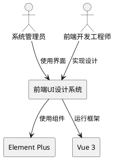
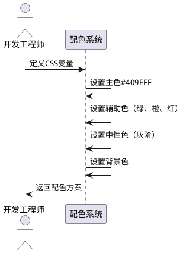
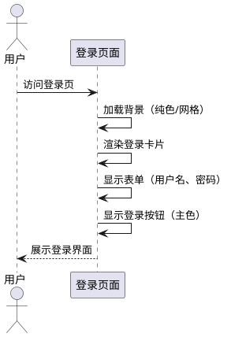
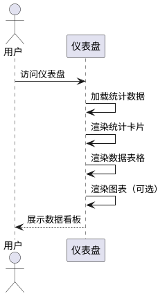
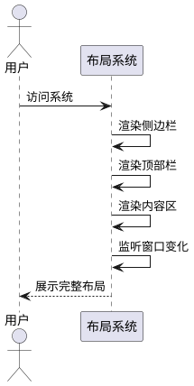

# **1. 组件定位**

## **1.1 核心职责**

本组件负责重新设计前端UI界面，实现专业、克制、高级的视觉风格，杜绝AI生成的千篇一律设计。

## **1.2 核心输入**

1. 用户的设计需求：要求避免紫色渐变、采用60-30-10配色法则、参考Linear/Stripe风格
2. 现有项目配色方案：Element Plus蓝色主色系（#409EFF）
3. 现有前端代码：Vue 3 + Element Plus架构

## **1.3 核心输出**

1. 统一的CSS变量配色系统
2. 重新设计的登录页面
3. 重新设计的仪表盘页面
4. 重新设计的整体布局
5. 公共样式规范文档

## **1.4 职责边界**

本组件不负责：
- 后端API接口开发
- 数据库设计
- 业务逻辑实现
- 第三方组件库替换

# **2. 领域术语**

**配色系统**
: 定义项目整体色彩规范的系统，包括主色、辅助色、强调色、中性色等。

**60-30-10法则**
: 配色黄金比例法则，主色占60%（中性色调），辅助色占30%，强调色仅10%。

**AI紫色问题**
: AI生成设计中常见的千篇一律问题，表现为过度使用紫色渐变、indigo-500系颜色、紫到蓝/粉的渐变。

**Element Plus**
: 基于Vue 3的企业级UI组件库，默认主色为#409EFF蓝色。

# **3. 角色与边界**

## **3.1 核心角色**

- **系统管理员**：使用管理系统的用户，需要清晰、专业的界面进行数据管理
- **前端开发工程师**：基于设计规范实现UI代码的开发人员

## **3.2 外部系统**

- **Element Plus组件库**：提供基础UI组件
- **Vue 3框架**：前端应用框架

## **3.3 交互上下文**

# **4. DFX约束**

## **4.1 性能**

- 页面首屏加载时间 < 2秒
- CSS文件大小 < 100KB
- 动画过渡时间统一为0.3秒

## **4.2 可靠性**

- 浏览器兼容性：支持Chrome、Firefox、Safari、Edge最新版本
- 响应式设计：支持1920px、1440px、1366px、1280px分辨率

## **4.3 安全性**

- 不在CSS中硬编码敏感信息
- 使用CSS变量管理配色，便于主题切换

## **4.4 可维护性**

- 所有颜色值使用CSS变量定义
- 样式文件模块化，按功能划分
- 遵循BEM命名规范

## **4.5 兼容性**

- 保持与Element Plus组件库的兼容性
- 不破坏现有业务功能

# **5. 核心能力**

## **5.1 配色系统设计**

### **5.1.1 业务规则**

1. **主色规则**：必须使用Element Plus默认蓝色#409EFF作为主色
   a. 验收条件：[查看CSS变量] → [--primary-color: #409EFF]

2. **禁止紫色规则**：禁止使用紫色、indigo、violet色系及渐变
   a. 验收条件：[检查所有颜色值] → [不包含#8B5CF6、#6366F1、#A855F7等紫色系]

3. **60-30-10配色规则**：中性色占60%，辅助色占30%，强调色占10%
   a. 验收条件：[统计页面色彩占比] → [符合60-30-10比例]

4. **背景规则**：优先使用纯色背景（#ffffff或#f5f7fa），禁止大面积渐变
   a. 验收条件：[检查背景样式] → [无大面积渐变背景]

### **5.1.2 交互流程**

### **5.1.3 异常场景**

1. **颜色值格式错误**
   a. 触发条件：CSS变量值不是有效的颜色格式
   b. 系统行为：使用默认值回退
   c. 用户感知：界面显示正常，控制台警告

2. **浏览器不支持CSS变量**
   a. 触发条件：在IE11等旧浏览器运行
   b. 系统行为：提供降级方案
   c. 用户感知：界面使用固定颜色值

## **5.2 登录页面设计**

### **5.2.1 业务规则**

1. **布局规则**：必须采用居中卡片式布局，左右或上下分栏
   a. 验收条件：[访问登录页] → [卡片居中显示]

2. **表单规则**：用户名、密码输入框必须清晰标识，带图标提示
   a. 验收条件：[查看表单] → [输入框带图标和placeholder]

3. **按钮规则**：登录按钮使用主色#409EFF，悬停时加深10%
   a. 验收条件：[悬停按钮] → [颜色变为#66b1ff]

4. **背景规则**：使用纯色背景或细微网格纹理，禁止渐变
   a. 验收条件：[检查背景] → [纯色或网格纹理]

### **5.2.2 交互流程**

### **5.2.3 异常场景**

1. **表单验证失败**
   a. 触发条件：用户输入不符合规则
   b. 系统行为：显示错误提示
   c. 用户感知：红色错误提示文字

## **5.3 仪表盘页面设计**

### **5.3.1 业务规则**

1. **统计卡片规则**：使用白色卡片背景，轻微阴影，圆角8px
   a. 验收条件：[查看统计卡片] → [白色背景、阴影、圆角]

2. **数据展示规则**：数值使用深色文本，标签使用次要文本色
   a. 验收条件：[查看数据] → [数值#303133，标签#606266]

3. **图标规则**：使用Element Plus图标，颜色与功能对应（成功绿、警告橙、危险红）
   a. 验收条件：[查看图标] → [颜色与功能语义一致]

4. **悬停效果规则**：卡片悬停时上浮2px，阴影增强
   a. 验收条件：[悬停卡片] → [上浮动画、阴影增强]

### **5.3.2 交互流程**

### **5.3.3 异常场景**

1. **数据加载失败**
   a. 触发条件：API请求失败
   b. 系统行为：显示空状态或错误提示
   c. 用户感知：友好的错误提示信息

## **5.4 整体布局设计**

### **5.4.1 业务规则**

1. **侧边栏规则**：使用深色背景（#304156），宽度200px，可折叠
   a. 验收条件：[查看侧边栏] → [深色背景、200px宽]

2. **顶部栏规则**：使用白色背景，高度60px，包含面包屑和用户信息
   a. 验收条件：[查看顶部栏] → [白色背景、60px高]

3. **内容区规则**：使用浅灰背景（#f5f7fa），内边距20px
   a. 验收条件：[查看内容区] → [浅灰背景、内边距]

4. **响应式规则**：小屏幕下侧边栏自动折叠
   a. 验收条件：[缩小窗口] → [侧边栏折叠]

### **5.4.2 交互流程**

### **5.4.3 异常场景**

1. **路由不存在**
   a. 触发条件：访问不存在的路径
   b. 系统行为：跳转到404页面
   c. 用户感知：友好的404提示

# **6. 数据约束**

## **6.1 配色变量**

1. **--primary-color**：主色，固定值#409EFF
2. **--success-color**：成功色，固定值#67C23A
3. **--warning-color**：警告色，固定值#E6A23C
4. **--danger-color**：危险色，固定值#F56C6C
5. **--text-primary**：主要文本色，固定值#303133
6. **--text-secondary**：次要文本色，固定值#606266
7. **--text-tertiary**：三级文本色，固定值#909399
8. **--border-color**：边框色，固定值#DCDFE6
9. **--bg-page**：页面背景色，固定值#f5f7fa
10. **--bg-card**：卡片背景色，固定值#ffffff

## **6.2 布局尺寸**

1. **侧边栏宽度**：200px（展开），64px（折叠）
2. **顶部栏高度**：60px
3. **内容区内边距**：20px
4. **卡片圆角**：8px
5. **过渡时间**：0.3s
