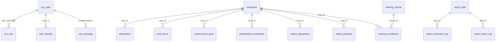

# 数据库设计（基于 SQL 初始化脚本与 ORM 实体）

> 权威来源：`database/hr_datacenter_mysql_init.sql`（MySQL 业务库）、各 `entity` 上 `@TableName` 注解。  
> Hive 侧见 `database/hr_datacenter_hive_init.sql` 及 `database/2hive/*.sql`（分析/演示数据）。

---

## 1. 数据库与字符集

- **库名**：`hr_datacenter`
- **字符集**：`utf8mb4`，排序规则 `utf8mb4_unicode_ci`
- **逻辑删除**：多数业务表含 `deleted` 字段（0 未删 / 1 已删），与 MyBatis-Plus 全局配置一致。

---

## 2. ER 关系概览（Mermaid）

说明：`sys_user` 与 `sys_role` 在脚本中为独立表，通过 `role_code` 字符串关联，非物理外键。若线上某套后端仍使用「`u.id` + `sys_user_role` + `r.id`」类 SQL，请在导入业务数据并执行 `update_user_passwords.sql` 之后，再执行 **`database/mysql_compat_sys_user_role_20260423.sql`**（`scripts/vm/run-on-vm.sh` 已按此顺序调用）。

---

## 3. 表清单与说明（MySQL）

| 表名 | 说明 | 主要外键/关联 |
|------|------|----------------|
| `sys_user` | 系统用户 | `role_code`；部署脚本可追加生成列 `id`、`password_hash`（见下） |
| `sys_role` | 角色字典 | 可追加 `id`（与 `role_id` 同步）、`data_scope` |
| `sys_user_role` | 用户↔角色多对多（可选） | 由 `mysql_compat_sys_user_role_20260423.sql` 创建；与 `role_code` 数据对齐 |
| `user_favorite` | 用户收藏 | `user_id` → 用户 |
| `analysis_rule` | 分析/预警规则 | — |
| `warning_model` | 预警模型参数 | — |
| `report_task` | 报表定时任务 | — |
| `report_execution_log` | 报表执行记录 | `task_id` |
| `report_share_log` | 报表分享记录 | `task_id` |
| `recruitment_plan` | 招聘计划 | — |
| `employee` | 员工主数据 | — |
| `attendance` | 考勤 | `emp_id` → `employee` |
| `emp_leave` | 请假 | `emp_id` → `employee`（实体类 `Leave`） |
| `performance_goal` | 绩效目标 | `emp_id` → `employee` |
| `performance_evaluation` | 绩效评估 | `emp_id` → `employee` |
| `salary_adjustment` | 薪资调整申请 | `emp_id` → `employee` |
| `salary_payment` | 薪资发放明细 | `emp_id` → `employee`；`uk_emp_year_month` |
| `training_course` | 培训课程 | — |
| `training_enrollment` | 培训报名 | `course_id`、`emp_id` |
| `sys_message` | 站内消息 | 发送方/接收方用户 ID |
| `data_category` | 数据分类树 | `parent_id` 自关联 |
| `sys_operation_log` | 操作审计日志 | — |

视图与过程（脚本内）：`v_employee_attendance_stats`、`v_employee_salary_stats`、`sp_calculate_work_years`、`sp_clean_expired_logs`；触发器维护 `training_course.enrolled_count`。

---

## 4. 与 Java 实体对应关系（节选）

| 实体类 | `@TableName` |
|--------|----------------|
| `User` | `sys_user` |
| `Role` | `sys_role` |
| `Employee` | `employee` |
| `Attendance` | `attendance` |
| `Leave` | `emp_leave` |
| `PerformanceGoal` | `performance_goal` |
| `PerformanceEvaluation` | `performance_evaluation` |
| `SalaryAdjustment` | `salary_adjustment` |
| `SalaryPayment` | `salary_payment` |
| `TrainingCourse` | `training_course` |
| `TrainingEnrollment` | `training_enrollment` |
| `RecruitmentPlan` | `recruitment_plan` |
| `Message` | `sys_message` |
| `DataCategory` | `data_category` |
| `SysOperationLog` | `sys_operation_log` |
| `UserFavorite` | `user_favorite` |
| `AnalysisRule` | `analysis_rule` |
| `WarningModel` | `warning_model` |
| `ReportTask` | `report_task` |
| `ReportExecutionLog` | `report_execution_log` |
| `ReportShareLog` | `report_share_log` |

完整字段定义以 `hr_datacenter_mysql_init.sql` 中 `CREATE TABLE` 为准。

---

## 5. 补丁与补数脚本（运维顺序参考）

| 文件 | 用途 |
|------|------|
| `hr_datacenter_mysql_init.sql` | 建库、建表、索引、初始种子数据、视图/过程/触发器 |
| `mysql_patch_20260416.sql` | 增量补丁（若有结构变更） |
| `update_user_passwords.sql` | 用户密码批量更新（演示/重置） |
| `1mysql/insert_data.sql`、`1mysql/insert_large_data.sql` | 扩大演示数据量 |
| `hr_datacenter_hive_init.sql` | Hive 侧初始化 |
| `2hive/insert_data.sql`、`2hive/insert_large_data.sql` | Hive 演示数据 |

根目录另有 `test_leave_functionality.sql` 等，用于专项测试，**不必**与主初始化混在同一自动化批次，除非已人工审阅依赖顺序。

---

## 6. 双数据源（应用配置层）

- **MySQL**：`spring.datasource.mysql.*`，默认 JDBC URL 指向集群内 MySQL 实例。
- **Hive**：`spring.datasource.hive.*`，用于分析型 SQL。

具体 IP、库名以部署环境 `application.yml` / `application-vm.yml` 为准，勿将生产密码写入文档。

---

## 7. 索引与约束建议

脚本末尾含**可选**复合索引注释（考勤、请假、薪资发放等），可按慢查询情况在运维窗口执行。
