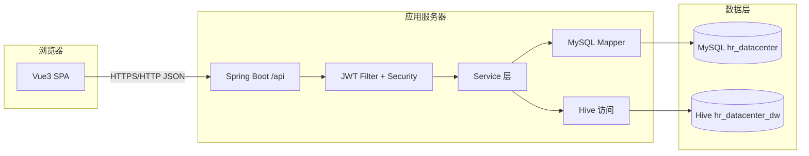
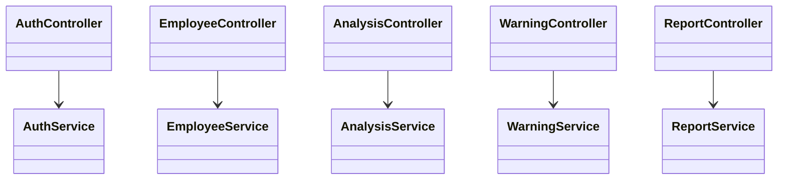

# 系统设计（基于现有代码反推）

> 本系统完全符合任务书"技术支撑 - 数据处理 - 功能应用"三位一体的分层架构要求。

---

## 0. 系统分层架构（符合任务书三位一体要求）

### 0.1 底层技术支撑层

#### 后端框架
- **SpringBoot 2.7.18**: 简化Spring应用的初始搭建和开发过程
  - 自动配置机制，减少XML配置
  - 快速构建独立运行的生产级应用
  - 嵌入式服务器、监控管理、简化依赖

#### 前端框架
- **Vue 3.3.4**: 组件化开发，数据驱动视图
  - 将复杂页面拆成可复用组件
  - 数据绑定，数据和视图同步更新
- **Element Plus 2.3.14**: 企业级前端组件库
  - 表格、图表、弹窗、导航栏等可视化组件
  - 快速搭建美观、规范的企业级界面

#### 数据存储
- **MySQL 8.0.33**: 存储基础业务数据
  - 员工基本信息、部门信息、权限信息
  - 基础薪酬绩效数据
  - 体积小、运行快、稳定性高
- **Hive 3.1.3**: 存储海量分析型数据
  - 组织效能、人才梯队、员工流失等分析数据
  - 支持类SQL查询语言（HQL）
  - 分布式存储和离线分析
- **数据同步**: MySQL → Hive定时同步，保证数据完整性

### 0.2 中间数据处理层

#### 数据同步机制
- **定时同步任务**: 配置见`application.yml`的`data-sync`
- **同步流程**: MySQL基础数据 → Hive分析数据
- **同步内容**: 维度表、事实表、聚合表

#### 分析引擎
- **Hive OLAP**: 联机分析处理能力
- **分析规则**: 流失预警阈值、薪酬竞争力对标标准、培训ROI计算规则
- **预警模型**: 员工流失、人才缺口、成本超支预警模型

#### 数据流转
```
基础数据(MySQL) → 分析数据(Hive) → 决策数据(分析结果)
```

#### 解决的问题
- 打通"基础数据 - 分析数据 - 决策数据"的流转
- 解决"单一模块分析、数据不通"的问题
- 实现全流程数据整合分析

### 0.3 上层功能应用层

#### 数据采集与沉淀
- **员工管理**: 员工档案、在职/离职管理
- **考勤管理**: 打卡记录、考勤统计
- **请假管理**: 请假申请、审批流程
- **绩效管理**: 绩效目标、绩效评估、绩效改进
- **薪酬管理**: 薪资发放、薪资调整
- **培训管理**: 课程管理、报名审批、签到成绩
- **招聘管理**: 招聘计划、岗位需求

#### 专题分析
- **组织效能分析**: 部门效率、组织架构、人员配置、组织健康度
- **人才梯队建设**: 人才储备、继任计划、能力评估、梯队健康度
- **薪酬福利分析**: 薪酬结构、竞争力分析、成本分析、优化建议

#### 预警分析
- **员工流失预警**: 流失风险分析、部门流失率、预警概览
- **人才缺口预警**: 缺口分析、结构分析、预警概览
- **人力成本超支预警**: 成本分析、预警概览

#### 决策支持
- **报表中心**: 定时生成、导出、分享
- **分析看板**: 关键指标展示、趋势分析

### 0.4 顶层用户权限层

#### 角色体系
- **ROLE_ADMIN**: 系统管理员 - 全功能、系统用户管理、规则/模型、报表
- **ROLE_HR_ADMIN**: HR管理员 - 人力资源业务、分析、预警、报表
- **ROLE_MANAGER**: 部门负责人 - 部门视角管理
- **ROLE_EMPLOYEE**: 普通员工 - 个人相关功能

#### 权限控制
- **菜单级权限**: 基于`sys_user.role_code`，前端路由守卫
- **方法级权限**: `@PreAuthorize`注解，后端接口控制
- **数据权限**: 不同角色查看不同范围的数据

---

## 1. 技术栈

### 1.1 后端

| 技术 | 版本/说明 | 用途 |
|------|------------|------|
| Java | 1.8 | 运行环境 |
| Spring Boot | 2.7.18 | Web、安全、校验、AOP、调度等 |
| Spring Security + JWT | jjwt 0.11.5 | 认证授权 |
| MyBatis-Plus | 3.5.3.1 | ORM、分页、逻辑删除 |
| MySQL Connector | 8.0.33 | 主业务库 |
| Apache Hive JDBC | 3.1.3 | 分析型查询数据源 |
| Hadoop Common | 3.2.4 | Hive 依赖链 |
| Hutool | 5.8.20 | 工具类 |
| WebSocket | Spring | 消息推送场景 |

来源：`backend/pom.xml`。

### 1.2 前端

| 技术 | 说明 |
|------|------|
| Vue 3 | 组件化 UI |
| Vue Router 4 | 路由与守卫 |
| Element Plus | 管理端组件库 |
| ECharts | 图表 |
| Axios | HTTP 客户端，`baseURL: '/api'` |
| Vite 4 | 开发与构建；开发态将 `/api` 代理到 `http://localhost:8080` |
| xlsx、file-saver | 导入导出辅助 |

来源：`frontend/package.json`、`frontend/vite.config.js`。

### 1.3 数据与运维

- **MySQL**：库名默认 `hr_datacenter`（见 `application.yml` 与初始化脚本）。
- **Hive**：库名示例 `hr_datacenter_dw`（见配置）。
- 初始化与补数脚本：`database/` 目录下 `.sql` 文件。

---

## 2. 逻辑架构



---

## 3. 后端模块划分

包根：`com.hr.datacenter`。

| 包/目录 | 职责 |
|---------|------|
| `controller` | REST API：认证、员工、考勤、请假、绩效、薪酬、培训、招聘、分类、文件、收藏、日志、消息 |
| `controller/analysis` | 组织效能、人才梯队、薪酬分析 |
| `controller/warning` | 流失、人才缺口、成本预警 |
| `controller/system` | 用户管理、规则、模型、报表、运行画像 |
| `service` | 业务逻辑；含 `analysis`、`warning`、`sync` 等子包 |
| `mapper/mysql` | MyBatis-Plus 数据访问 |
| `entity` | 与表映射的实体 |
| `dto` | 请求/响应封装 |
| `config` | 多数据源、Security、MyBatis-Plus、WebSocket 等 |
| `common` / `exception` | 统一响应、全局异常 |
| `util` | JWT 等工具 |
| `task` / 调度相关 | 数据同步 cron（见配置 `data-sync`） |

入口类：`HrDataCenterApplication`。

---

## 4. 安全设计要点

- **无状态会话**：`SessionCreationPolicy.STATELESS`。
- **放行路径**：仅 `POST /auth/login`、`POST /auth/register`（相对 context-path 下的路径由 Spring 匹配规则处理，与当前 Boot 2.7 + context-path 行为一致）。
- **其余请求**：`.authenticated()`，由 `JwtAuthenticationFilter` 解析 Token 并写入 `SecurityContext`。
- **方法级控制**：`@EnableMethodSecurity(prePostEnabled = true)`，具体接口可结合 `@PreAuthorize` 使用。

---

## 5. 前端模块划分

| 路径 | 职责 |
|------|------|
| `src/views` | 各业务页面（登录、看板、员工、分析、预警、报表等） |
| `src/api` | 按域拆分的接口封装，与后端 Controller 对齐 |
| `src/router` | 路由表与导航守卫 |
| `src/utils` | 请求封装、Excel 等 |
| `src/components` | 复用组件 |

---

## 6. 组件关系（简化）



实际类名以代码为准；上图仅表达**控制器 → 服务**分层依赖方向。

---

## 7. 配置与运行模式

- **服务端口**：默认 `8080`；**上下文路径**：`/api`。
- **JWT**：密钥、过期时间、Header 前缀见 `application.yml` 中 `jwt` 段。
- **MyBatis-Plus**：逻辑删除字段 `deleted`；主键策略 `auto`。
- **数据同步**：`data-sync.enabled` 与多条 cron 表达式控制维度/事实/聚合同步节奏。
- **报表导出目录**：`report.export.dir`（默认 `report-exports`）。
- **运行模式展示**：`project.runtime` 提供给前端展示用文案。

---

## 8. 与部署相关的设计

- 生产/集群场景常见：**Nginx** 反代静态资源并将 `/api` 转到 Spring Boot（详见仓库内 VM 脚本说明与 `docs/02-论文与答辩材料/论文写作-项目详细阐述.md` 部署章节）。
- 数据库初始化与更新脚本位于 `database/`，与 `docs/修改的操作文档.md` 中的运维步骤配合使用。
