# HrDataCenter 项目架构与流程图文档

## 项目概述

- **项目名称**: 人力资源数据中心 (HrDataCenter)
- **技术架构**: SpringBoot + Vue3 + Hadoop + Hive
- **文档版本**: v1.0
- **创建日期**: 2026-04-07
- **文档说明**: 本文档包含项目的各种架构图、流程图、ER图，用于项目理解、参考和学习

---

## 目录

1. [系统整体架构图](#1-系统整体架构图)
2. [技术架构图](#2-技术架构图)
3. [数据流程图](#3-数据流程图)
4. [业务流程图](#4-业务流程图)
5. [数据库ER图](#5-数据库er图)
6. [数据仓库架构图](#6-数据仓库架构图)
7. [API接口架构图](#7-api接口架构图)
8. [部署架构图](#8-部署架构图)
9. [安全架构图](#9-安全架构图)
10. [组件关系图](#10-组件关系图)

---

## 1. 系统整体架构图

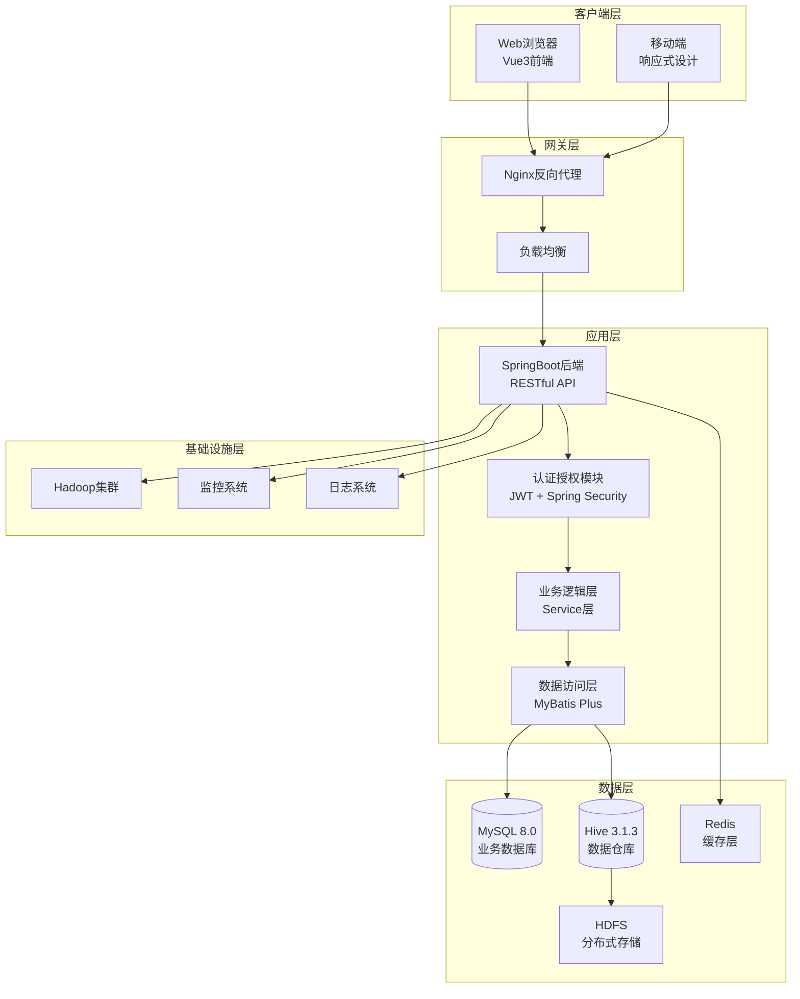
```mermaid
graph TB
    subgraph "客户端层"
        A[Web浏览器<br/>Vue3前端]
        B[移动端<br/>响应式设计]
    end

    subgraph "网关层"
        C[Nginx反向代理]
        D[负载均衡]
    end

    subgraph "应用层"
        E[SpringBoot后端<br/>RESTful API]
        F[认证授权模块<br/>JWT + Spring Security]
        G[业务逻辑层<br/>Service层]
        H[数据访问层<br/>MyBatis Plus]
    end

    subgraph "数据层"
        I[(MySQL 8.0<br/>业务数据库)]
        J[(Hive 3.1.3<br/>数据仓库)]
        K[HDFS<br/>分布式存储]
        L[Redis<br/>缓存层]
    end

    subgraph "基础设施层"
        M[Hadoop集群]
        N[监控系统]
        O[日志系统]
    end

    A --> C
    B --> C
    C --> D
    D --> E
    E --> F
    F --> G
    G --> H
    H --> I
    H --> J
    E --> L
    J --> K
    E --> M
    E --> N
    E --> O
```

---

## 2. 技术架构图

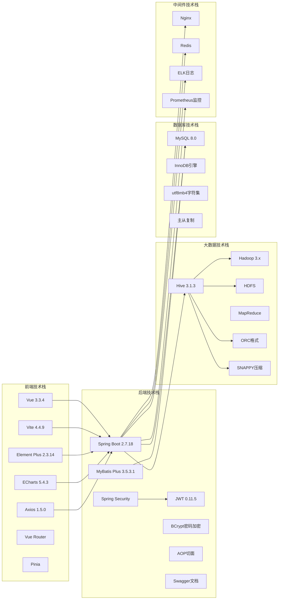
```mermaid
graph LR
    subgraph "前端技术栈"
        A1[Vue 3.3.4]
        A2[Vite 4.4.9]
        A3[Element Plus 2.3.14]
        A4[ECharts 5.4.3]
        A5[Axios 1.5.0]
        A6[Vue Router]
        A7[Pinia]
    end

    subgraph "后端技术栈"
        B1[Spring Boot 2.7.18]
        B2[MyBatis Plus 3.5.3.1]
        B3[Spring Security]
        B4[JWT 0.11.5]
        B5[BCrypt密码加密]
        B6[AOP切面]
        B7[Swagger文档]
    end

    subgraph "大数据技术栈"
        C1[Hadoop 3.x]
        C2[Hive 3.1.3]
        C3[HDFS]
        C4[MapReduce]
        C5[ORC格式]
        C6[SNAPPY压缩]
    end

    subgraph "数据库技术栈"
        D1[MySQL 8.0]
        D2[InnoDB引擎]
        D3[utf8mb4字符集]
        D4[主从复制]
    end

    subgraph "中间件技术栈"
        E1[Nginx]
        E2[Redis]
        E3[ELK日志]
        E4[Prometheus监控]
    end

    A1 --> B1
    A2 --> B1
    A3 --> B1
    A4 --> B1
    A5 --> B1
    B1 --> D1
    B1 --> C2
    B2 --> D1
    B3 --> B4
    C2 --> C1
    C2 --> C3
    C2 --> C5
    C2 --> C6
    B1 --> E2
    B1 --> E1
    B1 --> E3
    B1 --> E4
```

---

## 3. 数据流程图

### 3.1 整体数据流程图

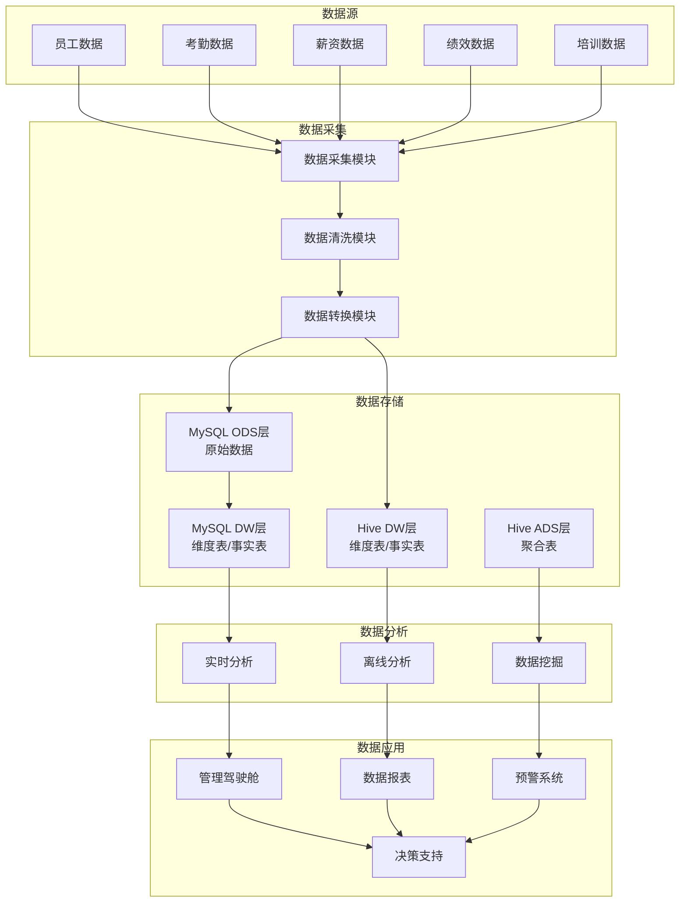
```mermaid
graph TB
    subgraph "数据源"
        A[员工数据]
        B[考勤数据]
        C[薪资数据]
        D[绩效数据]
        E[培训数据]
    end

    subgraph "数据采集"
        F[数据采集模块]
        G[数据清洗模块]
        H[数据转换模块]
    end

    subgraph "数据存储"
        I[MySQL ODS层<br/>原始数据]
        J[MySQL DW层<br/>维度表/事实表]
        K[Hive DW层<br/>维度表/事实表]
        L[Hive ADS层<br/>聚合表]
    end

    subgraph "数据分析"
        M[实时分析]
        N[离线分析]
        O[数据挖掘]
    end

    subgraph "数据应用"
        P[管理驾驶舱]
        Q[数据报表]
        R[预警系统]
        S[决策支持]
    end

    A --> F
    B --> F
    C --> F
    D --> F
    E --> F
    F --> G
    G --> H
    H --> I
    H --> K
    I --> J
    J --> M
    K --> N
    L --> O
    M --> P
    N --> Q
    O --> R
    P --> S
    Q --> S
    R --> S
```

### 3.2 MySQL到Hive数据同步流程

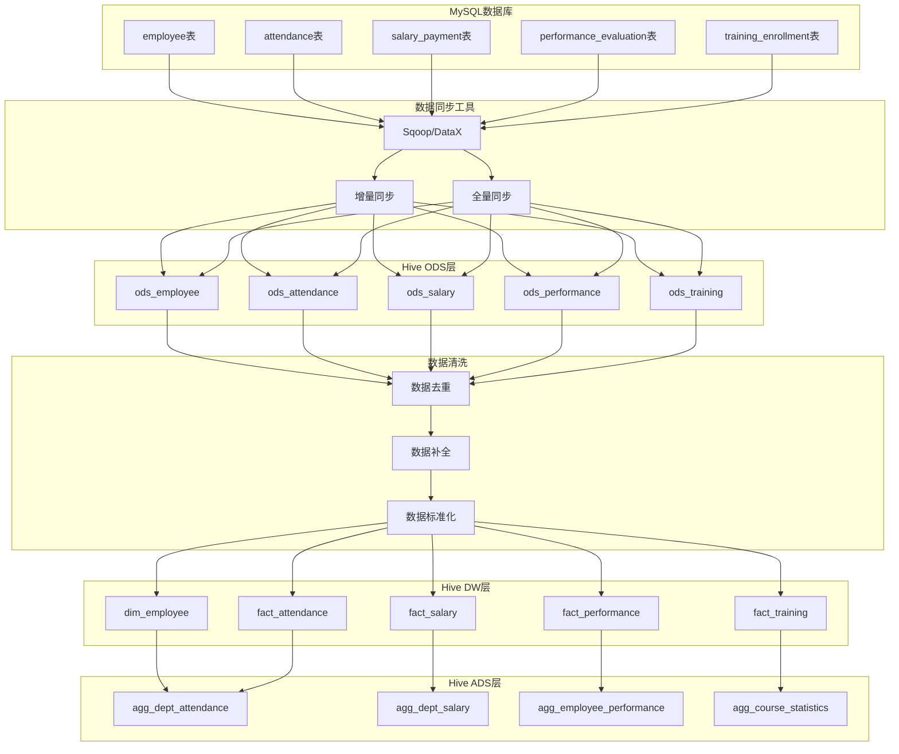
```mermaid
graph TB
    subgraph "MySQL数据库"
        A1[employee表]
        A2[attendance表]
        A3[salary_payment表]
        A4[performance_evaluation表]
        A5[training_enrollment表]
    end

    subgraph "数据同步工具"
        B[Sqoop/DataX]
        C[增量同步]
        D[全量同步]
    end

    subgraph "Hive ODS层"
        E1[ods_employee]
        E2[ods_attendance]
        E3[ods_salary]
        E4[ods_performance]
        E5[ods_training]
    end

    subgraph "数据清洗"
        F[数据去重]
        G[数据补全]
        H[数据标准化]
    end

    subgraph "Hive DW层"
        I1[dim_employee]
        I2[fact_attendance]
        I3[fact_salary]
        I4[fact_performance]
        I5[fact_training]
    end

    subgraph "Hive ADS层"
        J1[agg_dept_attendance]
        J2[agg_dept_salary]
        J3[agg_employee_performance]
        J4[agg_course_statistics]
    end

    A1 --> B
    A2 --> B
    A3 --> B
    A4 --> B
    A5 --> B
    B --> C
    B --> D
    C --> E1
    C --> E2
    C --> E3
    C --> E4
    C --> E5
    D --> E1
    D --> E2
    D --> E3
    D --> E4
    D --> E5
    E1 --> F
    E2 --> F
    E3 --> F
    E4 --> F
    E5 --> F
    F --> G
    G --> H
    H --> I1
    H --> I2
    H --> I3
    H --> I4
    H --> I5
    I1 --> J1
    I2 --> J1
    I3 --> J2
    I4 --> J3
    I5 --> J4
```

### 3.3 数据ETL流程

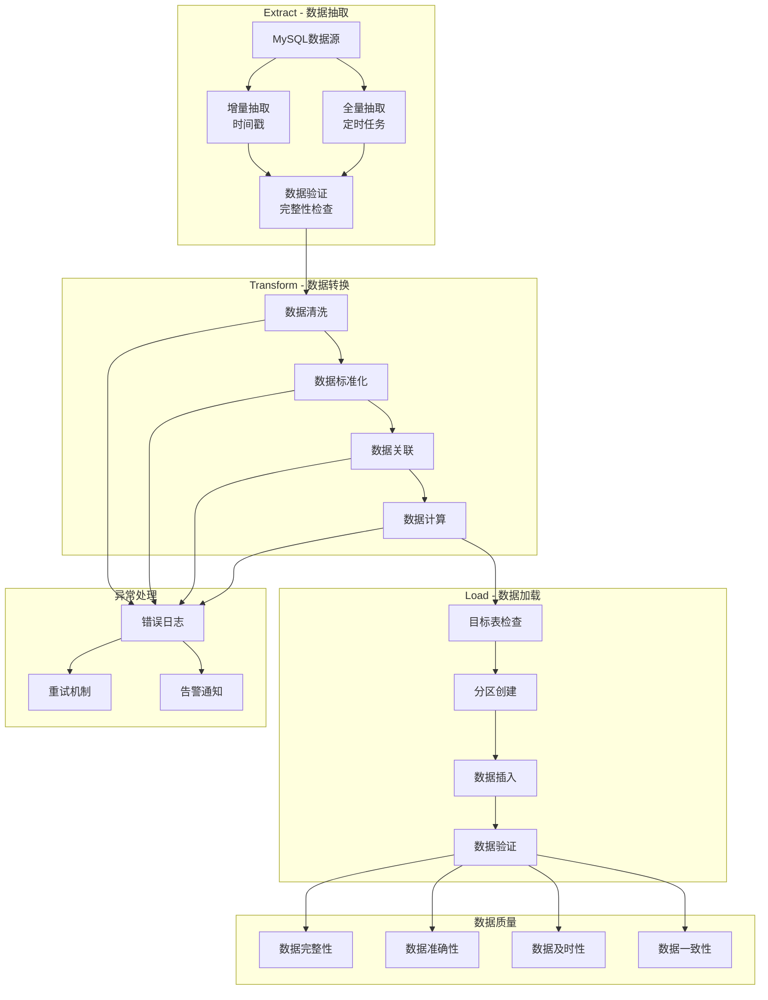
```mermaid
graph TB
    subgraph "Extract - 数据抽取"
        A[MySQL数据源]
        B[增量抽取<br/>时间戳]
        C[全量抽取<br/>定时任务]
        D[数据验证<br/>完整性检查]
    end

    subgraph "Transform - 数据转换"
        E[数据清洗]
        F[数据标准化]
        G[数据关联]
        H[数据计算]
    end

    subgraph "Load - 数据加载"
        I[目标表检查]
        J[分区创建]
        K[数据插入]
        L[数据验证]
    end

    subgraph "数据质量"
        M[数据完整性]
        N[数据准确性]
        O[数据及时性]
        P[数据一致性]
    end

    subgraph "异常处理"
        Q[错误日志]
        R[重试机制]
        S[告警通知]
    end

    A --> B
    A --> C
    B --> D
    C --> D
    D --> E
    E --> F
    F --> G
    G --> H
    H --> I
    I --> J
    J --> K
    K --> L
    L --> M
    L --> N
    L --> O
    L --> P
    E --> Q
    F --> Q
    G --> Q
    H --> Q
    Q --> R
    Q --> S
```

---

## 4. 业务流程图

### 4.1 员工入职流程

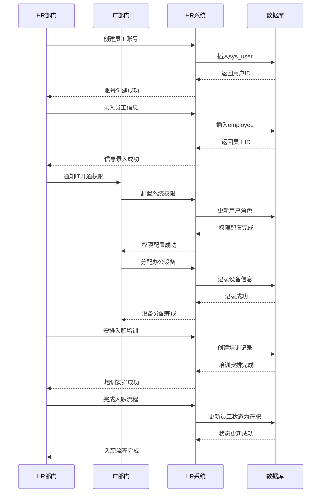
```mermaid
sequenceDiagram
    participant HR as HR部门
    participant IT as IT部门
    participant System as HR系统
    participant DB as 数据库

    HR->>System: 创建员工账号
    System->>DB: 插入sys_user
    DB-->>System: 返回用户ID
    System-->>HR: 账号创建成功

    HR->>System: 录入员工信息
    System->>DB: 插入employee
    DB-->>System: 返回员工ID
    System-->>HR: 信息录入成功

    HR->>IT: 通知IT开通权限
    IT->>System: 配置系统权限
    System->>DB: 更新用户角色
    DB-->>System: 权限配置完成
    System-->>IT: 权限配置成功

    IT->>System: 分配办公设备
    System->>DB: 记录设备信息
    DB-->>System: 记录成功
    System-->>IT: 设备分配完成

    HR->>System: 安排入职培训
    System->>DB: 创建培训记录
    DB-->>System: 培训安排完成
    System-->>HR: 培训安排成功

    HR->>System: 完成入职流程
    System->>DB: 更新员工状态为在职
    DB-->>System: 状态更新成功
    System-->>HR: 入职流程完成
```

### 4.2 考勤管理流程

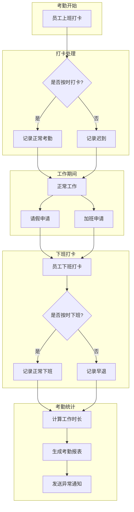
```mermaid
graph TB
    subgraph "考勤开始"
        A[员工上班打卡]
    end

    subgraph "打卡处理"
        B{是否按时打卡?}
        B -->|是| C[记录正常考勤]
        B -->|否| D[记录迟到]
    end

    subgraph "工作期间"
        E[正常工作]
        F[请假申请]
        G[加班申请]
    end

    subgraph "下班打卡"
        H[员工下班打卡]
        I{是否按时下班?}
        I -->|是| J[记录正常下班]
        I -->|否| K[记录早退]
    end

    subgraph "考勤统计"
        L[计算工作时长]
        M[生成考勤报表]
        N[发送异常通知]
    end

    A --> B
    C --> E
    D --> E
    E --> F
    E --> G
    F --> H
    G --> H
    H --> I
    J --> L
    K --> L
    L --> M
    M --> N
```

### 4.3 请假审批流程

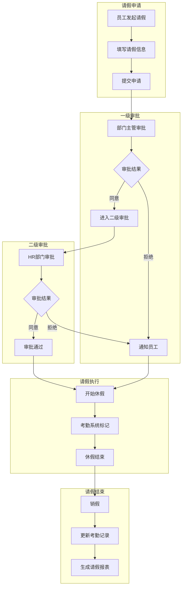
```mermaid
graph TB
    subgraph "请假申请"
        A[员工发起请假]
        B[填写请假信息]
        C[提交申请]
    end

    subgraph "一级审批"
        D[部门主管审批]
        E{审批结果}
        E -->|同意| F[进入二级审批]
        E -->|拒绝| G[通知员工]
    end

    subgraph "二级审批"
        H[HR部门审批]
        I{审批结果}
        I -->|同意| J[审批通过]
        I -->|拒绝| G
    end

    subgraph "请假执行"
        K[开始休假]
        L[考勤系统标记]
        M[休假结束]
    end

    subgraph "请假结束"
        N[销假]
        O[更新考勤记录]
        P[生成请假报表]
    end

    A --> B
    B --> C
    C --> D
    D --> E
    F --> H
    H --> I
    J --> K
    G --> K
    K --> L
    L --> M
    M --> N
    N --> O
    O --> P
```

### 4.4 薪资发放流程

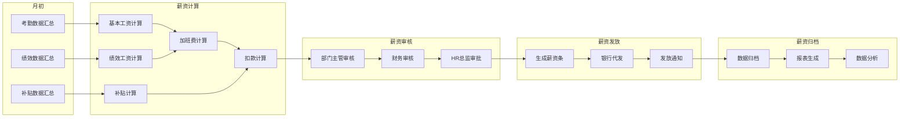
```mermaid
graph LR
    subgraph "月初"
        A[考勤数据汇总]
        B[绩效数据汇总]
        C[补贴数据汇总]
    end

    subgraph "薪资计算"
        D[基本工资计算]
        E[绩效工资计算]
        F[加班费计算]
        G[补贴计算]
        H[扣款计算]
    end

    subgraph "薪资审核"
        I[部门主管审核]
        J[财务审核]
        K[HR总监审批]
    end

    subgraph "薪资发放"
        L[生成薪资条]
        M[银行代发]
        N[发放通知]
    end

    subgraph "薪资归档"
        O[数据归档]
        P[报表生成]
        Q[数据分析]
    end

    A --> D
    B --> E
    C --> G
    D --> F
    E --> F
    F --> H
    G --> H
    H --> I
    I --> J
    J --> K
    K --> L
    L --> M
    M --> N
    N --> O
    O --> P
    P --> Q
```

### 4.5 绩效评估流程

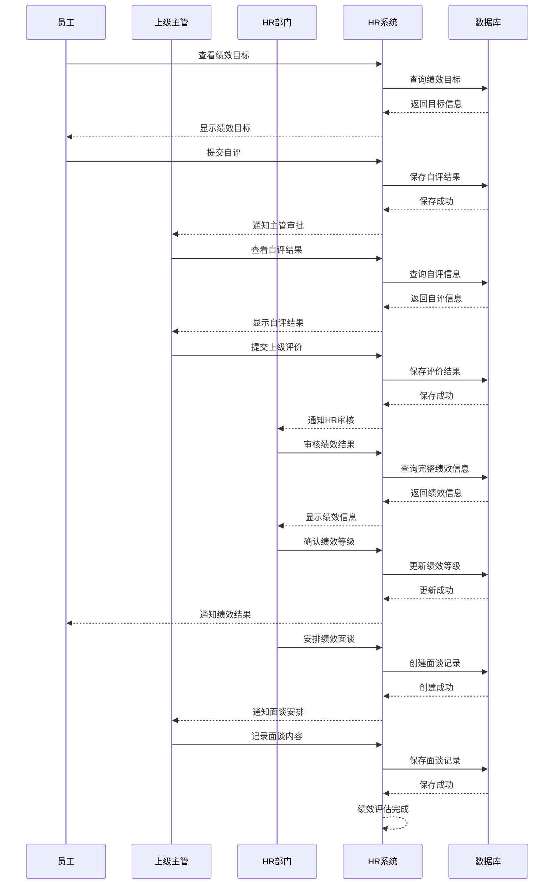
```mermaid
sequenceDiagram
    participant Emp as 员工
    participant Supervisor as 上级主管
    participant HR as HR部门
    participant System as HR系统
    participant DB as 数据库

    Emp->>System: 查看绩效目标
    System->>DB: 查询绩效目标
    DB-->>System: 返回目标信息
    System-->>Emp: 显示绩效目标

    Emp->>System: 提交自评
    System->>DB: 保存自评结果
    DB-->>System: 保存成功
    System-->>Supervisor: 通知主管审批

    Supervisor->>System: 查看自评结果
    System->>DB: 查询自评信息
    DB-->>System: 返回自评信息
    System-->>Supervisor: 显示自评结果

    Supervisor->>System: 提交上级评价
    System->>DB: 保存评价结果
    DB-->>System: 保存成功
    System-->>HR: 通知HR审核

    HR->>System: 审核绩效结果
    System->>DB: 查询完整绩效信息
    DB-->>System: 返回绩效信息
    System-->>HR: 显示绩效信息

    HR->>System: 确认绩效等级
    System->>DB: 更新绩效等级
    DB-->>System: 更新成功
    System-->>Emp: 通知绩效结果

    HR->>System: 安排绩效面谈
    System->>DB: 创建面谈记录
    DB-->>System: 创建成功
    System-->>Supervisor: 通知面谈安排

    Supervisor->>System: 记录面谈内容
    System->>DB: 保存面谈记录
    DB-->>System: 保存成功
    System-->>System: 绩效评估完成
```

### 4.6 培训管理流程

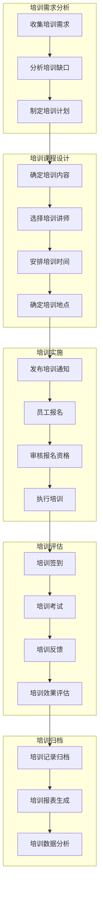
```mermaid
graph TB
    subgraph "培训需求分析"
        A[收集培训需求]
        B[分析培训缺口]
        C[制定培训计划]
    end

    subgraph "培训课程设计"
        D[确定培训内容]
        E[选择培训讲师]
        F[安排培训时间]
        G[确定培训地点]
    end

    subgraph "培训实施"
        H[发布培训通知]
        I[员工报名]
        J[审核报名资格]
        K[执行培训]
    end

    subgraph "培训评估"
        L[培训签到]
        M[培训考试]
        N[培训反馈]
        O[培训效果评估]
    end

    subgraph "培训归档"
        P[培训记录归档]
        Q[培训报表生成]
        R[培训数据分析]
    end

    A --> B
    B --> C
    C --> D
    D --> E
    E --> F
    F --> G
    G --> H
    H --> I
    I --> J
    J --> K
    K --> L
    L --> M
    M --> N
    N --> O
    O --> P
    P --> Q
    Q --> R
```

### 4.7 员工离职流程

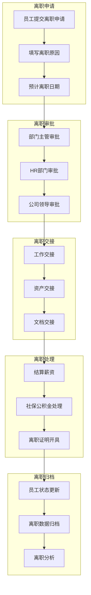
```mermaid
graph TB
    subgraph "离职申请"
        A[员工提交离职申请]
        B[填写离职原因]
        C[预计离职日期]
    end

    subgraph "离职审批"
        D[部门主管审批]
        E[HR部门审批]
        F[公司领导审批]
    end

    subgraph "离职交接"
        G[工作交接]
        H[资产交接]
        I[文档交接]
    end

    subgraph "离职处理"
        J[结算薪资]
        K[社保公积金处理]
        L[离职证明开具]
    end

    subgraph "离职归档"
        M[员工状态更新]
        N[离职数据归档]
        O[离职分析]
    end

    A --> B
    B --> C
    C --> D
    D --> E
    E --> F
    F --> G
    G --> H
    H --> I
    I --> J
    J --> K
    K --> L
    L --> M
    M --> N
    N --> O
```

---

## 5. 数据库ER图

### 5.1 核心业务表ER图

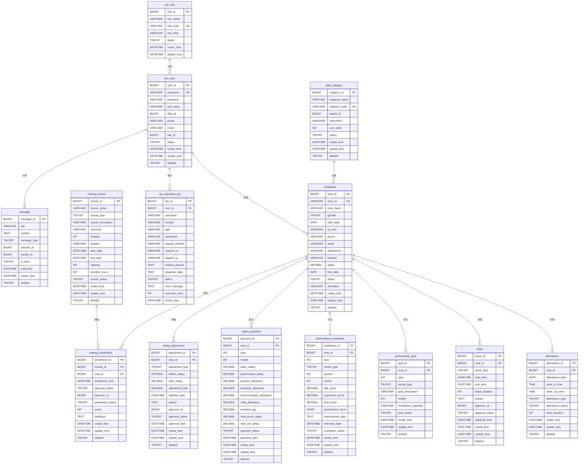
```mermaid
erDiagram
    sys_user ||--o{ employee : "管理"
    sys_role ||--o{ sys_user : "分配"
    employee ||--o{ attendance : "考勤"
    employee ||--o{ leave : "请假"
    employee ||--o{ performance_goal : "目标"
    employee ||--o{ performance_evaluation : "评估"
    employee ||--o{ salary_payment : "薪资"
    employee ||--o{ salary_adjustment : "调整"
    employee ||--o{ training_enrollment : "报名"
    training_course ||--o{ training_enrollment : "课程"
    data_category ||--o{ employee : "分类"
    sys_user ||--o{ sys_operation_log : "操作"
    sys_user ||--o{ message : "消息"

    sys_user {
        BIGINT user_id PK
        VARCHAR username UK
        VARCHAR password
        VARCHAR real_name
        BIGINT dept_id
        VARCHAR phone
        VARCHAR email
        BIGINT role_id
        TINYINT status
        DATETIME create_time
        DATETIME update_time
        TINYINT deleted
    }

    sys_role {
        BIGINT role_id PK
        VARCHAR role_name
        VARCHAR role_code UK
        VARCHAR role_desc
        TINYINT status
        DATETIME create_time
        DATETIME update_time
    }

    employee {
        BIGINT emp_id PK
        VARCHAR emp_no UK
        VARCHAR emp_name
        TINYINT gender
        DATE birth_date
        VARCHAR id_card
        VARCHAR phone
        VARCHAR email
        VARCHAR department
        VARCHAR position
        DECIMAL salary
        DATE hire_date
        TINYINT status
        VARCHAR education
        DATETIME create_time
        DATETIME update_time
        TINYINT deleted
    }

    attendance {
        BIGINT attendance_id PK
        BIGINT emp_id FK
        DATE attendance_date
        TIME clock_in_time
        TIME clock_out_time
        TINYINT attendance_type
        TINYINT attendance_status
        INT work_duration
        DATETIME create_time
        DATETIME update_time
        TINYINT deleted
    }

    leave {
        BIGINT leave_id PK
        BIGINT emp_id FK
        TINYINT leave_type
        DATETIME start_time
        DATETIME end_time
        INT leave_duration
        TEXT reason
        BIGINT approver_id
        TINYINT approval_status
        DATETIME approval_time
        DATETIME create_time
        DATETIME update_time
        TINYINT deleted
    }

    performance_goal {
        BIGINT goal_id PK
        BIGINT emp_id FK
        INT year
        TINYINT period_type
        VARCHAR goal_description
        INT weight
        VARCHAR completion_standard
        TINYINT goal_status
        DATETIME create_time
        DATETIME update_time
        TINYINT deleted
    }

    performance_evaluation {
        BIGINT evaluation_id PK
        BIGINT emp_id FK
        INT year
        TINYINT period_type
        INT quarter
        INT month
        DECIMAL self_score
        DECIMAL supervisor_score
        DECIMAL final_score
        CHAR performance_level
        TEXT improvement_plan
        DATETIME interview_date
        TINYINT evaluation_status
        DATETIME create_time
        DATETIME update_time
        TINYINT deleted
    }

    salary_payment {
        BIGINT payment_id PK
        BIGINT emp_id FK
        INT year
        INT month
        DECIMAL basic_salary
        DECIMAL performance_salary
        DECIMAL position_allowance
        DECIMAL transport_allowance
        DECIMAL communication_allowance
        DECIMAL meal_allowance
        DECIMAL overtime_pay
        DECIMAL total_gross_salary
        DECIMAL total_net_salary
        TINYINT payment_status
        DATETIME payment_date
        DATETIME create_time
        DATETIME update_time
        TINYINT deleted
    }

    salary_adjustment {
        BIGINT adjustment_id PK
        BIGINT emp_id FK
        TINYINT adjustment_type
        DECIMAL before_salary
        DECIMAL after_salary
        DECIMAL adjustment_rate
        DATETIME effective_date
        TEXT reason
        BIGINT approver_id
        TINYINT approval_status
        DATETIME approval_date
        DATETIME create_time
        DATETIME update_time
        TINYINT deleted
    }

    training_course {
        BIGINT course_id PK
        VARCHAR course_name
        TINYINT course_type
        VARCHAR course_description
        VARCHAR instructor
        INT duration
        VARCHAR location
        DATETIME start_date
        DATETIME end_date
        INT capacity
        INT enrolled_count
        TINYINT course_status
        DATETIME create_time
        DATETIME update_time
        TINYINT deleted
    }

    training_enrollment {
        BIGINT enrollment_id PK
        BIGINT course_id FK
        BIGINT emp_id FK
        DATETIME enrollment_time
        TINYINT approval_status
        BIGINT approver_id
        TINYINT attendance_status
        INT score
        TEXT feedback
        DATETIME create_time
        DATETIME update_time
        TINYINT deleted
    }

    data_category {
        BIGINT category_id PK
        VARCHAR category_name
        VARCHAR category_code UK
        BIGINT parent_id
        VARCHAR description
        INT sort_order
        TINYINT status
        DATETIME create_time
        DATETIME update_time
        TINYINT deleted
    }

    sys_operation_log {
        BIGINT log_id PK
        BIGINT user_id FK
        VARCHAR username
        VARCHAR module
        VARCHAR type
        VARCHAR description
        VARCHAR request_method
        VARCHAR request_url
        VARCHAR request_ip
        TEXT request_params
        TEXT response_data
        TINYINT status
        TEXT error_message
        INT execution_time
        DATETIME create_time
    }

    message {
        BIGINT message_id PK
        VARCHAR title
        TEXT content
        TINYINT message_type
        BIGINT receiver_id
        BIGINT sender_id
        TINYINT is_read
        DATETIME read_time
        DATETIME create_time
        TINYINT deleted
    }
```

### 5.2 数据仓库星型模型ER图

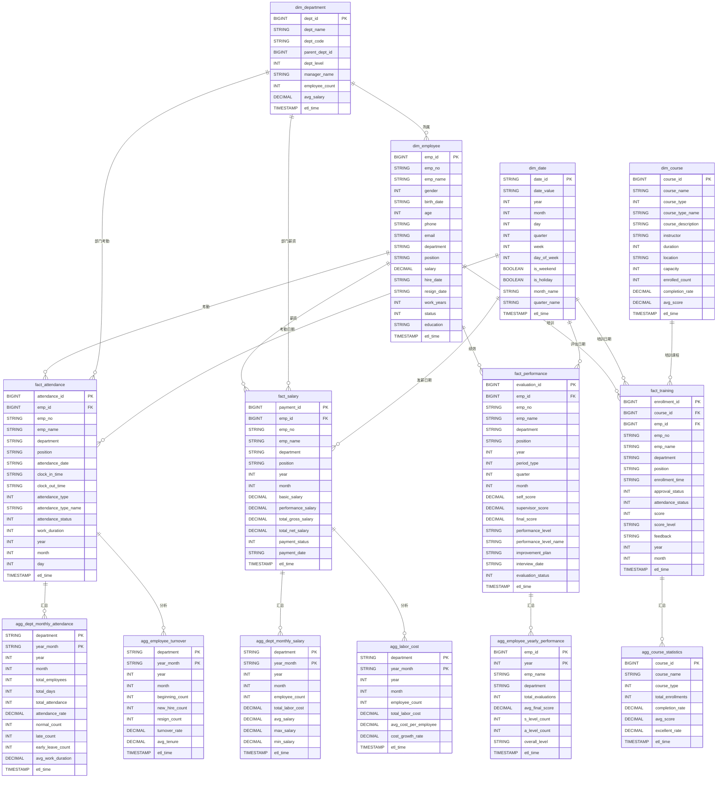
```mermaid
erDiagram
    dim_employee ||--o{ fact_attendance : "考勤"
    dim_employee ||--o{ fact_salary : "薪资"
    dim_employee ||--o{ fact_performance : "绩效"
    dim_employee ||--o{ fact_training : "培训"

    dim_department ||--o{ dim_employee : "所属"
    dim_department ||--o{ fact_attendance : "部门考勤"
    dim_department ||--o{ fact_salary : "部门薪资"

    dim_date ||--o{ fact_attendance : "考勤日期"
    dim_date ||--o{ fact_salary : "发薪日期"
    dim_date ||--o{ fact_performance : "评估日期"
    dim_date ||--o{ fact_training : "培训日期"

    dim_course ||--o{ fact_training : "培训课程"

    fact_attendance ||--o{ agg_dept_monthly_attendance : "汇总"
    fact_salary ||--o{ agg_dept_monthly_salary : "汇总"
    fact_performance ||--o{ agg_employee_yearly_performance : "汇总"
    fact_training ||--o{ agg_course_statistics : "汇总"
    fact_attendance ||--o{ agg_employee_turnover : "分析"
    fact_salary ||--o{ agg_labor_cost : "分析"

    dim_employee {
        BIGINT emp_id PK
        STRING emp_no
        STRING emp_name
        INT gender
        STRING birth_date
        INT age
        STRING phone
        STRING email
        STRING department
        STRING position
        DECIMAL salary
        STRING hire_date
        STRING resign_date
        INT work_years
        INT status
        STRING education
        TIMESTAMP etl_time
    }

    dim_department {
        BIGINT dept_id PK
        STRING dept_name
        STRING dept_code
        BIGINT parent_dept_id
        INT dept_level
        STRING manager_name
        INT employee_count
        DECIMAL avg_salary
        TIMESTAMP etl_time
    }

    dim_date {
        STRING date_id PK
        STRING date_value
        INT year
        INT month
        INT day
        INT quarter
        INT week
        INT day_of_week
        BOOLEAN is_weekend
        BOOLEAN is_holiday
        STRING month_name
        STRING quarter_name
        TIMESTAMP etl_time
    }

    dim_course {
        BIGINT course_id PK
        STRING course_name
        INT course_type
        STRING course_type_name
        STRING course_description
        STRING instructor
        INT duration
        STRING location
        INT capacity
        INT enrolled_count
        DECIMAL completion_rate
        DECIMAL avg_score
        TIMESTAMP etl_time
    }

    fact_attendance {
        BIGINT attendance_id PK
        BIGINT emp_id FK
        STRING emp_no
        STRING emp_name
        STRING department
        STRING position
        STRING attendance_date
        STRING clock_in_time
        STRING clock_out_time
        INT attendance_type
        STRING attendance_type_name
        INT attendance_status
        INT work_duration
        INT year
        INT month
        INT day
        TIMESTAMP etl_time
    }

    fact_salary {
        BIGINT payment_id PK
        BIGINT emp_id FK
        STRING emp_no
        STRING emp_name
        STRING department
        STRING position
        INT year
        INT month
        DECIMAL basic_salary
        DECIMAL performance_salary
        DECIMAL total_gross_salary
        DECIMAL total_net_salary
        INT payment_status
        STRING payment_date
        TIMESTAMP etl_time
    }

    fact_performance {
        BIGINT evaluation_id PK
        BIGINT emp_id FK
        STRING emp_no
        STRING emp_name
        STRING department
        STRING position
        INT year
        INT period_type
        INT quarter
        INT month
        DECIMAL self_score
        DECIMAL supervisor_score
        DECIMAL final_score
        STRING performance_level
        STRING performance_level_name
        STRING improvement_plan
        STRING interview_date
        INT evaluation_status
        TIMESTAMP etl_time
    }

    fact_training {
        BIGINT enrollment_id PK
        BIGINT course_id FK
        BIGINT emp_id FK
        STRING emp_no
        STRING emp_name
        STRING department
        STRING position
        STRING enrollment_time
        INT approval_status
        INT attendance_status
        INT score
        STRING score_level
        STRING feedback
        INT year
        INT month
        TIMESTAMP etl_time
    }

    agg_dept_monthly_attendance {
        STRING department PK
        STRING year_month PK
        INT year
        INT month
        INT total_employees
        INT total_days
        INT total_attendance
        DECIMAL attendance_rate
        INT normal_count
        INT late_count
        INT early_leave_count
        DECIMAL avg_work_duration
        TIMESTAMP etl_time
    }

    agg_dept_monthly_salary {
        STRING department PK
        STRING year_month PK
        INT year
        INT month
        INT employee_count
        DECIMAL total_labor_cost
        DECIMAL avg_salary
        DECIMAL max_salary
        DECIMAL min_salary
        TIMESTAMP etl_time
    }

    agg_employee_yearly_performance {
        BIGINT emp_id PK
        INT year PK
        STRING emp_name
        STRING department
        INT total_evaluations
        DECIMAL avg_final_score
        INT s_level_count
        INT a_level_count
        STRING overall_level
        TIMESTAMP etl_time
    }

    agg_course_statistics {
        BIGINT course_id PK
        STRING course_name
        INT course_type
        INT total_enrollments
        DECIMAL completion_rate
        DECIMAL avg_score
        DECIMAL excellent_rate
        TIMESTAMP etl_time
    }

    agg_employee_turnover {
        STRING department PK
        STRING year_month PK
        INT year
        INT month
        INT beginning_count
        INT new_hire_count
        INT resign_count
        DECIMAL turnover_rate
        DECIMAL avg_tenure
        TIMESTAMP etl_time
    }

    agg_labor_cost {
        STRING department PK
        STRING year_month PK
        INT year
        INT month
        INT employee_count
        DECIMAL total_labor_cost
        DECIMAL avg_cost_per_employee
        DECIMAL cost_growth_rate
        TIMESTAMP etl_time
    }
```

---

## 6. 数据仓库架构图

### 6.1 数据仓库分层架构

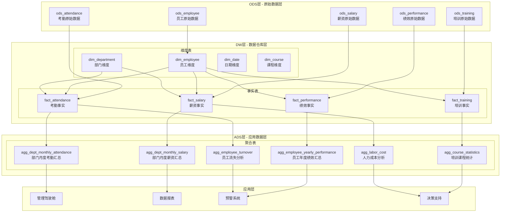
```mermaid
graph TB
    subgraph "ODS层 - 原始数据层"
        A1[ods_employee<br/>员工原始数据]
        A2[ods_attendance<br/>考勤原始数据]
        A3[ods_salary<br/>薪资原始数据]
        A4[ods_performance<br/>绩效原始数据]
        A5[ods_training<br/>培训原始数据]
    end

    subgraph "DW层 - 数据仓库层"
        subgraph "维度表"
            B1[dim_employee<br/>员工维度]
            B2[dim_department<br/>部门维度]
            B3[dim_date<br/>日期维度]
            B4[dim_course<br/>课程维度]
        end

        subgraph "事实表"
            C1[fact_attendance<br/>考勤事实]
            C2[fact_salary<br/>薪资事实]
            C3[fact_performance<br/>绩效事实]
            C4[fact_training<br/>培训事实]
        end
    end

    subgraph "ADS层 - 应用数据层"
        subgraph "聚合表"
            D1[agg_dept_monthly_attendance<br/>部门月度考勤汇总]
            D2[agg_dept_monthly_salary<br/>部门月度薪资汇总]
            D3[agg_employee_yearly_performance<br/>员工年度绩效汇总]
            D4[agg_course_statistics<br/>培训课程统计]
            D5[agg_employee_turnover<br/>员工流失分析]
            D6[agg_labor_cost<br/>人力成本分析]
        end
    end

    subgraph "应用层"
        E1[管理驾驶舱]
        E2[数据报表]
        E3[预警系统]
        E4[决策支持]
    end

    A1 --> B1
    A2 --> C1
    A3 --> C2
    A4 --> C3
    A5 --> C4
    B1 --> C1
    B1 --> C2
    B1 --> C3
    B1 --> C4
    B2 --> C1
    B2 --> C2
    C1 --> D1
    C1 --> D5
    C2 --> D2
    C2 --> D6
    C3 --> D3
    C4 --> D4
    D1 --> E1
    D2 --> E2
    D3 --> E3
    D4 --> E4
    D5 --> E3
    D6 --> E4
```

### 6.2 数据仓库星型模型

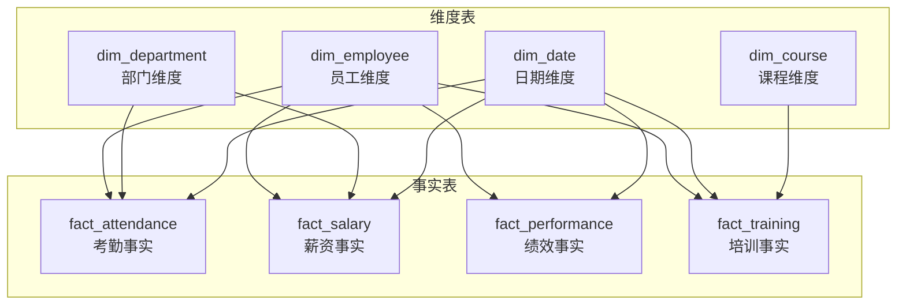
```mermaid
graph TB
    subgraph "维度表"
        D1[dim_employee<br/>员工维度]
        D2[dim_department<br/>部门维度]
        D3[dim_date<br/>日期维度]
        D4[dim_course<br/>课程维度]
    end

    subgraph "事实表"
        F1[fact_attendance<br/>考勤事实]
        F2[fact_salary<br/>薪资事实]
        F3[fact_performance<br/>绩效事实]
        F4[fact_training<br/>培训事实]
    end

    D1 --> F1
    D1 --> F2
    D1 --> F3
    D1 --> F4
    D2 --> F1
    D2 --> F2
    D3 --> F1
    D3 --> F2
    D3 --> F3
    D3 --> F4
    D4 --> F4
```

---

## 7. API接口架构图

### 7.1 RESTful API架构

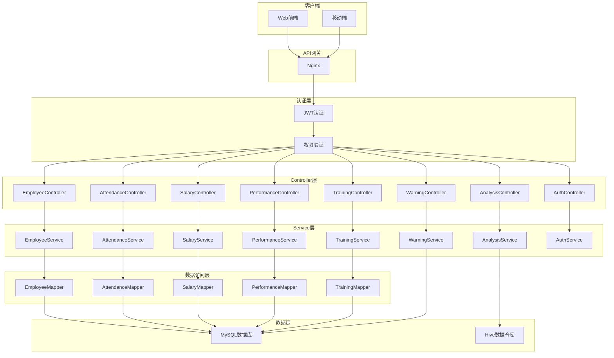
```mermaid
graph TB
    subgraph "客户端"
        A1[Web前端]
        A2[移动端]
    end

    subgraph "API网关"
        B[Nginx]
    end

    subgraph "认证层"
        C1[JWT认证]
        C2[权限验证]
    end

    subgraph "Controller层"
        D1[EmployeeController]
        D2[AttendanceController]
        D3[SalaryController]
        D4[PerformanceController]
        D5[TrainingController]
        D6[AnalysisController]
        D7[WarningController]
        D8[AuthController]
    end

    subgraph "Service层"
        E1[EmployeeService]
        E2[AttendanceService]
        E3[SalaryService]
        E4[PerformanceService]
        E5[TrainingService]
        E6[AnalysisService]
        E7[WarningService]
        E8[AuthService]
    end

    subgraph "数据访问层"
        F1[EmployeeMapper]
        F2[AttendanceMapper]
        F3[SalaryMapper]
        F4[PerformanceMapper]
        F5[TrainingMapper]
    end

    subgraph "数据层"
        G1[MySQL数据库]
        G2[Hive数据仓库]
    end

    A1 --> B
    A2 --> B
    B --> C1
    C1 --> C2
    C2 --> D1
    C2 --> D2
    C2 --> D3
    C2 --> D4
    C2 --> D5
    C2 --> D6
    C2 --> D7
    C2 --> D8
    D1 --> E1
    D2 --> E2
    D3 --> E3
    D4 --> E4
    D5 --> E5
    D6 --> E6
    D7 --> E7
    D8 --> E8
    E1 --> F1
    E2 --> F2
    E3 --> F3
    E4 --> F4
    E5 --> F5
    F1 --> G1
    F2 --> G1
    F3 --> G1
    F4 --> G1
    F5 --> G1
    E6 --> G2
    E7 --> G1
```

### 7.2 API请求流程

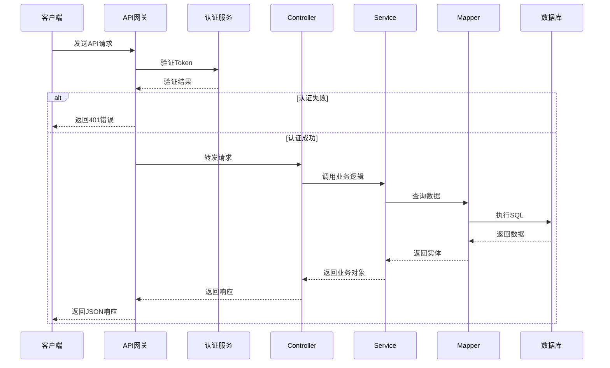
```mermaid
sequenceDiagram
    participant Client as 客户端
    participant Gateway as API网关
    participant Auth as 认证服务
    participant Controller as Controller
    participant Service as Service
    participant Mapper as Mapper
    participant DB as 数据库

    Client->>Gateway: 发送API请求
    Gateway->>Auth: 验证Token
    Auth-->>Gateway: 验证结果
    alt 认证失败
        Gateway-->>Client: 返回401错误
    else 认证成功
        Gateway->>Controller: 转发请求
        Controller->>Service: 调用业务逻辑
        Service->>Mapper: 查询数据
        Mapper->>DB: 执行SQL
        DB-->>Mapper: 返回数据
        Mapper-->>Service: 返回实体
        Service-->>Controller: 返回业务对象
        Controller-->>Gateway: 返回响应
        Gateway-->>Client: 返回JSON响应
    end
```

---

## 8. 部署架构图

### 8.1 生产环境部署架构

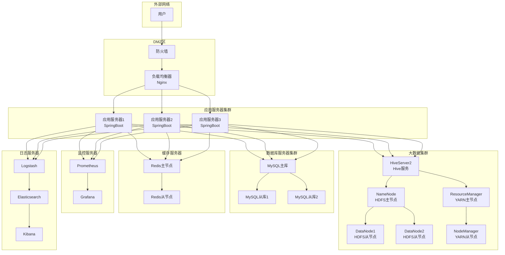
```mermaid
graph TB
    subgraph "外部网络"
        A[用户]
    end

    subgraph "DMZ区"
        B[防火墙]
        C[负载均衡器<br/>Nginx]
    end

    subgraph "应用服务器集群"
        D1[应用服务器1<br/>SpringBoot]
        D2[应用服务器2<br/>SpringBoot]
        D3[应用服务器3<br/>SpringBoot]
    end

    subgraph "数据库服务器集群"
        E1[MySQL主库]
        E2[MySQL从库1]
        E3[MySQL从库2]
    end

    subgraph "大数据集群"
        F1[NameNode<br/>HDFS主节点]
        F2[DataNode1<br/>HDFS从节点]
        F3[DataNode2<br/>HDFS从节点]
        F4[HiveServer2<br/>Hive服务]
        F5[ResourceManager<br/>YARN主节点]
        F6[NodeManager<br/>YARN从节点]
    end

    subgraph "缓存服务器"
        G1[Redis主节点]
        G2[Redis从节点]
    end

    subgraph "监控服务器"
        H1[Prometheus]
        H2[Grafana]
    end

    subgraph "日志服务器"
        I1[Logstash]
        I2[Elasticsearch]
        I3[Kibana]
    end

    A --> B
    B --> C
    C --> D1
    C --> D2
    C --> D3
    D1 --> E1
    D2 --> E1
    D3 --> E1
    E1 --> E2
    E1 --> E3
    D1 --> F4
    D2 --> F4
    D3 --> F4
    F4 --> F1
    F1 --> F2
    F1 --> F3
    F4 --> F5
    F5 --> F6
    D1 --> G1
    D2 --> G1
    D3 --> G1
    G1 --> G2
    D1 --> H1
    D2 --> H1
    D3 --> H1
    H1 --> H2
    D1 --> I1
    D2 --> I1
    D3 --> I1
    I1 --> I2
    I2 --> I3
```

### 8.2 容器化部署架构

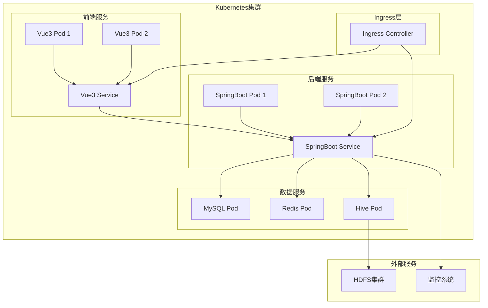
```mermaid
graph TB
    subgraph "Kubernetes集群"
        subgraph "Ingress层"
            A[Ingress Controller]
        end

        subgraph "前端服务"
            B1[Vue3 Pod 1]
            B2[Vue3 Pod 2]
            B3[Vue3 Service]
        end

        subgraph "后端服务"
            C1[SpringBoot Pod 1]
            C2[SpringBoot Pod 2]
            C3[SpringBoot Service]
        end

        subgraph "数据服务"
            D1[MySQL Pod]
            D2[Redis Pod]
            D3[Hive Pod]
        end
    end

    subgraph "外部服务"
        E[HDFS集群]
        F[监控系统]
    end

    A --> B3
    A --> C3
    B1 --> B3
    B2 --> B3
    B3 --> C3
    C1 --> C3
    C2 --> C3
    C3 --> D1
    C3 --> D2
    C3 --> D3
    D3 --> E
    C3 --> F
```

---

## 9. 安全架构图

### 9.1 系统安全架构

```mermaid
graph TB
    subgraph "网络安全层"
        A1[防火墙]
        A2[DDoS防护]
        A3[入侵检测]
    end

    subgraph "应用安全层"
        B1[HTTPS/TLS]
        B2[JWT认证]
        B3[RBAC权限控制]
        B4[SQL注入防护]
        B5[XSS防护]
        B6[CSRF防护]
    end

    subgraph "数据安全层"
        C1[数据加密<br/>AES-256]
        C2[密码加密<br/>BCrypt]
        C3[敏感数据脱敏]
        C4[数据备份]
        C5[审计日志]
    end

    subgraph "运维安全层"
        D1[堡垒机]
        D2[VPN访问]
        D3[安全补丁管理]
        D4[安全扫描]
    end

    subgraph "合规安全层"
        E1[等保合规]
        E2[数据隐私保护]
        E3[安全审计]
    end

    A1 --> B1
    A2 --> B1
    A3 --> B1
    B1 --> B2
    B2 --> B3
    B3 --> C1
    B4 --> C1
    B5 --> C1
    B6 --> C1
    C1 --> C2
    C2 --> C3
    C3 --> C4
    C4 --> C5
    C5 --> D1
    D1 --> D2
    D2 --> D3
    D3 --> D4
    D4 --> E1
    E1 --> E2
    E2 --> E3
```

### 9.2 认证授权流程

```mermaid
sequenceDiagram
    participant User as 用户
    participant Frontend as 前端
    participant Backend as 后端
    participant Auth as 认证服务
    participant Database as 数据库

    User->>Frontend: 输入用户名密码
    Frontend->>Backend: 登录请求
    Backend->>Auth: 验证用户凭证
    Auth->>Database: 查询用户信息
    Database-->>Auth: 返回用户数据
    Auth->>Auth: 验证密码(BCrypt)
    alt 验证失败
        Auth-->>Backend: 返回错误
        Backend-->>Frontend: 返回401
        Frontend-->>User: 登录失败
    else 验证成功
        Auth->>Auth: 生成JWT Token
        Auth-->>Backend: 返回Token
        Backend-->>Frontend: 返回Token
        Frontend->>Frontend: 存储Token
        Frontend-->>User: 登录成功
    end

    User->>Frontend: 访问受保护资源
    Frontend->>Backend: 携带Token请求
    Backend->>Auth: 验证Token
    Auth->>Auth: 检查Token有效性
    alt Token无效
        Auth-->>Backend: 返回错误
        Backend-->>Frontend: 返回401
        Frontend-->>User: 跳转登录
    else Token有效
        Auth->>Auth: 检查用户权限
        Auth-->>Backend: 返回权限信息
        Backend->>Backend: 验证资源访问权限
        alt 权限不足
            Backend-->>Frontend: 返回403
            Frontend-->>User: 权限不足
        else 权限通过
            Backend-->>Frontend: 返回数据
            Frontend-->>User: 显示数据
        end
    end
```

---

## 10. 组件关系图

### 10.1 Spring Boot组件关系图

```mermaid
graph TB
    subgraph "Web层"
        A1[EmployeeController]
        A2[AttendanceController]
        A3[SalaryController]
        A4[PerformanceController]
        A5[TrainingController]
        A6[AnalysisController]
        A7[WarningController]
        A8[AuthController]
    end

    subgraph "Service层"
        B1[EmployeeService]
        B2[AttendanceService]
        B3[SalaryService]
        B4[PerformanceService]
        B5[TrainingService]
        B6[AnalysisService]
        B7[WarningService]
        B8[AuthService]
    end

    subgraph "Mapper层"
        C1[EmployeeMapper]
        C2[AttendanceMapper]
        C3[SalaryMapper]
        C4[PerformanceMapper]
        C5[TrainingMapper]
    end

    subgraph "Entity层"
        D1[Employee]
        D2[Attendance]
        D3[SalaryPayment]
        D4[PerformanceEvaluation]
        D5[TrainingCourse]
    end

    subgraph "公共组件"
        E1[Result统一返回]
        E2[PageResult分页]
        E3[AOP日志切面]
        E4[全局异常处理]
        E5[Redis缓存]
        E6[JWT工具类]
    end

    A1 --> B1
    A2 --> B2
    A3 --> B3
    A4 --> B4
    A5 --> B5
    A6 --> B6
    A7 --> B7
    A8 --> B8
    B1 --> C1
    B2 --> C2
    B3 --> C3
    B4 --> C4
    B5 --> C5
    C1 --> D1
    C2 --> D2
    C3 --> D3
    C4 --> D4
    C5 --> D5
    A1 --> E1
    A2 --> E1
    A3 --> E1
    A4 --> E1
    A5 --> E1
    A6 --> E1
    A7 --> E1
    A8 --> E1
    A1 --> E2
    A2 --> E2
    A3 --> E2
    A4 --> E2
    A5 --> E2
    A6 --> E2
    A7 --> E2
    A8 --> E2
    A1 --> E3
    A2 --> E3
    A3 --> E3
    A4 --> E3
    A5 --> E3
    A6 --> E3
    A7 --> E3
    A8 --> E3
    A1 --> E4
    A2 --> E4
    A3 --> E4
    A4 --> E4
    A5 --> E4
    A6 --> E4
    A7 --> E4
    A8 --> E4
    B1 --> E5
    B2 --> E5
    B3 --> E5
    B4 --> E5
    B5 --> E5
    B8 --> E6
```

### 10.2 Vue3组件关系图

```mermaid
graph TB
    subgraph "路由层"
        A[Vue Router]
    end

    subgraph "页面组件"
        B1[Dashboard<br/>数据看板]
        B2[OrgEfficiency<br/>组织效能]
        B3[TalentPipeline<br/>人才梯队]
        B4[SalaryAnalysis<br/>薪酬分析]
        B5[EmployeeManagement<br/>员工管理]
        B6[AttendanceManagement<br/>考勤管理]
        B7[PerformanceManagement<br/>绩效管理]
        B8[TrainingManagement<br/>培训管理]
    end

    subgraph "公共组件"
        C1[App.vue<br/>根组件]
        C2[Layout.vue<br/>布局组件]
        C3[Header.vue<br/>头部组件]
        C4[Sidebar.vue<br/>侧边栏]
        C5[Footer.vue<br/>底部组件]
    end

    subgraph "业务组件"
        D1[EmployeeTable<br/>员工表格]
        D2[AttendanceChart<br/>考勤图表]
        D3[SalaryChart<br/>薪资图表]
        D4[PerformanceChart<br/>绩效图表]
        D5[TrainingChart<br/>培训图表]
    end

    subgraph "工具组件"
        E1[API封装]
        E2[Store状态管理]
        E3[Utils工具类]
        E4[Directives指令]
    end

    A --> B1
    A --> B2
    A --> B3
    A --> B4
    A --> B5
    A --> B6
    A --> B7
    A --> B8
    C1 --> C2
    C2 --> C3
    C2 --> C4
    C2 --> C5
    C2 --> B1
    C2 --> B2
    C2 --> B3
    C2 --> B4
    C2 --> B5
    C2 --> B6
    C2 --> B7
    C2 --> B8
    B2 --> D2
    B4 --> D3
    B4 --> D5
    B7 --> D4
    B8 --> D5
    B1 --> E1
    B2 --> E1
    B3 --> E1
    B4 --> E1
    B5 --> E1
    B6 --> E1
    B7 --> E1
    B8 --> E1
    B1 --> E2
    B2 --> E2
    B3 --> E2
    B4 --> E2
    B5 --> E2
    B6 --> E2
    B7 --> E2
    B8 --> E2
    D1 --> E3
    D2 --> E3
    D3 --> E3
    D4 --> E3
    D5 --> E3
    D1 --> E4
    D2 --> E4
    D3 --> E4
```

---

## 附录

### A. 图例说明

| 符号 | 说明 |
|------|------|
| `[ ]` | 节点/组件 |
| `( )` | 数据库 |
| `{ }` | 判断/条件 |
| `-->` | 数据流向 |
| `||--o{` | 一对多关系 |
| `||--||` | 一对一关系 |

### B. 技术术语表

| 术语 | 英文 | 说明 |
|------|------|------|
| ODS层 | Operational Data Store | 操作数据存储层 |
| DW层 | Data Warehouse | 数据仓库层 |
| ADS层 | Application Data Store | 应用数据存储层 |
| ETL | Extract-Transform-Load | 数据抽取-转换-加载 |
| JWT | JSON Web Token | JSON网络令牌 |
| RBAC | Role-Based Access Control | 基于角色的访问控制 |
| ORC | Optimized Row Columnar | 优化的行列式存储格式 |
| SNAPPY | Snappy Compression | 快速压缩算法 |

### C. 参考文档

1. Spring Boot官方文档
2. Vue3官方文档
3. Hadoop官方文档
4. Hive官方文档
5. MySQL官方文档

---

## 版本历史

| 版本 | 日期 | 修改内容 | 修改人 |
|------|------|----------|--------|
| v1.0 | 2026-04-07 | 初始版本，包含完整的架构图和流程图 | AI助手 |

---

## 联系方式

如有问题或建议，请联系项目团队。

---

**文档结束**
